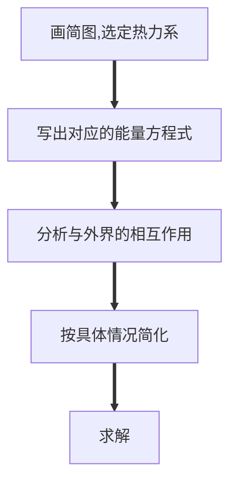

$$
\begin{cases}
热力学第一定律的定义与实质\\
几种功的定义与计算★
	\begin{cases}
	容积变化功\\
	轴功\\
	流动功\\
	推动功★
	\end{cases}\\
总能
	\begin{cases}
	定义\\
	计算
	\end{cases}\\
热力学能与焓★
	\begin{cases}
	焓
		\begin{cases}
		定义\\
		计算
		\end{cases}\\
	热力学能
		\begin{cases}
		定义\\
		计算
		\end{cases}\\
	二者的关系
	\end{cases}\\
闭口系能量方程★
	\begin{cases}
	表达式\\
	各项的含义
	\end{cases}\\
开口系能量方程
	\begin{cases}
	基本能量方程式
		\begin{cases}
		表达式\\
		各项的含义
		\end{cases}\\
	稳定流动能量方程★★★
		\begin{cases}
		表达式\\
		各项的含义
		\end{cases}\\
	\end{cases}\\
能量方程的应用
\begin{cases}
管道\\
压气机\\
动力机\\
换热器\\
绝热节流
\end{cases}\\
使用能量方程分析具体问题时的步骤★★★
\end{cases}
$$

### 学习后须达到的要求
* 对于不同系统下的能量方程记忆准确、使用熟练
* 完成教材例题：2-1、2-2、2-3、2-4
* 教材第二章所有思考题
* 精要解析例题：2-1、2-2、2-3、2-4、2-5、2-6、2-8、2-10、2-13、2-14
* 精要解析自我测验：2-1~11、2-13、2-15、2-16

# 第一节 热力学第一定律的实质

**实质**：能量守恒与转换定律在**热现象**中的应用。

**表述**：进入系统的能量 $-$ 离开系统的能量 $=$ 系统能量的变化 $\Delta E$ 。
$$
\Delta E_{\rm iso}=0
$$

# 第二节 热力系的能量——热力学能

## 一、热力学能（内部储存能，internal energy）

> 物质内部微粒子热运动具有的能量的总和。

### 构成

$$
\begin{array}{l}
\left\{\begin{array}{l}
\left.\begin{array}{l}
&U\rm_k\ 内动能\ (kinetic\ energy)\\
&U\rm_p\ 内势能\ (potential\ energy)
\end{array}\right\}\longrightarrow分子尺度上\\
\begin{array}{l}
&U\rm_c\ 化学能\ (chemical\ energy)\quad\longrightarrow原子尺度上
\end{array}\\
\begin{array}{l}
&U\rm_e\ 原子能\ (nuclear\ energy)\ \ \quad\longrightarrow原子尺度以下
\end{array}\\
\qquad\quad\vdots
\end{array}\right.\\
\ \Rightarrow\  U=U\rm_k+U\rm_p+U\rm_c+\cdots
\end{array}
$$

由于在热力学中我们仅关注内动能和内势能，所以

$$
\begin{array}{c}
U=U_\mathrm k+U_\mathrm p+C\\
\Delta U=\Delta U_\mathrm k+\Delta U_\mathrm p
\end{array}
$$

### 热力学能是状态参数

$$
\begin{array}{c}
U=U_\mathrm k+U_\mathrm p=f_1(T)+f_2(T)=f(T,V)\\
\displaystyle\oint \mathrm dU=0
\end{array}
$$

### 热力学能是广延量（可加性）

单位： $J$ ， $kJ$ ， $kJ/kg$ 

$$
u=\frac Um
$$

#### 本课程只关心 $\Delta U$ 

## 二、总能量（total stored energy of system）

$$
\begin{align}
&\qquad\boxed{宏观动能}\ \boxed{宏观位能}\\
&\qquad\qquad\ \Downarrow\ \ \ \ \Downarrow\\
&E=U+E_\mathrm k+E_\mathrm p\\
&E=\underset{\displaystyle\Uparrow}{U}+\underline{\frac12mc_\mathrm f^2+mgz}\Leftarrow\boxed{外部储存能}\\
&\boxed{内部储存能}
\end{align}
$$

# 第三节 能量的传递和转化

|                    |                  热量 heat transfer                  |                     功量 work                      |
| :----------------: | :------------------------------------------------------: | :----------------------------------------------------: |
|      **定义**      | 在温差的推动下，系统与外界借助于微观的无序运动传递的能量 | 在压力推动下。系统与外界借助于宏观的有序运动传递的能量 |
|     **推动力**     |                           温差                           |                          力差                          |
| **借助运动的方式** |                         微观无序                         |                        宏观有序                        |
|    **传递过程**    |                       能量形态不变                       |                    能量形态发生变化                    |
|     **过程量**     |                          过程量                          |                         过程量                         |
|     **正负号**     |                   吸热 $+$ ，放热 $-$                    |                对外做功 $+$ ，耗功 $-$                 |

热能是杂乱无序运动的，品位较低。把无序的东西整理成有序的东西才能真正有用，但需要花费代价。有序的机械能来得比热能要更加宝贵，品位较高。

## 一、计算

### 热量

$$
\begin{align}
&Q=\int mc\mathrm dT\\
&Q_{re}=\int mT\mathrm ds
\end{align}
$$

### 各种功

1. 容积变化功 $W$ ；
2. 轴功 $W_s$ （shaft）：通过叶轮机械的轴输出与输入的功；
3. 流动功 $W_f$ （flow）：维持流动所需的功；
4. 推动功 $W_{\rm push}$ ：系统引进或排出工质传递的功量。

$$
\begin{array}{c}
\displaystyle w_{\rm push1}=\int_{0-0}^{1-1}pA\mathrm dx=p_1v_1\\
\displaystyle w_f=\sum_iw_{\rm push,i}=p_2v_2-p_1v_1=\Delta(pv) 
\end{array}
$$

## 二、焓

$$
\begin{align}
&H=U+pV\\
&h=u+pv
\end{align}
$$

### 焓的物理意义

表示了物质流入或流出系统所**携带**的能量。（人为定义，目的是简化公式和计算）

### 焓是一个组合状态参数

$$
\rm J,\ kJ,\ kJ/kg
$$

### 关心 $\Delta h$ 

# 第四节 闭口系能量方程式

$$
\begin{array}{c}
\begin{array}{c}
\delta Q-\delta W=\mathrm dE\\
\Downarrow\\
\delta Q=\mathrm dE+\delta W\\
\Downarrow\\
\delta Q=\mathrm dU+\delta W\\
\end{array}\\\\
\begin{cases}
\delta Q=\mathrm dU+\delta W\\
\delta q=\mathrm du+\delta w\\
Q=\Delta U+W\\
q=\Delta u+w
\end{cases}\overset{可逆}\Longrightarrow
\begin{cases}
\delta Q=\mathrm dU+p\mathrm dV\\
\delta q=\mathrm du+p\mathrm dv\\
\displaystyle Q=\Delta U+\int p\mathrm dV\\
\displaystyle q=\Delta u+\int p\mathrm dv
\end{cases}\\
循环:\displaystyle \oint\delta Q=\oint \mathrm dU+\oint \mathrm dW\Rightarrow Q_{net}=W_{net}
\end{array}
$$

* 初终状态应是平衡态。
* 公式中热量、功量是代数值。
* 量纲要统一。
* 物理意义：真正反映了热功转换，它表明加给系统的热量一部分用于增加工质的热力学能，仍以热能的形式储存于工质内部，余下的一部分以作功的方式传递给外界，转化为机械能。

$$
q-\Delta u=w
$$

# 第五节 稳定流动能量方程

## 一、稳定流动及实现条件（Steady-Flow Processes）

### 1、定义

系统内各点参数（包括热力参数和流速）不随时间变化的流动。

### 2、实现条件

1. 物质的相互作用不随时间变化（质量交换不随时间改变）

$$
q_{m1}=q_{m2}=\rm const
$$

2. 能量的相互作用不随时间变化

$$
\frac{\delta q}{\delta\tau}={\rm const},\quad\frac{\delta w}{\delta\tau}={\rm const}
$$

3. 进出口的状态参数不随时间变化

## 二、能量方程

$$
已知:\quad\begin{align}
进口&\ p_1,T_1,v_1,c_{\rm f1},z_1,q_{m1}\\
出口&\ p_2,T_2,v_2,c_{\rm f2},z_2,q_{m2}
\end{align}
$$

由于是稳定流动，

$$
\begin{align}
&q_{m1}=q_{m2}=q_m\\
&\Delta E_{CV}=0
\end{align}
$$

进入系统的能量：

$$
\begin{cases}
u_1+\displaystyle\frac12c_{\rm f1}^2+gz_1+p_1v_1&(随工质带入)\\
q&(传热)
\end{cases}
$$

离开系统的能量：

$$
\begin{cases}
u_2+\displaystyle\frac12c_{\rm f2}^2+gz_2+p_2v_2&(随工质带出)\\
w_s&(作功)
\end{cases}
$$

于是有

$$
\begin{align}
&q+u_1+\frac12c_{\rm f1}^2+gz_1+p_1v_1=u_2+\frac12c_{\rm f2}^2+gz_2+p_2v_2+w_s\\
\therefore\ &q=(u_2+p_2v_2)-(u_1+p_1v_1)+\frac12\Delta c_{\rm f}^2+g\Delta z+w_s\\
&\qquad\qquad\qquad\boxed{q=\Delta h+\frac12\Delta c_{\rm f}^2+g\Delta z+w_s}
\end{align}
$$

#### 注意

1. 适用于任何工质（理想或实际气体），任何过程（可逆或不可逆）只要进出口是平衡态，不管系统内平衡与否。
2. $q,w_s$ 是代数符号，**注意正负号**。
3. $\Delta u,\Delta h,\Delta c_{\rm f}$ 等不是系统不同时刻的变化量，是进出口参数差。
4. 注意单位。如：动能中 $c_\rm f$ 的单位 $m/s$ 对应的能量单位是 $J/kg$ 而不是 $kJ/kg$ 。

## 三、能量方程的分析与讨论

### 1、物理意义

$$
\begin{array}{c}
q=\Delta h+\displaystyle\frac12\Delta c_{\rm f}^2+g\Delta z+w_s\\\\
\ \ \ \ \ \qquad\qquad\qquad流动功\qquad\qquad\qquad\qquad\ 轴功\\
 \ \ \ \ \ \ \qquad\qquad\qquad\Uparrow\qquad\qquad\qquad\qquad\ \ \ \ \ \Uparrow\\
w=\boxed{q-\Delta u}=\boxed{\Delta(pv)}+\underline{\displaystyle\frac12\Delta c_{\rm f}^2+g\Delta z+\boxed{w_s}}\\
\Downarrow\qquad\qquad\qquad\qquad\qquad\quad\Downarrow\\
热能转变成机械能(功量)部分\Rightarrow膨胀功\Rightarrow机械能增量\qquad\qquad\\
\qquad\quad\searrow\qquad\swarrow\quad\ \searrow\qquad\swarrow\\
\qquad\quad\ \ \ \ 能量形式变化\qquad能量形式未变化
\end{array}
$$

#### 结论

热变功的根本途径：是通过容积变化功！流动系中，膨胀功是隐含的。

### 2、技术功

> 技术上可资利用的功 $w_t$ 

$$
\begin{align}
w_t&=w_s+\frac12\Delta c_{\rm f}^2+g\Delta z\\
w_t&=w-\Delta(pv)=w-\int\mathrm d(pv)\\
&\overset{re}=\int\mathrm dv-\int\mathrm d(pv)\overset{re}=-\int v\mathrm dp\\\\
\therefore\ w_t&\overset{re}=-\int v\mathrm dp,\quad\delta w_t\overset{re}=-v\mathrm dp
\end{align}
$$

### 3、几种功的表示

可逆过程：

$$
\begin{align}
&w\overset{re}=\int p\mathrm dv\\
&w_t\overset{re}=-\int v\mathrm dp\\
&w_\mathrm f\overset{re}=\Delta(pv)
\end{align}
$$

### 4、第一定律的其他表达形式

基本形式

$$
q=\Delta h+w_t\overset{re}=\Delta h-\int_1^2v\mathrm dp
$$

微元形式

$$
\delta q=\mathrm dh+\delta w_t\overset{re}=\mathrm dh-v\mathrm dp
$$

用率形式

$$
\begin{align}
&q_mq=q_m(\Delta h+\frac12\Delta c_{\rm f}^2+g\Delta z+w_s)\\
\dot Q=\Delta&\dot H+\frac12q_m\Delta c_{\rm f}^2+q_mg\Delta z+\dot W_s=\Delta\dot H+\dot W_t
\end{align}
$$

### 5、不稳定流动过程——开口系能量方程一般式

$$
\delta Q=\mathrm dE_{CV}+(h+\frac12c_{\mathrm f}^2+gz)_{out}\delta m_{out}-(h+\frac12c_{\mathrm f}^2+gz)_{in}\delta m_{in}+\delta W_s
$$

不建议死记硬背

# 第六节 能量方程的应用

## 一、叶轮机械

* 动力机：汽轮机（steam turbine），燃气轮机（gas turbine）等；
* 压气机：透平压气机等（compressor，pump）

一般处理为绝热，且动能差势能差忽略不计。

$$
\begin{align}
&\ \underline q=\Delta h+\underline{\frac12\Delta c_{\mathrm f}^2}+\underline{g\Delta z}+w_s\\
&\Downarrow\qquad\qquad\quad \Downarrow\qquad\ \Downarrow\\
&\ \ 0\qquad\qquad\quad 0\qquad\quad0\\\\
&\qquad w_s=-\Delta h=h_1-h_2\\\\
	&\begin{cases}
	压气机:\ h_1\lt h_2,\ 所以\ w_s\lt0\\
	动力机:\ h_1\gt h_2,\ 所以\ w_s\gt0
	\end{cases}
\end{align}
$$

## 二、压气机（compressor）

$$
w_c=-w_i=-w_t
$$

## 三、换热设备（heat exchanger）

选取整个换热器为研究对象：

$$
\begin{align}
&\ \underline Q=\Delta H+\underline{\frac12m\Delta c_{\rm f}^2}+\underline{mg\Delta z}+\underline{W_s}\\
&\Downarrow\qquad\qquad\qquad\Downarrow\qquad\qquad\Downarrow\qquad\Downarrow\\
&\ 0\qquad\qquad\qquad\ 0\qquad\qquad0\qquad\ 0\\\\
\therefore\ &\Delta H=0\\
&\Delta H_热+\Delta H_冷=0\\
&(H_2+H_2')_热-(H_1+H_1')_冷=0
\end{align}
$$

选取冷流体为研究对象：

$$
\begin{align}
&\ q=\Delta h+\underline{\frac12\Delta c_{\rm f}^2}+\underline{g\Delta z}+\underline{w_s}\\
&\qquad\qquad\qquad\Downarrow\qquad\ \Downarrow\qquad\Downarrow\\
&\qquad\qquad\qquad0\qquad\quad0\qquad0\\\\
&\therefore\ q=\Delta h\\
\end{align}
$$

## 四、绝热节流

$$
\begin{align}
&\ \underline q=\Delta h+\underline{\frac12\Delta c_{\mathrm f}^2}+\underline{g\Delta z}+\underline{w_s}\\
&\Downarrow\qquad\qquad\quad \Downarrow\qquad\ \Downarrow\qquad\Downarrow\\
&\ \ 0\qquad\qquad\quad 0\qquad\quad0\qquad0\\\\
&\qquad \Delta h=h_2-h_1=0\\\\
	&\begin{cases}
	压气机:\ h_1\lt h_2,\ 所以\ w_s\lt0\\
	动力机:\ h_1\gt h_2,\ 所以\ w_s\gt0
	\end{cases}
\end{align}
$$

进出口焓值相等。（但并不能说是等焓过程，因为在节流孔附近的紊流摩擦较多，状态参数无法确定。）

# 使用能量方程分析具体问题的一般步骤

* 明确目的已知和求解
  * 已知：
  * 求解：
* 画出示意图（简图即可）
  * 系统的大概示意
  * 在图中表明需要研究各点的序号，方便在公式中体现
* 确定研究对象（选定热力系统）
  * 闭口系（控制质量C.M.）：分析定量工质
  * 开口系（控制容积V.M.）：分析热力设备
* 列出所研究热力系的对应的能量方程
  * 闭口系统
  * 开口系统
    * 一般形式（不稳定流动）
    * 稳定流动
* 写出所研究热力系对应的能量方程
* 针对具体的问题分析与外界的相互作用（功量、热量），简化方程
  * 是否有做功、耗功
  * 是否绝热
  * 是否可以忽略动能、位能
* 带入求解
* 整体检查
  * 公式使用的条件是否满足
  * 计算是否正确
  * 结果是否符合经验

# 小结

## 一、实质

* 能量守恒与转换定律在热现象中的应用。
* 从能量量的角度解释自然界过程的能量转换关系。

## 二、能量方程

### 闭口系

$$
\begin{cases}
q=\Delta u+w\\
\displaystyle q=\Delta u+\int_1^2p\mathrm dv
\end{cases}\quad
\begin{cases}
\delta q=\mathrm du+\delta w&任意工质，任意过程\\
\delta q=\mathrm du+p\mathrm dv&任意工质，可逆过程
\end{cases}
$$

### 开口系

$$
\begin{cases}
\displaystyle q=\Delta h+\frac12\Delta c_{\rm f}^2+g\Delta z+w_s\\
q=\Delta h+w_t\\
\displaystyle q=\Delta h-\int_1^2v\mathrm dp
\end{cases}\quad
\begin{cases}
\displaystyle \delta q=\mathrm dh+\frac12\mathrm dc_{\rm f}^2+g\mathrm dz+\delta w_s&任意工质，任意过程\\
\delta q=\mathrm dh+\delta w_t&任意工质，任意过程\\
\displaystyle\delta q=\mathrm dh-v\mathrm dp&任意工质，可逆过程
\end{cases}\quad
$$

## 三、过程量和状态量

* 过程量： $\delta$ ，$\int_1^2$ 
* 状态量： $\Delta$ ， $\mathrm d$

## 四、功的类型及其关系

* 膨胀功 $W$ ——容积变化而引起的，若可逆，则 $w=\int p\mathrm dv$ ；
* 轴功 $W_s$ ——通过叶轮机械的轴输出或输入的功；
* 流动功 $W_f$ ——维持流动所需的功， $w_f=\Delta(pv)$ ；
* 技术功 $W_t$ ——技术上可资利用的功，若可逆，则 $w_t=-\int v\mathrm dp$ 。

$$
\begin{align}
膨胀&功\ w\quad流动功\ w_f\qquad技术功\ w_t\\
&\Uparrow\qquad\quad\Uparrow\qquad\qquad\qquad\Uparrow\\
q-\Delta u=&\boxed w=\boxed{\Delta(pv)}+\boxed{\displaystyle\frac12\Delta c_{\rm f}^2+g\Delta z+w_s}
\end{align}
$$

## 五、能量分析的步骤

# 思考题

#### 2-1 热力学能就是热量吗？

热力学能 $U$ 不是热量 $Q$ 。热力学能包括内动能、内势能、化学能和原子能等。

#### 2-2 若在研究飞机发动机中工质的能量转换规律时把参考坐标建在飞机上，工质的总能中是否包括外部储能？在以氢、氧为燃料的电池系统中系统的热力学能是否应包括氢和氧的化学能？

1. 若以飞机为参照物，发动机相对静止，工质在发动机中不受到外界的动能和重力势能影响，所以不应包括外部储能。
2. 因氢氧作为燃料燃烧是将化学能转化为了动能，所以热力学能应该包括化学能。

#### 2-3 能否由基本能量方程式得出功、热量和热力学能是相同性质的参数的结论？

他们的单位都是焦耳，表示能量，但 $q$ 和 $w$ 是过程量，而 $u$ 是状态量，所以不是相同性质的参数，但是可以相互转化。

#### 2-4 一刚性绝热容器，中间用绝热隔板分为两部分，A中存有高压空气，B中保持真空，如图2-12所示。若将隔板抽去，分析容器中空气的热力学能将如何变化？若在隔板上有一小孔，气体泄漏入B中，分析A、B两部分压力相同时A、B两部分气体热力学能如何变化？

1.  $q=\Delta u+w$ ，其中 $q=0,w=0$ ，则 $\Delta u=0$ 热力学能不变。
2. 小孔左右压力相同，但绝热。气体从左边推到右边，产生推动功，A的热力学能降低，B的热力学能升高。

#### 2-5 热力学第一定律的能量方程式是否可写成下列形式？为什么？

$$
\begin{array}{c}
q=\Delta u+pv\\
q_2-q_1=(u_2-u_1)+(w_2-w_2)
\end{array}
$$

不可以。因为功是过程量而非状态量，不能单纯用初末状态的值相减，而应采用 $\int_1^2 p\mathrm dv$ 来表示膨胀功。热量也是过程量。

#### 2-6 热力学第一定律解析式有时写成下列两种形式，分别讨论两式的适用范围。

$$
\begin{array}{c}
q=\Delta u+w\\
q=\Delta u+\displaystyle\int_1^2p\mathrm dv
\end{array}
$$

第一种形式适用于任意过程，第二种形式只适用于可逆过程。

#### 2-7 为什么推动功出现在开口系能量方程式中，而不出现在闭口系能量方程式中？

因为推动功是系统引进或排出工质传递的功量，而闭口系与外界不存在质量交换，也就不存在工质的流进流出。

#### 2-8 焓是工质流入（或流出）开口系时传递入（或传递出）系统的总能量，那么闭口系工质有没有焓值？

有。因为焓是个状态参数，由其定义 $h=u+pv$ 可知，除了流入流出时的推动功以外，也包含了工质本身具有的热力学能。

#### 2-9 气体流入真空容器，是否需推动功？

不需要。这是自发的扩散，没有功的产生。

#### 2-10 稳定流动能量方程式是否可应用于像活塞式压气机这样的机械稳定工况运行的能量分析？为什么？

不可以。因为活塞式压气机的稳定工况不属于稳定流动，在压缩过程中系统内各点参数随时变化。

#### 2-11 为什么稳定流动开口系内不同部位工质的比热力学能、比焓、比熵等都会改变，而整个系统的 $\Delta U_{CV}=0$ 、 $\Delta H_{CV}=0$ 、 $\Delta S_{CV}=0$ ？

因为稳定流动为内各点参数（包括热力参数和流速）不随时间变化的流动，这说明了整个系统中工质的热力学能、焓和熵的总和不随时间变化。而稳定流动的工质并不一定是均匀的，所以每一不同部位的比热力学能、比焓和比熵等都会改变。

#### 2-12 开口系实施稳定流动过程，是否同时满足下列三式？下述三式中， $W$ 、 $W_t$ 和 $W_s$ 的相互关系是什么？

$$
\begin{array}{c}
\delta Q=\mathrm dU+\delta W\\
\delta Q=\mathrm dH+\delta W_t\\
\delta Q=\mathrm dH+\displaystyle\frac m2\mathrm d(c_{\mathrm f}^2)+mg\mathrm dz+\delta W_s
\end{array}
$$

可以同时满足上述三式。 $W$ 是膨胀功，由容积变化产生，在开口系中膨胀功是隐含的； $W_t$ 是技术功，即技术上可资利用的功； $W_s$ 是轴功，仅代表通过叶轮机械的轴输出或输入的功。 $W\supseteq W_t\supseteq W_s$ 。

#### 2-13 几股流体汇合成一股流体称为合流，如图2-13所示。工程上几台压气机同时向主气道送气以及混合式换热器等都有合流的问题。通常合流过程都是绝热的。取 $1-1$ 、 $2-2$ 和 $3-3$ 截面之间的空间为控制体积，列出能量方程式并导出出口截面上焓值 $h_3$ 的计算式。

过程绝热，则 $q=0$ ，且动能差，势能差和轴功皆可忽略不计。则

$$
\begin{align}
&q_mq=q_m(\Delta h+\frac12\Delta c_{\rm f}^2+g\Delta z+w_s)\\
&0=q_m\Delta h+0+0+0\\
\therefore\ &q_m\Delta h=0\\
\therefore\ &q_{m1}h_1+q_{m2}h_2=q_{m3}h_3\\
&h_3=\frac{q_{m1}h_1+q_{m2}h_2}{q_{m3}}
\end{align}
$$
