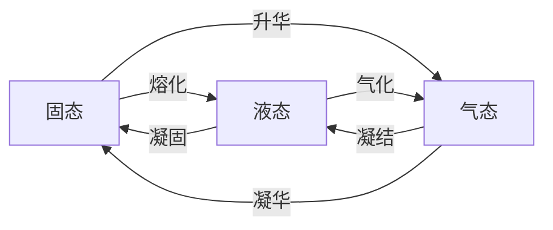

$$
\begin{cases}
理想气体
	\begin{cases}
	定义、特征\\
	理想气体状态方程\\
	两个常数(背下数值)
		\begin{cases}
		摩尔气体常数(通用气体常数)\\
		气体常数
		\end{cases}
	\end{cases}\\
理想气体的比热容
	\begin{cases}
	比热容的定义\\
	定压比热容与定容比热容★
		\begin{cases}
		定义\\
		计算公式、如何推倒\\
		二者的大小关系
		\end{cases}\\
	迈耶公式与热容比★
		\begin{cases}
		表达式、适用条件\\
		如何推导
		\end{cases}\\
	理想气体比热容的四种计算方法
		\begin{cases}
		真实比热容\\
		平均比热容\\
		平均比热容的直线关系式\\
		定值比热容(记住表格)★
		\end{cases}
	\end{cases}\\
理想气体的热力学能、焓和熵（计算和公式推导）★\\
水蒸气的饱和状态和相图
	\begin{cases}
	饱和状态的定义\\
	水和相图与纯物质的相图(p-T图)
	\end{cases}\\\\
水蒸气的定压气化过程★
	\begin{cases}
	完整过程的描述\\
		\begin{cases}
		一点、两线、三区、五态的具体含义\\
		各阶段的特征
		\end{cases}\\
	在p-V图、T-S图的表示
	\end{cases}\\
水蒸气的h-s图\\
水的两相点与三相点
	\begin{cases}
	两相点\\
	三相点\\
	二者的区别
	\end{cases}
\end{cases}
$$

蒸**汽**（Steam）、水蒸**气**（Water Vapor）、蒸**气**（Vapor）

* 对象：理想气体，蒸气（水蒸气、氨蒸气、氟利昂蒸气）
* 任务：
  * 热力性质的确定（ $p,T,v,u,h,s$ ）
  * 状态方程（ $p-T-v$ ）
  * 比热容（ $c_p,c_V$ ）
  * 热力学能（ $\Delta u$ ），焓（ $\Delta h$ ），熵（ $\Delta s$ ）的计算
* 目的：利用热力性质计算热量和功量。
* 方法：宏观的方法，依据实际定律（热力学第一定律和热力学第二定律）。理想气体采用计算公式，蒸气采用图表。

# 第一节 理想气体的概念

## 一、理想气体和实际气体（ideal gas）

### 1、理想气体的分子模型

假设：

1. 分子都是弹性的不占体积的质点；
2. 分子相互之间没有作用力。

极限情况：是**低压高温**时的抽象： $p\to0$ 或 $v\to\infty$ 。实际意义？

### 2、 能否作为理想气体处理的依据

1. 气体所处的状态是否原理液态；
2. 工程上所允许的误差。

### 3、工程上可作为理想气体处理的常见气体

在常温、常压下 $\rm O_2$ 、$\rm N_2$ 、 $\rm CO$ 、 $\rm H_2$ 、空气、燃气、烟气等离液态较远，可作理想气体处理。

## 二、理想气体状态方程式

### 1、状态方程式

$$
\begin{align}\\
&\qquad\quad\boxed{v=\frac Vm}\\
&\qquad\quad\ \ \ \ \Downarrow\\
\frac{p_1v_1}{T_1}=\frac{p_2v_2}{T_2}=\frac{pv}{T}=R_g&\quad\Longrightarrow\quad pv=R_gT&&则有\ pV=mR_gT\\
\frac{p_1V_{m1}}{T_1}=\frac{p_2V_{m2}}{T_2}=\frac{pV_m}{T}=R&\quad\Longrightarrow\quad pV_m=RT&&则有\ pV=nRT\\
&\qquad\qquad\ \ \Uparrow\\
&\qquad\quad\boxed{V_m=\frac Vn}
\end{align}
$$

### 2、 $R$ 与 $R_g$ 

$R_g$ ：气体常数， $\rm J/(kg\cdot K)$ ，与工质有关，但与状态无关。

$R$ ：摩尔（通用）气体常数， $\rm J/(mol\cdot K)$ ，与工质以及状态均无关。
$$
R=\frac{p_0V_{m0}}{T_0}=\frac{101325\times22.41\times^{-3}}{273.15}=8.314\ \rm J/(mol\cdot K)
$$
关系：
$$
R_g=\frac RM=\frac{通用气体常数}{摩尔质量}
$$

### 3、说明

1. 应用场合：

$$
\begin{align}
&pv=R_gT&&\Longrightarrow&&v\\
&pV=mR_gT&&\Longrightarrow&&m\\
&pV_m=RT&&\Longrightarrow&&V_m\\
&pV=nRT&&\Longrightarrow&&n\\
\end{align}
$$

2. $p,v(V),T$ 是同一状态下的值。
3. 注意单位统一： $p-{\rm Pa}$ ， $R_g-{\rm J/(kg\cdot K)}$ ， $R-{\rm J/(mol\cdot K)}$ 。

# 第二节 理想气体的比热容（specific heat capacity）

## 一、定义与种类

1. **定义**：准静态过程中，单位物量的物体温度升高1度所需的热量。（过程量）

$$
c=\lim_{\Delta T\to0}\frac q{\Delta T}=\frac{\delta q}{\mathrm dT}=\frac{\delta q}{\mathrm dt}
$$

2. **种类**：有以下6种常用的比热容

**根据物理量单位不同**：

* 质量热容（比热容）： $c\quad\rm J/(kg\cdot K)$ 

  （specific heat capacity per unit of mass）

* 摩尔热容： $C_m\quad\rm J/(mol\cdot K)$ 

  （mole specific heat capacity）

* 体积热容： $C' \quad\rm J/(m^3\cdot K)$ 

  （volumetric specific heat capacity）

$$
C_m=Mc=0.0224C'
$$

**根据过程不同**：

* 质量定压热容（比定压热容）： $c_p,\ C_{p,m},\ C_p'$ 

  （constant pressure specific heat capacity per unit of mass）

* 质量定容热容（比定容热容）： $c_V,\ C_{V,m},\ C_V'$ 

  （constant volume specific heat capacity per unit of mass）

## 二、影响比热容的因素

### （一）过程对比热容的影响

#### 1、 $c_V,\ c_p$ 与状态参数的关系

$$
\begin{align}
&\qquad\qquad\quad c_v,\ c_p\ 的热力学定义\\\\
&c_V=\left(\frac{\delta q}{\mathrm dt}\right)_V=\left(\frac{\mathrm du+p\mathrm dv}{\mathrm dT}\right)_V=\left(\frac{\partial u}{\partial T}\right)_V\\
&c_p=\left(\frac{\delta q}{\mathrm dt}\right)_p=\left(\frac{\mathrm dh+v\mathrm dp}{\mathrm dT}\right)_p=\left(\frac{\partial h}{\partial T}\right)_p
\end{align}
$$

$C$ 是过程量，但是

$\displaystyle\left(\frac{\partial u}{\partial T}\right)$ 在定容下，仅是状态的函数

$\displaystyle\left(\frac{\partial h}{\partial T}\right)$ 在定压下，仅是状态的函数

#### 2、理想气体的 $c_V,\ c_p$ 关系

实际气体： $u=u_k+u_p=f(T,p)$ 

理想气体： 
$$
\begin{array}{c}
u=f(T)\\
h=u+pv=u+R_gT=\varphi(T)
\end{array}
$$
理想气体热力学能、焓是温度的单值函数。
$$
\begin{align}
\therefore\ c_V&=\left(\frac{\partial u}{\partial T}\right)_V\overset{理气}=\frac{\mathrm du}{\mathrm dT}\\
c_p&=\left(\frac{\partial h}{\partial T}\right)_p\overset{理气}=\frac{\mathrm dh}{\mathrm dT}\\\\
c\ 是过程量\Longrightarrow实气&\ c_V,c_p\ 是状参\Longrightarrow理气\ c_V,c_p\ 是状参\\
&f(T,V)\qquad\qquad\qquad\quad f(T)
\end{align}
$$

##### 迈耶尔公式（Mayer's formula）

$$
\begin{array}{c}
\left.\begin{array}{l}
h=u+pv=u+R_gT\\
\displaystyle\frac{\mathrm dh}{\mathrm dT}=\frac{\mathrm du}{\mathrm dT}+R_g\\
\Rightarrow c_p=c_V+R_g
\end{array}\right\}
\Longrightarrow
\left\{\begin{array}{l}
c_p-c_V=R_g\\
C_{p,m}-C_{V,m}=R\\
C_p'-C_V'=\displaystyle\frac R{22.4}
\end{array}\right.
\end{array}
$$

1. $c_p$ 与 $c_V$ 之差 $R_g$为常数，与物性、温度无关。
2. 由于不存在具有绝对刚性的物质，所以 $c_p$ 比 $c_V$ 更容易测准。
3. $c_p\gt c_V$ ，因为加热定压膨胀时，除了热量供给 $1kg$ 物质吸收升高 $1℃$ 以外，还要推动外界物质作功。
4. 令 $\displaystyle\kappa=\frac{c_p}{c_V}$ 

$$
\therefore\begin{cases}
\displaystyle c_V=\frac{R_g}{\kappa-1}\\
\displaystyle c_p=\frac{\kappa R_g}{\kappa-1}
\end{cases}
$$

## 三、理想气体比热容的计算

> 对 $c_n$ 测量值作不同的技术处理，可得精度不同的比热容计算方法。

### 1、真实比热容（true specific heat capacity）

$$
\begin{align}
c&=\alpha+\beta T+\gamma T^2+\cdots\\
q&=\int_{T_1}^{T_2}c_n\mathrm dT=S_{amnba}
\end{align}
$$

### 2、平均比热容（mean specific heat capacity）

$$
\begin{align}
&q=\int_{t_1}^{t_2}c_n\mathrm dt=c_n\vline_{t_1}^{t_2}(t_2-t_1)\\
&c_n\vline_{t_1}^{t_2}=\frac q{t_2-t_1}=\frac{\int_{t_1}^{t_2}c_n\mathrm dt}{t_2-t_1}
\end{align}
$$

$t_1,t_2$ 均为变量，制表太繁复。考虑将积分下限统一换成 $0$ 。
$$
\begin{align}
c_n\vline_{t_1}^{t_2}=\frac q{t_2-t_1}=&\frac{\int_{t_1}^{t_2}c_n\mathrm dt}{t_2-t_1}=\frac{\int_{0}^{t_2}c_n\mathrm dt-\int_{0}^{t_1}c_n\mathrm dt}{t_2-t_1}\\
c_n\vline_{t_1}^{t_2}=&\frac{c_n\vline_{0}^{t_2}t_2-c_n\vline_{0}^{t_1}t_1}{t_2-t_1}
\end{align}
$$
制作出平均比热容表
$$
c_n\vline_0^T=\frac{\int_0^Tc_n\mathrm dT}{T-0}
$$

### 3、平均直线比热容

令 $c_n=a+bt$ ，则
$$
\begin{align}
&c_n\vline_{t_1}^{t_2}=\frac q{t_2-t_1}=\frac{\int_{t_1}^{t_2}c_n\mathrm dt}{t_2-t_1}=\frac{\int_{t_1}^{t_2}(a+bt)\mathrm dt}{t_2-t_1}=a+\frac b2(t_2+t_1)\\\\
&c_n\vline_{t_1}^{t_2}=a+bt
\end{align}
$$
注意：

1. $t$ 的系数已除过 $2$ ；
2. $t$ 需用 $t_1+t_2$ 代入。

$$
q=\int_{t_1}^{t_2}c_n\mathrm dt=c_n\vline_{t_1}^{t_2}\Delta t
$$

### 4、定值比热容

根据气体分子运动理论，能量均分原理，可导出
$$
\begin{align}
&C_{V,m}=\frac i2R\qquad(i-自由度)\\
&C_{p,m}=\frac{i+2}2R\\
&\kappa=\frac{i+2}i
\end{align}
$$
但多原子气体误差更大

|                                                              |   单原子气体  $i=3$   |   双原子气体  $i=5$   |   多原子气体  $i=6$   |
| :----------------------------------------------------------: | :-----------------------: | :-----------------------: | :-----------------------: |
|                $C_{V,m}\ \rm J/(mol\cdot K)$                 |  $\displaystyle\frac32R$  |  $\displaystyle\frac52R$  |  $\displaystyle\frac72R$  |
|                $C_{p,m}\ \rm J/(mol\cdot K)$                 |  $\displaystyle\frac52R$  |  $\displaystyle\frac72R$  |  $\displaystyle\frac92R$  |
|                   $c_V\ \rm J/(kg\cdot K)$                   | $\displaystyle\frac32R_g$ | $\displaystyle\frac52R_g$ | $\displaystyle\frac72R_g$ |
|                   $c_p\ \rm J/(kg\cdot K)$                   | $\displaystyle\frac52R_g$ | $\displaystyle\frac72R_g$ | $\displaystyle\frac92R_g$ |
| $\kappa=\displaystyle\frac{C_{p,m}}{C_{V,m}}=\frac{c_p}{c_V}$ |          $1.67$           |          $1.40$           |          $1.29$           |

对 $c_n$ 测量值作不同的技术处理，可得精度不同的热量计算方法：

* 真实比热容
* 平均比热容
* 平均直线比热容
* 定值比热容

# 第三节 理想气体热力学能、焓和熵

## 一、理想气体的热力学能和焓

### 1、理想气体<u>热力学能</u>和<u>焓</u>仅是温度的函数

$$
\begin{align}
\because\ &T_b=T_c=T_d\\
\therefore\ &\Delta u_{ab}=\Delta u_{ac}=\Delta u_{ad}=\int c_V\mathrm dT\\
&\Delta h_{ab}=\Delta h_{ac}=\Delta h_{ad}=\int c_p\mathrm dT
\end{align}
$$
若为任意工质（定值比热容）
$$
\begin{align}
&\Delta u_{ab}=c_V(T_b-T_a)\quad,\Delta u_{ac}=\quad,\Delta u_{ad}=\\
&\Delta h_{ab}=c_p(T_b-T_a)\quad,\Delta h_{ac}=\quad,\Delta h_{ad}=
\end{align}
$$

* 理想气体一切同温限之间的过程 $\Delta u$ 相同， $\Delta h$ 相同，且均可用 $\int c_V\mathrm dT$ 、 $\int c_p\mathrm dT$ 计算；
* 实际气体 $\Delta u$ 及 $\Delta h$ 不仅与 $T$ 有关、还与另外一个参数有关。

### 2、热力学能和焓零点的规定

可任取参考点，令其热力学能为零，但通常取 $0K$ 
$$
\begin{align}
&\Delta u=u(T)-u(T_0)=u(T)=c_V\vline_0^TT\\
&\Delta h=h(T)-h(T_0)=h(T)=c_p\vline_0^TT
\end{align}
$$
可以制作热力性质表

## 二、理想气体的熵

### 1、定义

$$
\mathrm ds=\frac{\delta q_{re}}T\quad\rm J/(kg\cdot K)
$$

### 2、理想气体的熵

$$
\begin{align}
&\qquad\qquad\qquad\qquad\quad\ \left(\because\ pv=R_gT\ \therefore\frac pT=\frac{R_g}v\right)\\
&\qquad\qquad\qquad\qquad\qquad\qquad\qquad\quad\ \Downarrow\\
&\mathrm ds=\frac{\delta q_{re}}T=\frac{\mathrm du+p\mathrm dv}T=c_V\frac{\mathrm dT}T+\frac pT\mathrm dv=c_V\frac{\mathrm dT}T+R_g\frac{\mathrm dv}v\\
&\qquad\qquad\qquad\qquad\qquad\quad\ \Uparrow\\
&\qquad\qquad\qquad\qquad\quad\mathrm du=c_V\mathrm dT
\end{align}
$$

理想气体热力学熵是状态参数
$$
\begin{align}
&(1)\ [T,v]:\mathrm ds=\frac{\delta q_{re}}T=\frac{c_V\mathrm dT+p\mathrm dv}T=c_V\frac{\mathrm dT}T+R_g\frac{\mathrm dv}v=f(T,v)\\
&(2)\ [T,p]:\mathrm ds=\frac{\delta q_{re}}T=\frac{c_p\mathrm dT-v\mathrm dp}T=c_p\frac{\mathrm dT}T-R_g\frac{\mathrm dp}p=f(T,p)\\
&(3)\ [v,p]:\mathrm ds=c_p(\frac{\mathrm dp}{p}+\frac{\mathrm dv}{v})-R_g\frac{\mathrm dp}{p}=c_p\frac{\mathrm dv}v+c_V\frac{\mathrm dp}p=f(v,p)
\end{align}
$$
经过有限过程，进行积分
$$
\begin{align}
\Delta s=\int_1^2\mathrm ds=
\begin{cases}
\displaystyle\int_1^2c_V\frac{\mathrm dT}T+R_g\ln\frac{v_2}{v_1}\\
\displaystyle\int_1^2c_p\frac{\mathrm dT}T-R_g\ln\frac{p_2}{p_1}\\
\displaystyle\int_1^2c_V\frac{\mathrm dp}p+\int_1^2c_p\frac{\mathrm dv}v
\end{cases}
\underrightarrow{\ 定比热容\ }
\begin{cases}
\displaystyle c_V\ln\frac{T_2}{T_1}+R_g\ln\frac{v_2}{v_1}\\
\displaystyle c_p\ln\frac{T_2}{T_1}-R_g\ln\frac{p_2}{p_1}\\
\displaystyle c_V\ln\frac{p_2}{p_1}+c_p\ln\frac{v_2}{v_1}
\end{cases}
\end{align}
$$

### 3、理想气体变比热容熵差计算

$$
\Delta s=\int_1^2c_p\frac{\mathrm dT}T-R_g\ln\frac{p_2}{p_1}
$$

* 零点规定：通常取**标准状态下**气体的熵为零

$$
\begin{align}
令&\ \int_0^Tc_p\frac{\mathrm dT}T=s^0(T)\\
则&\ \int_1^2c_p\frac{\mathrm dT}T=s^0(T_2)-s^0(T_1)=s_2^0-s_1^0\\
&\ \Delta s=s_2^0-s_1^0-R_g\ln\frac{p_2}{p_1}
\end{align}
$$

# 第四节 相变

## 一、相及相变

#### 相

指系统中物理性质和化学组成完全相同且均匀的部分。

相与相之间有明显的界面。如：水+水蒸气；酒精与水蒸气组成的蒸气混合物。

#### 相变

物质不同相之间的相互转化。

## 二、气液相变

### 1、汽化与凝结（vaporization and liquefaction）

#### 汽化

$液\Rightarrow汽$ 过程

汽化速率 $C_汽$ 取决于液体温度 $f_1(t)$ 

#### 凝结

$汽\Rightarrow液$ 过程

凝结速率 $C_凝$ 取决于蒸汽空间压力 $f_2(p)$ 

当两者速率相等（ $C_汽=C_凝$ ）达到动态平衡，宏观状态不变，称为**饱和状态**（Saturated state）。

### 2、饱和温度及饱和压力（Saturated temperature, Saturated pressure）

#### 饱和状态

汽化和凝结达到动态平衡时的状态。

#### 饱和

* 汽相再不能容纳更多的来自液相汽化而成的蒸气；
* 液相再不能容纳更多的来自汽相液化而成的液体。
* 这就说明此时蒸气压力和密度为对应温度下的最大值。

#### 饱和温度和饱和压力

* 饱和温度——饱和状态时气、液的温度
* 饱和压力——饱和状态时蒸气的压力

$$
\left.\begin{array}{l}
c_汽=f_1(t)\\
\quad\ \Updownarrow\\
c_凝=f_2(p)
\end{array}\right\}
\ t_s\Leftrightarrow p_s\quad一一对应，只有一个独立变量
$$

### 3、汽化的两种形式

* 蒸发——在液体表面、任何温度下（只要未饱和）进行
* 沸腾——在液体内部、温度达到饱和温度时才能进行。是强烈的汽化过程。

#### 产生沸腾的方法

* 一定压力下加热：

$$
T\lt T_s(p)\Rightarrow加热\ T\uparrow\Rightarrow T=T_s(p)
$$

* 一定温度下减压（闪蒸）：

$$
p\gt p_s(T)\Rightarrow减压\ p\downarrow\Rightarrow p=p_s(T)
$$

### 4、汽化潜热

* 克服界面表层液体分子的引力作功（飞出液面）
* 扩大容积占据汽相空间而作膨胀功

所以汽化过程需要吸收热量

# 第五节 蒸汽的定压产生过程

## 一点、两线、三区、五态

### 一点

临界点 Critical point
$$
\begin{cases}
p_{cr}=22.064\ MPa\\
t_{cr}=373.99\ ^\circ\rm C\\
v_{cr}=0.03106\ m^3/kg
\end{cases}
$$

### 两线

$$
\begin{cases}
饱和液线\ (下界限线)\\
干饱和蒸气线\ (上界限线)
\end{cases}
$$

### 三区

$$
\begin{cases}
液\\
汽液共存\\
汽
\end{cases}
$$

### 五态

$$
\begin{cases}
未饱和水\\
饱和水\\
湿蒸汽\\
干饱和蒸汽\\
过热蒸汽
\end{cases}
$$

# 第六节 水和水蒸气状态参数的确定方法——水蒸气的表和图

