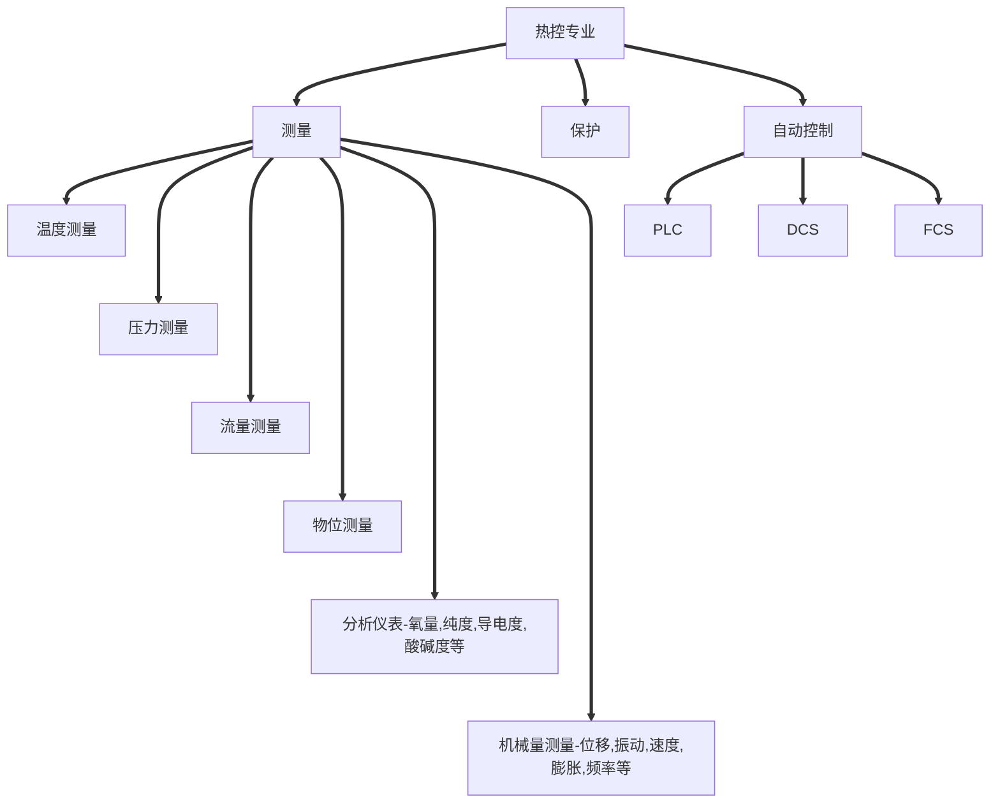

# 热控专业概述

### 热控

电厂包括各种系统，如果把机务专业比作人的躯干，电气专业相当于动脉，热控专业相当于人的神经系统。

热控，也叫热工。国外习惯称呼为仪表控制 I&C（Instrumentation & control）。

# 热工测量与仪表

## 热工测量

* 热工测量是测量技术中的一种，是指在热工过程中对各种热工参数，如温度、压力、流量、振动、转速、物位及位移等的测量。
* 在火力发电厂中，热工测量是运行人员的耳目，通过热工测量可以及时反映热力设备及系统的运行状态，为运行人员提供操作依据，为热工自动控制准确地、及时地提供测量信号，保证热力设备安全、经济运行，实现自动控制，节省人力、物力。

### 热电偶（Thermocouple 简称 TC）

#### 热电偶测温原理

热电偶利用的是热电效应原理。

**热电势**：两种不同的金属相互接触时，其接触端与非接触端的温度若不相等，则在两种金属之间产生的电位差称为热电势。

**热电效应**：在两种不同的导体或半导体组成的闭合回路中，当两个接点所处的温度不同时，回路中，就会产生电动势（热电势），这种现象叫做热电效应。

两种不同成份的导体，两端经焊接，形成回路，直接测量端叫工作端T₁（热端）接线端子端叫冷端T₀，当热端和冷端存在温差时，就会在回路里产生微小的电流，接上显示仪表，仪表上就会指示所产生的热电势的对应温度值，热电势随温度升高而增长。

#### 热电偶测温系统构成

在实际应用中，将A、B的一端焊接在一起作为热电偶的测量端放到被测温度t处，而将参考端t₀分开，用导线或补偿导线接入温度仪表，如果保持参考端接点温度t₀稳定。温度仪表所测电势只随被测温度t而变化。

### 热电阻（Resistance Temperature Detector 简称 RTD）

#### 热电阻测温原理

它是基本导体或半导体材料的电阻值，随温度的变化而变化电阻值与温度成一定函数关系。再用显示仪表测出热电阻的电阻值，从而得出与电阻值相对应的温度值。金属热电阻的电阻值与温度在某一范围内基本呈线性关系。

### 双金属温度计（Bimetal thermometer）

由于两种金属的热膨胀系数不同，双金属片在温改变时，两面的热胀冷缩程度不同，因此在不同的温度下，其弯曲程度发生改变。利用这一原理，制成温度计叫双金属温度计。

### 压力式温度计（Pressure-filled thermometer）

压力表式温度计是根据在封闭容器中的液体、气体或低沸点液体和饱和蒸汽，受热后体积膨胀或压力变化这一原理而制作的，并用压力来测量这种变化，从而测得温度。压力表式温度计主要由以下三部分组成：

1. 温包——温包是直接与被测介质相接触来感受温度变化的元件，因此要求它具有高的强度，小的膨胀系数，高的导热率以及抗腐蚀等性质，根据所充工作介质和被测介质的不同，温包可用铜合金，钢或不锈钢来制造。
2. 毛细管——它是用铜或钢等材料冷拉成的无缝圆管，用来传递压力的变化。
3. 弹簧管——它就是一般压力表用的弹性元件。

### 压力测量（Pressure measurement）

#### 压力测量的基本概念

垂直作用在单位面积的力称为压力，物理学中称为压强，其数学表达式为：P=F/S

式中：P-压力，Pa；F-垂直作用力，N；S-受力面积，m²

压力的单位也取法定计量单位，名称是“帕斯卡”，简称“帕”，用符号“Pa”表示。实际应用中，“Pa”的单位太小，工程上习惯以“帕”的1×10⁶倍为单位，即MPa。

#### 压力、大气压力、绝对压力、表压力、负压力（疏空压力）的定义

* 压力：是指垂直均匀作用于单位面积上的力。
* 大气压力：是指地球表面大气自重所产生的压力。
* 绝对压力：是指以完全真空作为零标准表示的压力。
* 表压力：是指以大气压力作为零标准表示的压力。
* 负压力：是指绝对压力低于大气压力时的表压力。

### 压力表（Pressure gauge）

压力表通过表内的敏感元件（波登管、波纹管、膜盒）的弹性形变，再由表内机芯的传动机构将压力形变传导至指针，引起指针转动来显示压力。

### 压力变送器（Pressure transmitter）

压力变送器将气压这种压力的力学信号转变成电流电子信号，然后把这些信号展示在工作电路设备中；一步来说压力和电压或电流大小成线性关系，大部分情况下是正比关系；所以，变送器输出的电压或电流随压力增大而增大；由此得出一个压力和电压或电流的关系式。

用途：压力变送器主要用于测量匀体、液体和蒸汽的压力、负压和绝对压力等参数，然后将其转换成4-20mA.DC信号输出，供电方一般24VDC。

### 压力开关（Pressure switch）

压力开关是一种简单的压力控制装置，当被测压力达到额定值时，压力开关可发出（警报或控制）信号。

压力开关的工作原理是：当被测压力超过额定值时，弹性元件的自由端（产生位移），直接或经过比较后推动（开关元件），改变（开关元件）的通断状态，达到控制被测压力的目的。

压力开关采用的弹性元件有（单圈弹簧管）、（膜片）、（膜盒）及（波纹管）等。开关元件有（磁性开关）、（水银开关）、（微动开关）等。

压力开关的开关形式有常开式（疏空压力时接点断开）和常闭式（疏空压力时接点闭合）两种。

压力开关的参数可调，依实际使用压力范围调节。

### 流量测量（flow measurement）

所谓流量，是指单位时间内流经封闭管道或明渠有效截面的流体量，又称瞬时流量。当流体量以体积表示时称为体积流量；当流体量以质量表示时称为质量流量。单位时间内流过某一段管道的流体的体积，称为该横截面的体积流量。简称为流量，用Q来表示。
$$
Q_V=S\times V\qquad Q_m=Q_V\times\rho
$$

### 涡轮流量计（Turbine flowmeter）

当被测流体流过涡轮流量计传感器时，在流体作用下，叶轮受力旋转，其转速与管道平均流速成正比叶轮的转动周期地改变磁电转换器的磁阻值。

### 孔板流量计（Orifice-plate flowmeter）

充满管道的流体，当它们流经管道内的节流装置时，流束将在节流装置的节流件处形成局部收缩，从而使流速增加，静压力低，于是在节流件前后便产生了压力降，即压差，介质流动的流量越大，在节流件前后产生的压差就越大，所以孔板流量计可以通过测量压差来衡量流体流量的大小。这种测量方法是以能量守衡定律和流动连续性定律为基准的。

### 浮子流量计（Float flowmeter）

浮子流量计，又称转子流量计，是变面积式流量计的一种，在一根由下向上扩大的垂直锥管中，圆形横截面的浮子的重力是由液体动力承受的，浮子可以在锥管内自由地上升和下降。在流速和浮力作用下上下运动，与浮子重量平衡后，通过磁耦合传到与刻度盘指示流量。一般分为玻璃和金属转子流量计。

### 涡街流量计（Vortex Flowmeter）

在流体中安放一个非流线型旋涡发生体，使流体在发生体两侧交替地分离，释放出两串规则地交错排列的旋涡，且在一定范围内旋涡分离频率与流量成正比的流量计。

### 超声波流量计（Ultrasonic flowmete）

超声波流量计常见的时间差计量（传播速度差法）。利用顺流和逆流时的传播速度之差与被测流体流速之间的关系求取流速。

### 电磁流量计（Electromagnetic flowmeter）

电磁流量计是根据法拉第电磁感应定律制造的用来测量管内导电介质体积流量的感应式仪表。

### 物位测量（level measurement）

#### 差压液位变送器

利用对测量介质的两点之间由于存在液位高度所产生的压差进行测量的变送器仪表。为了解决测量具有腐蚀性或含有结晶颗粒以及粘度大，易疑固等液体液位及引压管线被腐蚀、被堵的问题，而专门生产了法兰式差压变送器。变送器的法兰直接与容器上的法兰相连接。

作为敏感元件的测量头（金属膜盒），经毛细管与变送器的测量室相通。在膜盒、毛细管和测量室所组成的封闭系统内充有硅油，作为传压介质，并使被测介质不进入毛细管与变送器。

#### 电浮筒液位变送器（Electric float liquid level transmitter）

电浮筒是根据阿基米德原理工作的，当液位变化时浮筒（宽度是沉筒）所受浮力变化，通过支点，使扭力管受力作用后产生扭变，检测元件检测出后，变送器功能模块电路将测量信号经缓冲、放大和电压/电流变换后，输出4～20mA标准电流信号，此时与作用在浮筒上的浮力成正比例变化。

#### 磁翻板液位变送器（Magnetic level transmitter）

磁翻板式液位变送器是以浮子内磁钢驱动双色薄片的翻转来指示液位的一种新型仪表。主体内磁浮子随液位的升降而上下运动，同时驱使主体外指示器内的双色薄片翻转，有液位时转示红色、无液位时转示白色。

#### 雷达液位计（Radar level meter）

雷达液位计属于通用型雷达液位计，它基于时间行程原理的测量仪表，雷达波以光速运行，运行时间可以通过电子部件被转换成物位信号。
$$
t=2d/C\quad d=Ct/2\quad H=L-d=L-Ct/2
$$
只要测得微波的往返时间 $t$ ，即可计算得到液位的高度。探测器对时间测量有两种方式，即微波脉冲法及连续波调频法。

微波脉冲法：脉冲频率大多为5～6GHz

#### 音叉液位开关

音叉液位开关的工作原理是：通过安装在音又基座上的一对压电晶体使音叉在一定共振频率下振动。当音叉液位开关的音叉与被测介质相接触时，音叉的频率和振幅将改变，音叉液位开关的这些变化由智能电路来进行检测，处理并将之转换为一个开关信号。

特点：

适应性强：介质的电参数、密度对测量不产生影响。结垢、搅动、湍流、气泡、振动、中等粘度、高温、高压等恶劣条件对检测无影响；免于维护；不需调校。

### 浮球、浮标液位控制器（Floating ball liquid level controller）

浮标液位控制器利用重力与浮力的原理设计。主要包括浮标和微动开关，当液位变化，浮标内的开关通、断。

浮球液位控制器：由测量和输出两部分组成，当液位变化时，浮球随之上下移动，从而使磁钢摆动。根据磁性同性相斥原理，使触点接通或断开。

### 射频导纳物位计（RF admittance level meter）

射频导纳是一种从电容式发展起来的、防挂料、更可靠、更准确、适用性更广的新型物位控制技术，是电容式物位技术的升级。所谓射频导纳，导纳的含义为电学中阻抗的倒数，它由电阻性成分、电容性成分、感性成分综合而成，而射频即高频无线电波谱，所以射频导纳可以理解为用高频无线电波测量导纳。仪表工作时，仪表的传感器与灌壁及被测介质形成导纳值，物位变化时，导纳值相应变化，电路单元将测量导纳值转换成物位信号输出，实现物位测量。应用在液位测量，粉位及灰斗料位等测量。

### 电接点、玻璃板、玻璃管、牛眼双色水位计

电接点水位计根据水与汽电阻率不同而设计。测量筒的电极在水中对筒体的阻抗小。在汽中对筒体的阻抗大。 随着水位的变化，电极在水中的数量产生变化。

测量的水位比实际水位低。因为水的密度随温度的降低而升高。例如：测量汽包水位时，电接点水位计比实际水位低。现阶段，测量准确度较高的是差压式水位测量，图为差压变送器测量时虑了温度及压力对水位的影喻，运用了补偿公式。

### 机械量测量（Mechanical measurement）

机械量测量仪表是指测量位移、振动、速度、膨胀、厚度、长度等机械量的工业自动化检测仪表，一般由传感器、测电路、显示器和电源组成。测量电路包括变换、放大等，把传感器的输出信号转换成电信号；显示单元以模拟形式、数字形式，或以图像形式给出被测量的数据。

#### 转速传感器简介

光电式转速传感器：转轴每旋转一周，光敏元件就输出数目与白条纹数目相同个电脉冲信号。

磁电感应式转速传感器：当安装在被测转轴上的齿轮（导磁体）旋转时，其齿依次通过永久磁铁两磁极间的间隙，使磁路的磁阻和磁通发生周期性变化，从而在线圈上感应出频率和幅值均与轴转速成此例的交流电压信号u₀这种传感器不适合于低速测量。

#### 振动、位移、偏心、键相、膨胀测量

在现代火电厂站TSI（汽轮机监视仪表）中，电涡流传感器应用的比较广泛。现简单介绍下电涡流传感器的原理。

电涡流传感器是根据电涡流效应进行工作的，即利用金属导体置于变化的磁场中，产生感应电流，从而在金属体内形成自行闭合的电涡流线，这种现象称为电涡流效应。

电涡流传感器探头的直径越大，测量范围越大，分辨力越小。

电涡流探头主要监视主轴相对于轴承座的相对振动。

其工作原理：电涡流探头的线圈和被测金属体之间距离的变化，可以变换为线圈的等效电感、等效阻抗和品质因素三个电参数的变化，再配以相应的前置放大器，可进一步把这三个电参数变换成电压信号，即可实现对振动的测量。

#### 轴向位移

轴向位移是指机组内部转子沿轴心方向，相对于推力轴承二者之间的间隙而言。通过对轴向位移的测量，可以指示旋转部件与固定部件之间的轴向间隙或相对瞬时的轴向变化。它的工作原理与振动测量原理相同，但是需要说明一点，轴向位移的测量经常与轴向振动搞混。轴向振动是指传感器探头表面与被测体沿轴向之间距离的快速变动，用峰峰值表示，它与平均间隙无关。

#### 胀差

机组在运行时转子受热要发生膨胀，因为转子受推力轴承的限制，所以只能沿轴向往低压侧伸长。由于转子体积小，而且直接受蒸汽的冲击，因此升温和热膨胀比较快，而汽缸的体积较大，升温和热膨胀相对要慢一些。当转子和汽缸的热膨胀还没有达到稳定之前，它们之间存在的热膨胀值简称胀差。关于胀差方向的规定：在机组启动或增负荷时，是一个蒸汽对金属的加热过程，转子升温快于汽缸，大于汽缸的膨胀值称为正胀差。在停机或减负荷时，是一个降温过程，转子降温快于汽缸，所以转子收缩的快，也就是转子的轴向膨胀值小于汽缸的膨账，称为负胀差。

# 阀门及执行机构

### 调节阀（Regulating valve）

调节阀又名控制阀，通过接受调节控制单元输出的控制信号，借助动力操作去改变流体流量。调节阀一般由执行机构和阀门组成。如果按其所配执行机构使用的动力，调节阀可以分为气动调节阀、电动调节阀、液动调节阀三种。

#### 执行机构（Actuator）

执行机构使用液体、气体、电力或其它能源并通过电机、气缸或其它装置将其转化成驱动作用。

#### 执行机构分类

* 按执行机构划分：气动执行机构；电动执行机构；液压执行机构。
* 按执行机构的运行方式分为直行程（给水调节门）和角行程（风门、挡板控制）两类。
* 液压执行机构，常见的有主气门、高中压调节气门等。

# “装”“树”“联”

* “装”：垃圾焚烧企业要依法安装污染源自动监控设备，督促企业加强环境管理，落实主体责任。
* “树”：在便于群众查看的显著位置树立显示屏，向全社会公开污染排放数据，鼓励群众监督，确保治理效果。
* “联”：企业自动监控系统要与环保部门联网，进一步强化环境执法监管。

## CEMS系统介绍

CEMS （Continuous Emission Monitoring System）是烟气连续排放监测系统的英文缩写，即污染源排放连续监测系统。

CEMS 系统主要由三个部分组成，具体如下:

1. 气态污染物监测部分：监测烟气中的NOₓ、SO₂浓度等。
2. 烟气排放参数监测部分：监测烟气流速、温度、压力、氧含量等。
3. 控制系统部分：采用PLC控制，包括系统的采样、反吹、维护、校准、报警等的控制。同时当系统维护、反吹、校准的时候，系统模拟量信号输出保持不变，另外当系统处于报警的时候，系统会根据各种报警采取相应的控制。完成数据的采集、处理，并按相关标准要求的数据格式将相关参数上传环保部门。

### 数采仪

* 厂家：江苏三希科技股份有限公司
* 型号：C&M3000型
* 作用：实现采集、存储各种污染物监测数据、炉膛温度，并能计算出小时均值、日均值。同时将所得数据往市、省、国家的环保平台进行发送。

### 粉尘仪（CEMS）

* 厂家：杜拉格
* 型号：D-R800
* 原理：激光前向散射
* 组成：激光二极管、透镜组和光电检测器

散射时，如果相对于电子入射方向，散射角小于90°，则为前向散射，否则为后向散射。

散射光的强弱与颗粒物的大小成正比，即颗粒物越大，散射光越强。

通过光电监测器来检测光的散射光强，光电探测器受光照之后产生电信号，正比于粉尘的质量浓度。然后乘以电压校准系数，即可得到待测粉尘的浓度。

### 温压流（CMS）

* 温——烟气温度
* 压——烟气压力（静压）
* 流——烟气流速（动压）
* 厂家：北京航天益来型号：200CY

烟气温度原理：铂电阻

烟气流速原理：S型皮托管

烟气温度、压力、流速用于烟气的标干排放量的计算。

### 分析仪（CEMS）

* 厂家：ABB（中国）有限公司
* 型号：MBGAS-3000
* 原理：傅里叶红外
* 组成：气体检测池箱、光学器件箱、电气机箱

高淳项目的分析仪可以检测出：二氧化碳（SO₂）、氮氧化物（NOₓ）、一氧化碳（CO）、氯化氢（HCl）、湿度（H₂O）等的浓度，其中SO₂、NOₓ属于常规污染物因子，而CO、HCl属于特征污染物因子。

烟气氧量根据氧化锆原理监测。
