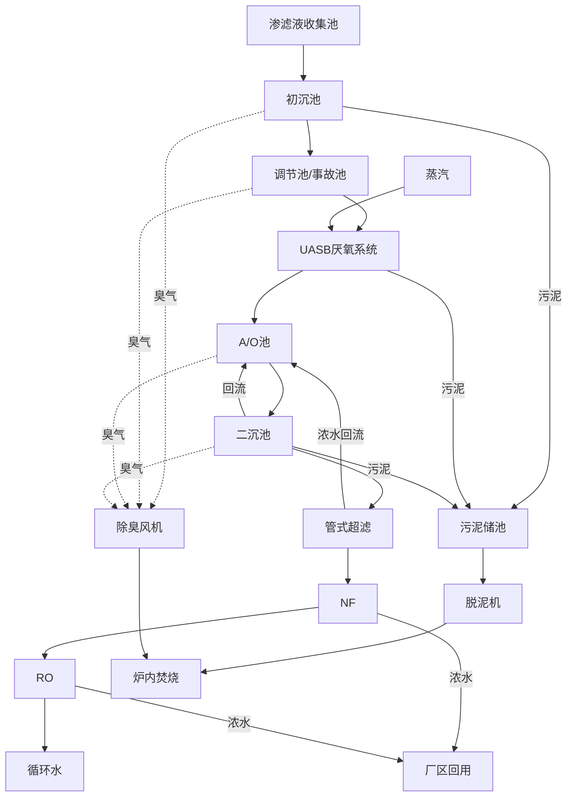

# 一、安全环保

渗滤液处理站主要处理垃圾渗滤液，将渗滤液这种高浓度废水处理达标，满足回用或者排放标准。

渗滤液处理站有各式各样的大型设备和仪表，只有保证这些设备和仪表安全、正常运行，充分发挥这些设备的工作潜能，才能保障整个渗滤液处理站的正常运转。设备、系统的安全正常运行是建立在生产一线员工的人身安全基础上的，因此只有经过规范的安全培训，熟知安全生产制度并严格执行，才能保障人身、设备的安全。

## 渗滤液现场危险点源的辨识与分布

1. 职业中毒危险点分布情况。废水在管网输送时已处于缺氧状态，在处理过程中污水中的硫化氢、二硫化碳、甲烷、氨气、一氧化碳等有毒有害气体将产生、溶解、沉积或溢出，因此人要进入以下区域时会发生中毒事件：调节池、预处理、厌氧罐、污泥脱水间、A/O池，渗滤液沟道间。生产过程中使用的盐酸、氨水、化验室使用的分析试剂吸入也将发生中毒事件。
2. 触电危险点分布情况。生产区域有高低压变配电系统，操作人员在操作过程中，由于操作不当、设备故障及接地防雷保护系统不在安全状态时容易发生触电伤亡事故。主要部位为：现场操作电控柜，中心配电室、膜车间配电室等。
3. 火灾危险点源分布情况。除工艺构建物外还配套建设附属构筑物，当构筑物电源老化、雷击、电器使用不当，使用明火作业及其他不安全行为时会发生火灾危险：办公楼、高低压变电所、鼓风机房、加药间、厌氧池（罐）、A/O池、泵房、配电室、污泥脱水间。
4. 爆炸危险点源分布情况。渗滤液站处理过程中产生的沼气不仅是有毒有害气体，而且是易燃易爆气体，因此人员进入调节池、预处理车间、厌氧池（罐）、除臭风机房、污泥脱水间、A/O池、膜车间空压机房、鼓风机区域工作时必须采取有效措施，开具动火证后方可作业。生产过程中使用的带有高压容器或管道的设备（空压机、鼓风机）由于安全装置失效可能发生爆炸事故。
5. 溺水危险点源分别情况。污水处理的过程需要一定的停留时间，处理构筑物的有效水深一般5～10米，人落入后由于水中含有有毒有害气体和污泥，可能造成溺水伤亡事故。主要构筑物是：调节池、初沉池、厌氧罐、A/0池、超滤产水池、纳滤产水池、反渗透产水池、污泥储池、污水池。
6. 坠落危险点源分布情况。渗滤液站构筑物在构筑物顶部距地面4～6米，部分构筑物将达到10米以上，构筑物的池深一般也有3～6米，操作人员不慎坠落池内或地上，可能造成摔伤事故。主要构筑物是：调节池、预处理、厌氧池（罐）、A/O池、污泥储池。
7. 机械伤害危险点源分布情况。各系统进出入提升泵、搅拌机、排泥泵、加药泵，污泥搅拌机，污泥螺杆泵、螺旋挤压机、鼓风机，行动，电动闸门、除臭风机，其转动部件会对人造成机械伤害，行车吊装的物品或钢丝绳断裂会造成其中伤害。

### 1、沼气

* 主要成分是甲烷55%~70%，其余为二氧化碳25%～40%、少量的氧气、氮气和硫化氢等；
* 甲烷爆炸范围——标态下，体积比率5～15%;
* 爆炸具备三个条件：一是甲烷浓度，一般在5%～15%之间。其次是甲烷引火温度，一般认为甲烷的引燃温度为650～750C。明火、电气火花、吸烟甚至撞击磨擦产生的火花等，都可以引燃甲烷。第三是氧气浓度，氧气浓度增加，爆炸极限范围扩大，氧气浓度降低到12%,甲烷混合气体即失去爆炸性，遇火也不爆炸。

### 2、硫化氢

* 硫化氢，是一种易燃的酸性气体，浓度低时气味如臭蛋；浓度高时麻痹嗅觉神经，闻不到味道。监测数据：硫化氢（H₂S）4000～5000mg/m³;
* 急性剧毒物质，吸入少量高浓（1000mg/m³）数秒钟，很快出现急性中毒，呼吸加快后呼吸麻痹而死亡。

### 3、气体泄漏燃烧

沼气（甲烷）的使用、贮存、运输等装置、设备、管线泄漏到环境中，是爆炸引起燃烧还是燃烧导致爆炸，**气形成爆炸性混合系统之后才遇到**由泄漏与点火的先后顺序及燃烧中装置状态所决定。如果气体在泄漏的同时被点燃，将会在泄漏处燃烧；**如果泄漏到空气中达一定量与空火源，将首先发生爆炸**，泄漏部位在爆炸之后持续燃烧。

泄漏燃烧有两种情况：一是气体泄漏速度大于或等于气体燃烧速度，则会**喷射燃烧**；二是泄漏速度小于燃烧速度，则会**回火以致系统内爆炸**。

氧气浓度（%体积）-征兆（大气压力下）

* 100%——致命/6分钟
* 50%——致命/4～5分钟经治疗可痊愈
* 23.5%——富氧，有强烈爆炸危险
* 20.9%——氧气浓度正常
* 19.5%——氧气最小允许浓度
* 15～19%——降低工作效率，并可导致头部、肺部和循环系统问题
* 10～12%——呼吸急促，判断力丧失，嘴唇发紫
* 8～10%——智力丧失，昏厥，无意识，脸色苍白，嘴唇发紫，恶心呕吐
* 6～8%——8分钟
* 4～6%——40秒内抽搐，呼吸停止，死亡

# 二、渗滤液基础知识

## 垃圾渗滤液的特性

### 1、属高浓度有机废水成分复杂

垃圾焚烧厂收集的主要是城镇居民生活垃圾，经过几天发酵腐熟以提高热值后沥出渗滤液，即俗称“渗滤液”。相对于垃圾填埋场而言，焚烧厂的渗滤液属新鲜的原生渗滤液，未经厌氧发酵、水解、酸化过程，污染物浓度高、成分复杂，内含如苯、茶、菲等杂环芳烃化合物、多环芳烃、酚、醇类化合物、苯胺类化合物等难降解化合物，呈黄褐色或灰褐色。一般而言，垃圾渗滤液中CODcr、BOD₅的浓度、BOD₅/CODcr，比随垃圾存放的“年龄”增长而降低。

垃圾焚烧厂渗滤液的有机物污染物浓度很高。一般情况下，CODcr在30000～70000mg/L，BOD₅在20000～45000mg/L。除此之外，还有大量其他的金属、无机污染物，依各地方的具体情况不同而不同。

### 2、水质、水量变化大

垃圾焚烧厂渗滤液产生量及成份受诸多因素影响，具有很大的不确定性。由于季节、运输条件、运行管理等因素的影响，垃圾焚烧厂渗滤液的水量变化很大。一般情况下，冬季干旱季节水量较少，污染物浓度高；夏季多雨季节水量较多，污染物浓度较低。

### 3、营养比例失调

垃圾焚烧厂渗滤液属原生渗滤液，BOD₅/CODcr，超过0.4，一般情况下可生化性较好，属较易生物降解的高浓度有机废水。对于处理系统而言，垃圾焚烧厂渗滤液中营养物比例失调，主要体现在相对COD、BOD指标而言，磷含量偏低，氨氮含量偏高。

## 渗滤液处理站的工艺流程及处理规模

2017年6月调试完成，开始接收渗滤液。2017年11月技术改造，开始接收填埋场渗滤液。设计处理规模250m3/d，采用预处理+厌氧（IOC）+缺氧/好氧（A/O）+超滤+纳滤+反渗透工艺，出水执行《城市污水再生利用 工业用水水质标准》（GB/T 19923-2005）表1规定的敞开式循环冷却水系统补充水水质标准，产水（反渗透膜透过液）回用于焚烧发电厂循环冷却水补水，纳滤及反渗透浓缩液回用于焚烧发电厂石灰浆制备、捞渣机、反应塔等各用水点，实现“全回用、零排放”。

## 工艺系统流程图

# 三、各处理工艺基本知识

## 1、预处理系统介绍

预处理系统由调节池、初沉池、自清洗过滤器等部分组成。

* 自清洗过滤器：利用滤网过滤水中悬浮物质，过滤的杂质通过内部搅拌机进行刮除，通过底部排空阀进入污泥储池。相较传统袋式过滤器减少了操作量。
* 初沉池：主要功能为去除水中的悬浮物，原理是利用悬浮物自身的重力沉降作用，使得悬浮物等大颗粒物质在沉淀池内进行沉淀分离，降低水中的SS（固定悬浮物浓度）。沉淀池的上清液进入出水池，经由提升泵送至厌氧系统，沉淀产生的污泥由排泥泵送至污泥浓缩池进行后续脱水处理。
* 调节池：主要功能为调节水量、水质，缓解来水不均匀有可能给后续处理系统带来的负荷冲击。

### 预处理系统主要功能参数

* 调节池：调节池共2座，设计总有效容积2200m³。采用半地下式钢筋混凝土结构，有效水深8m。调节池内设置液下搅拌器以保持整池的内部循环流动，避免池体内部产生死角而形成固体颗粒的沉淀沉积。
* 初沉池：通过池内布置的布水器，水流进入池内后冲击中心筒筒壁。颗粒物质在重力作用下下沉至池底排出，上清液通过溢流围堰溢流。

注：调节池及初沉池主要设备及参数详见《渗滤液处理站运行规程》及《设备台账》

## 2、高效厌氧反应器介绍

渗滤液厌氧系统采用的是由光大科技公司自主研发的高效厌氧反应器，设计规模250m³/d，共2座厌氧反应器。

该高效厌氧反应器是在第三代IC厌氧反应器基础上研发而成，增加了外循环设备及外循环管路，采用连续进水、连续出水的运行方式，通过外置式循环泵经外循环使经过预处理系统处理后的渗滤液与厌氧反应器内第一反应室出水混合后再通过底部布水管道均匀喷射到反应器底部，保证渗滤液与污泥能充分的混合，从而提高处理效率。

该反应器具有有机负荷高、抗水力冲击能力强、占地面积小等特点。运行操作简便，电耗成本相对UBF系统要低，且厌氧反应器密封性较好，无臭气逸散。

#### 高效厌氧反应器构造

1.进水管；2.外循环设备；3.第一反应室三相分离器；4.第二反应室三相分离器；5.沼气提升管；6.污泥回流管；7.第一反应室沼气收集管；8.第二反应室沼气收集管；9.气液分离器；10.沼气总管；11.出水管；12.排泥管

## 3、A/O工艺流程

A/O系统由A池、O池、曝气系统、排水回流系统等部分组成。

### A/O工艺功能描述

A/O工艺法也叫缺氧好氧工艺法，用于脱氮除磷；A是缺氧段，进行反硝化反应；O是好氧段，用于去除水中的有机物，进行硝化反应，通过排除磷。

A/O工艺的主要特点为流程简单，无需外加碳源并以原液为碳源，运行费用较低；反硝化在前，硝化在后，设内循环，以原污水中的有机底物作为碳源，效果好，反硝化反应充分；曝气池在后，使反硝化残留物得以进一步去除，提高了处理水质；A段搅拌，只起使污泥悬浮，而避免DO的增加。O段的前段采用强曝气，后段减少气量，使内循环液的DO含量降低，以保证A段的缺氧状态。

曝气系统采用射流曝气和鼓风曝气组合曝气方式向待处理污水充加足够的氧气，使好氧菌能有足够的氧气利用水中有机物进行新陈代谢，从而使水中的污染物变成二氧化碳和水等无害无机物。

目前A池由于有氨气等气体产生，考虑到安全、环保等因素，对A池加盖密封，并增加臭气收集管道，由除臭风机统一收集后输送至焚烧厂无害化处理。

## 4、超滤系统

### 功能描述

超滤系统采用外置式管式超滤膜，与A/O系统组合成MBR系统。A/O系统出水先经过袋式过滤器，待拦截大颗粒物质和毛发等纤维物后进入超滤循环系统，超滤产水进入超滤产水池，进入后续系统进一步处理，超滤浓液回到前端A/O系统。

超滤系统的功能是通过拦截作用进一步去除生化系统未降解的有机物、COD、BOD等污染物质。

### 系统介绍

超滤系统设计处理能力为300m³/d，膜通量70LMH，共2套。超滤系统采用外置管式超滤膜，选用滨特尔管式膜8mm组件。

## 5、纳滤系统

### 功能描述

纳滤膜技术作为污水治理及回用中一项实用技术，常用于二级处理后的深度处理中。纳滤系统通过拦截作用将水中的部分难降解有机物、二价及其以上的金属离子截留，其主要功能是降低水中有机物、二价离子等物质含量，能够有效降低色度；纳滤产水进入纳滤产水池进行后续处理，纳滤浓缩液外排至浓缩液储池进行回用。

经MBR处理的污水溶解盐、小分子及大部分离子仍难以脱除，必须经纳滤才能将这些组分脱除，从而满足回用或新标准排放的要求。二级出水经纳滤处理后，水回收率75%以上，COD和BOD的去除率85%以上。

### 系统介绍

纳滤系统设计处理能力为250m³/d，回收率为80%，共1套，纳滤系统选用美国陶氏NF270-400。

## 6、反渗透系统

### 功能描述

反渗透系统通过拦截作用将水中的部分难降解有机物、一价及以上的金属离子截留，其主要的功能是降低有机物、盐分等物质含量，能够有效降低色度；反渗透产水进入回用水池用于循环冷却水补水，反渗透浓缩液外排至浓缩液储池进行回用。

### 系统介绍

反渗透系统设计处理能力为250m³/d，回收率为75%，共1套。反渗透系统选用陶氏海淡膜。

## 7、污泥处理系统

1. **污泥浓缩**：初沉污泥、厌氧及A/0系统的剩余污泥排泥设备集中收集至污泥浓缩池，在浓缩池内经过浓缩沉降和停留。
2. **污泥脱水**：污泥储池底部经浓缩后的污泥经污泥螺杆泵压入螺旋挤压脱水机进行机械脱水。
3. **污泥焚烧**：脱水减容后的污泥含水率在75%-80%，这部分污泥通过管道输送方式送至焚烧厂污泥斗内通过和生活垃圾掺混后最终焚烧处理。

# 四、预处理系统运行操作

1. 调节池进水：由于焚烧厂、填埋场渗滤液分开输送，当值长通知进水时，需检查相应进水管路上阀门是否打开。操作步骤为：打开进水主管路进水手动阀及调节池进水阀，确认无误后通知值长已具备进水条件。

   根据调节池液位合理调整进水量和进水顺序，调节池最高液位不得超过8m。

2. 搅拌：调节池、事故池各安装两台潜水搅拌机，需保持搅拌机常开。

3. 调节池出水：根据调节池液位和系统处理量合理调整出水流量和每班出水总量。一般要均衡每班处理量，避免处理负荷大幅波动。

4. 初沉池排泥：每天白班进行预处理排泥，排泥时间根据渗滤液处理量和SS去除率确定。

5. 自清洗过滤器清理：白班进水前需要对自清洗过滤器进行反冲洗排污操作，将过滤器内过滤物反冲进入污泥储池。自清洗过滤器也可设置定时冲洗，进水一定时间后旁路阀自动打开，过滤器自动进行冲洗，冲洗间隔时间和冲洗时间均可视实际情况自行设定。

## 厌氧系统运行操作

### 1、厌氧系统运行操作知识

1. 厌氧进水：渗滤液厌氧系统采用连续或间隔进水方式，进水量视渗滤液产量进行确定，非极端情况不要超过设计进水负荷。正常运行时2台厌氧罐同时进水，同时开启外循环，循环量一般不超过150m³/h。厌氧进水流量可根据处理量通过进水调节阀调节。
2. 厌氧出水：厌氧罐从底部进水，从顶部溢流围堰出水。每台厌氧罐单独对应一个A/O池，特殊情况下也可以两台厌氧罐向一个A/O池进水。
3. 厌氧排泥：厌氧系统排泥前需要停止进水，避免未经处理的原液通过排泥排出。厌氧罐排泥量需要根据罐内污泥量确定，一般而言，厌氧罐内污泥浓度低于30g/L不需要排泥，高于30g/L视情况进行排泥。
4. 氧化还原电位：水解阶段氧化还原电位为-100～+100mv，产甲烷阶段的最优氧化还原电位为-150～-400mv。因此，应控制进水带入的氧的含量，不能因以对厌氧反应器造成不利影响。
5. 营养物：厌氧反应池营养物比例为 C:N:P=(350-500):5:1。
6. 有毒有害物：抑制和影响厌氧反应的有害物有三种：
   1. 无机物：有氨、无机硫化物、盐类、重金属等，特别硫酸盐和硫化物抑制作用最为严重；
   2. 有机化合物：非极性有机化合物，含挥发性脂肪酸（VFA）、非极性酚化合物、单宁类化合物、芬香族氨基酸、焦糖化合物等五类。
   3. 生物异型化合物，含氯化烃、甲醛、氰化物、洗涤剂、抗菌素等。

### 3、系统运行操作

#### A/O系统行操作知识

1. 进水：A/O池内水位控制在6-8m，一般控制7-8米。池内液位一部分为泡沫，运行中要注意判断实际液位。池内泡沫太多会导致冒池，为防止泡沫外溢，消泡系统需24h投运，必要时投加消泡剂。曝气系统以鼓风+射流曝气。
2. 出水：A/O系统保持进水、出水平衡，根据进水量合理调整超滤膜运行工况。
3. 排泥：A/O系统排泥通过二沉池排泥泵进行。每班均需进行排泥，排泥量由处理量、污泥浓度确定。
4. 温度控制：为保证微生物的活性以及超滤膜的运行要求，O池温度一般不超过35℃，夏季需开启冷却塔降温。

#### A/O工艺主要控制条件

1. 营养物质的平衡

   营养物质的平衡对微生物生长至关重要，当某些元素不足或缺少时会影响活性污泥的正常功能发挥。当碳源不足时会使得活性污泥生长不良，污泥松散、絮凝性不好。好氧池微生物所需营养元素中C、N、P比例控制100:5:1。

2. 溶解氧的含量
   在好氧生物处理中，为维持好氧微生物的代谢要求，需向曝气池补充氧气，好氧池混合液溶解氧浓度一般控制在2-5mg/L。

3. pH值

   曝气池中不利的pH值可引起细胞膜电荷的变化，从而影响微生物对营养物质的吸收以及代谢过程中酶的活性；改变营养物质的供给性和有害物质的毒性。此外，不利的pH值条件不仅影响微生物的生长，甚至影响微生物的形态。PH应控制在7-9。

4. 水温

   水温改变，影响在生物体内所进行的许多生化反应，因而影响生物的代谢活动。此外，水中温度改变可引起其他环境因子变化，从而影响微生物的生命活动。温度一般控制在30-35℃。

### 4、膜处理系统运行操作

1. 膜系统运行：超滤、纳滤、反渗透膜处理系统分为手动、自动控制方式。自动控制分为三种，运行自动控制、冲洗自动控制和化学清洗自动控制。当采用自动控制时，应在PLC控制面板上将控制方式打到“自动”档。手动控制操作详见《渗滤液处理站运行规程》。
2. 冲洗：膜污染比较严重或异常原因需停机时，需对膜系统进行清水冲洗，冲洗运行方式详见《渗滤液处理站运行规程》。
3. 化学清洗：当膜污染较严重时，应对膜进行清洗，清洗过程分为两种，酸洗和碱洗。在清洗过程，首先进行酸洗。膜系统酸清洗后，用水冲洗，然后进行碱性清洗，具体运行方式详见《膜系统清洗手册》。

### 5、污泥处理系统运行操作

1. 絮凝剂制备
2. 脱泥机启停
3. 污泥螺杆泵启停
4. 脱泥机清洗
5. 常见故障：a.脱泥机跑泥；b.出泥管路堵塞；c.污泥不絮凝；d.进料、药报警等

### 6、除臭系统运行操作

#### 除臭风机启动前准备

1. 检查除臭风机进、出口阀门，确认阀门打开后方可开启除臭风机。
2. 检查电源装置是否安全、可靠，电压是否符合规定，现场控制系统是否正常。
3. 检查电缆线有无破损、折断，接线盒处的密封是否完好，如发现不合规定处妥善处理。

#### 启动与运行管理

1. 开启除臭风机。
2. 操作人员在除臭风机开启至运行稳定后方可离开控制现场。
3. 一般情况下，不要频繁开、关除臭风机。

#### 停机

1. 关停除臭风机。关闭除臭风机进、出口阀门。
2. 关闭供电系统的电源。

#### 系统检修

除臭系统管路检修时，停运除臭风机，关闭风机进、出口阀门。关闭各个臭气电源系统除臭管路阀门。将各系统与除臭系统隔离。

