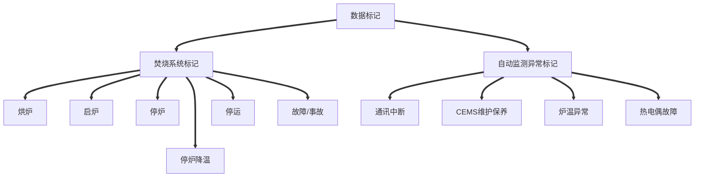

# 自动监控数据标记规则

当焚烧系统工况出现异常或自动监测数据出现联网异常、零值、恒值、超量程以及超过污染物限值等情形时，垃圾焚烧厂应在1小时内进行数据标记。未对超标异常的自动监测数据做出标记的接到电子督办单后，应当及时核实、排除故障、并在6小时内按操作提示如实填报完成数据标记。

## 一、焚烧炉工况标记

一般情况下，焚烧炉工况呈现为：正常运行→停炉→停炉降温→（停运）→烘炉→启炉→正常运行。启炉、正常运行和停炉时，炉膛温度不应低于850℃。

焚烧炉工况标记包括“烘炉”“启炉”“停炉”“停炉降温”“停运”“故障”和“事故”等7种标记。

1. 在未投入垃圾的情况下，用辅助燃烧器将炉膛温度升至850℃以上的时段，可标记为“烘炉”

   **标记为“烘炉”的，一般情况下，炉膛温度起点应低于400℃；当“烘炉”的前序标记为“停炉降温”“故障”或“事故”时，允许炉膛温度起点高于400℃。标记为“烘炉”的，一般情况下，每次时长不应超过12小时；炉内耐火材料修复或改造后，每次时长不应超过168小时。**

2. 完成烘炉后，投入垃圾至工况稳定，且炉膛温度保持在850℃以上的时段，可标记为“启炉”

   标记为“启炉”的，每次时长不应超过4小时。

3. 停止向焚烧炉投入垃圾至炉膛内垃圾完全燃尽，且炉膛温度保持在850℃℃以上的时段，可标记为“停炉”

4. 焚烧炉炉膛内垃圾完全燃尽后，炉膛温度继续降低的时段，可标记为“停炉降温”。

   标记为“停炉降温”的，一般情况下，炉膛温度应从850℃以上降至**400℃以下**；当“停炉降温”的后序标记为“烘炉”时，允许该标记时段结束时炉膛温度高于400℃。

5. 1.5焚烧炉停止运转的时段，可标记为“停运”。

   标记为“停运”的，烟气含氧量不应低于当地空气含氧量的2个百分点。

6. 焚烧炉发生故障或事故的时段，可标记为“故障”或“事故”。标记为“故障”或“事故”的，每次时长不应超过4小时，并简要描述故障或事故起因。

7. 垃圾焚烧厂在企业端未作上述标记的，焚烧炉视为为正常运行。

## 二、自动监测异常标记

自动监测异常标记包括“烟气排放连续监测系统维护（以下简称CEMS维护）”“通讯中断”“炉温异常”和“热电偶故障”等4种标记。

1. CEMS校准、故障、检修以及数采仪故障、检修的时段，可标记为“CEMS维护”。

   标记为“CEMS维护”的，应同时备注维护的类型，并简要描述维护过程，保存运行维护记录备查。

2. 网络故障、通讯设备故障等原因导致数据无法报送至生态环境主管部门的时段，可标记为“通讯中断”。标记为“通讯中断”的，应在通讯恢复后补传自动监测数据。

3. 正常运行时，因不可抗力导致焚烧炉炉膛温度低于850℃的时段，可标记为“炉温异常”。

   标记为“炉温异常”的，应备注炉膛温度异常的原因以及提前采取控制烟气污染物排放的有效措施（如加强垃圾预处理，启动辅助燃烧器、加大活性炭喷入量等），并保存运维记录和台账资料备查。

4. 因热电偶结焦、损坏等情况导致热电偶测量温度不能反映实际温度的时段，可标记为“热电偶故障”。标记为“热电偶故障”的，应备注故障测点位置、故障原因、维修或更换过程，保存运行维护记录和台账备查。

5. 垃圾焚烧厂在企业端未作上述标记的，自动监测数据视为有效。

# 标记操作&监控数据应用管理&排污许可管理条例

焚烧炉工况和自动监测异常可分别标记，分别包括事前标记或事后标记。

1. 事前标记。垃圾焚烧厂可根据生产计划、CEMS维护计划等，在企业端提前标记。

2. 事后标记。当出现焚烧炉工况改变，自动监测异常，自动监测数据出现零值、恒值、超量程以及超过污染物限值等情形时，垃圾焚烧厂应当于1小时内核实并标记。

3. 未及时标记的，由生态环境部污染源监控平台向垃圾焚烧厂发出电子督办单，并抄送所在地县级以上生态环境主管部门。垃圾焚烧厂在接到电子督办单后，应当及时核实，并在**6小时**内按操作提示如实进行标记。

4. 垃圾焚烧厂应当按照生活垃圾焚烧发电厂自动监测数据标记规则（以下简称标记规则），及时在自动监控系统企业端，如实标记每台焚烧炉工况和自动监测异常情况。自动监测设备发生故障，或者进行检修、校准的，垃圾焚烧厂应当按照标记规则及时标记；未标记的，视为数据有效。

5. 生态环境主管部门可以利用自动监控系统收集环境违法行为证据。自动监测数据可以作为判定垃圾焚烧厂是否存在环境违法行为的证据。

6. 一个自然日内，垃圾焚烧厂任一焚烧炉排放烟气中颗粒物、氮氧化物、二氧化硫、氯化氢、一氧化碳等污染物的自动监测日均值数据，有一项或者一项以上超过《生活垃圾焚烧污染控制标准》（GB18485）或者地方污染物排放标准规定的相应污染物24小时均值限值或者日均值限值，可以认定其污染物排放超标。

   自动监测日均值数据的计算，按照《污染物在线监控（监测）系统数据传输标准》（HJ212）执行。

   对二噁英类等暂不具备自动监测条件的污染物，以生态环境主管部门执法监测获取的监测数据作为超标判定依据。

7. 垃圾焚烧厂应当按照国家有关规定，确保正常工况下焚烧炉炉膛内热电偶测量温度的5分钟均值不低于850℃。

8. 生态环境主管部门开展行政执法时，可以按照监测技术规范要求采集一个样品进行执法监测，获取的监测数据可以作为行政执法的证据。

   生态环境主管部门执法监测获取的监测数据与自动监测数据不一致的，以生态环境主管部门执法监测获取的监测数据作为行政执法的证据。

10. 根据本规定第六条认定为污染物排放超标的，依照《中华人民共和国大气污染防治法》第九十九条第二项的规定处罚。对一个自然月内累计超标5天以上的，应当依法责令限制生产或者停产整治。（**由县级以上人民政府生态环境主管部门责令改正或者限制生产、停产整治，并处十万元以上一百万元以下的罚款；情节严重的，报经有批准权的人民政府批准，责令停业、关闭**）

    垃圾焚烧厂存在下列情形之一，按照标记规则及时在自动监控系统企业端如实标记的，不认定为污染物排放超标：

    （一）一个自然年内，每台焚烧炉标记为“启炉”“停炉”“故障”“事故”，且颗粒物浓度的小时均值不大于150毫克/立方米的时段，累计不超过60小时的；

    （二）一个自然年内，每台焚烧炉标记为“烘炉”“停炉降温”的时段，累计不超过700小时的；

    （三）标记为“停运”的。

11. 垃圾焚烧厂正常工况下焚烧炉炉膛内热电偶测量温度的五分钟均值低于850℃，一个自然日内累计超过5次的，认定为“未按照国家有关规定采取有利于减少持久性有机污染物排放的技术方法和工艺”，依照《中华人民共和国大气污染防治法》第一百一十七条第七项的规定处罚。（**处一万元以上十万元以下的罚款**）

    下列情形不认定为“未按照国家有关规定采取有利于减少持久性有机污染物排放的技术方法和工艺”：

    （一）因不可抗力导致焚烧炉炉膛内热电偶测量温度的五分钟均值低于850℃，提前采取了有效措施控制烟气中二噁英类污染物排放，按照标记规则标记为“炉温异常”的;

    （二）标记为“停运”的。

12. 垃圾焚烧厂违反本规定第三条第三款，导致自动监测数据缺失或者无效的，认定为“未保证自动监测设备正常运行”，依照《中华人民共和国大气污染防治法》第一百条第三项的规定处罚。（**处二万元以上二十万元以下的罚款；拒不改正的，责令停产整治**）

    下列情形不认定为“未保证自动监测设备正常运行”：

    （一）在一个季度内，每台焚烧炉标记为“烟气排放连续监测系统（CEMS）维护”的时段，累计不超过30小时的；

    （二）标记为“停运”的。

13. 垃圾焚烧厂通过下列行为排放污染物的，认定为“通过逃避监管的方式排放大气污染物”，依照《中华人民共和国大气污染防治法》第九十九条第三项的规定处罚：（**由县级以上人民政府生态环境主管部门责令改正或者限制生产、停产整治，并处十万元以上一百万元以下的罚款；情节严重的，报经有批准权的人民政府批准，责令停业、关闭**）

    （一）未按照标记规则虚假标记的；

    （二）篡改、伪造自动监测数据的。

14. 垃圾焚烧厂任一焚烧炉出现污染物排放超标，或者未按照国家有关规定采取有利于减少持久性有机污染物排放的技术方法和工艺的情形，持续数日的，按照其违法的日数依法分别处罚；不同焚烧炉分别出现上述违法情形的，依法分别处罚。

15. 垃圾焚烧厂5日内多次出现污染物超标排放，或者未按照国家有关规定采取有利于减少持久性有机污染物排放的技术方法和工艺的情形的，生态环境主管部门执法人员可以合并开展现场调查，分别收集每个违法行为的证据，分别制作行政处罚决定书或者列入同一行政处罚决定书。

16. 篡改、伪造自动监测数据或者干扰自动监测设备排放污染物，涉嫌构成犯罪的，生态环境主管部门应当依法移送司法机关，追究刑事责任。

17. 垃圾焚烧厂因污染物排放超标等环境违法行为被依法处罚的，应当依照国家有关规定，核减或者暂停拨付其国家可再生能源电价附加补贴资金。

18. 生活垃圾焚烧发电厂自动监测数据标记规则由生态环境部另行制定。

19. 排污单位应当按照排污许可证规定和有关标准规范，依法开展自行监测，并保存原始监测记录。原始监测记录保存期限不得少于5年。

    排污单位应当对自行监测数据的真实性、准确性负责，不得篡改、伪造。

    将监测记录上传至平台即可。

    关键是要按许可证载明的频次、项目和自行监测方案开展监测。