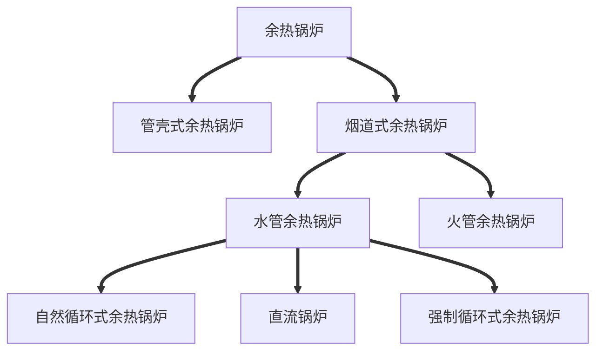

# 一、余热锅炉的定义与分类

## 余热锅炉的定义和作用

余热锅炉，是指利用各种工业过程中产生的**废气、废料或废液中的余热及其可燃物质燃烧后产生的热量**把水加热到一定温度的锅炉；具有烟箱、烟道余热回收利用的锅炉也称为余热锅炉，余热锅炉通过余热回收可以生产热水或蒸汽来供给其它需要的地方使用。

## 余热锅炉的工作原理

高温余热烟气流经水冷壁、蒸发器、过热器和省煤器，利用换热使高温烟气降低到合理范围内的排烟温度，其换热过程中所释放出的热量通过热交换的方式使锅炉给水变成过热蒸汽。

## 余热锅炉的分类

根据结构形式，余热锅炉可分为管壳式和**烟道式**余热锅炉：

1. 管壳式余热锅炉，烟气在受热管管内流动，水在管外的锅壳中流动，热量通过管壁传递给管外的水。

2. 烟道式余热锅炉利用高温气体通过炉膛，加热炉膛内装设管束，将管束内流动的水加热汽化。

3. 根据高温气体通过管内或管外，余热锅炉可分为火管余热锅炉和**水管余热锅炉**：

   * 火管余热锅炉：高温气体在炉管内流动。锅炉给水从汽包经下降管流入锅炉底部，在管壁受热，变为汽水混合物，由上升管返回汽包。这种余热锅炉结构简单，因壳体承受蒸汽压力，适用于生产压力不高的蒸汽。

   * 水管余热锅炉：锅炉给水流过管内，高温气体流经管外。因锅炉的壳体不承受蒸汽压力，适用于生产高压蒸汽。根据介质的流动形式，水管余热锅炉又可分：

     1. 自然循环式：管内饱和水流动的动力是下降管内的水与上升管内的汽水混合物之间的密度差产生，该形式锅炉为保证一定的汽水循环量，汽包需有足够的安装高度。

     2. 强制循环式：在下降管路中安装循环泵，借以提高管内饱和水的流速，防止汽水循环停滞造成传热过程变差或停滞。

     3. 直流锅炉：没有汽包，给水在给水泵的作用下依次通过加热、蒸发、过热等各个受热面，因各个受热面没有明确的固定的界限，故称为直流锅炉。

        自然循环式锅炉工程应用的最高压力为11.9MPa：当蒸汽压力超过16MPa时，自然循环式锅炉因受循环流速等因素影响，可靠性能下降，因此会采用强制循环式锅炉，当蒸汽压力超过19.6MPa时，直流锅炉更为适用。

   #### 直流锅炉的特点：

   1. 受热面布置灵活性较高，金属消耗量较小，锅炉启动、停止的速度快；水容量及蓄热能力较小，锅炉负荷受外界因素影响较大。
   2. 直流锅炉因设计结构原因，无法实现连续排污，故而对锅炉给水水质要求非常高；同时因需要保证足够压头来维持汽水循环，给水泵均使用大功率电机，能耗较高。

# 二、自然循环锅炉原理及组成

## 自然循环式锅炉的原理

在一个闭合的管道回路中，由于**工质自身的密度差造成的重位压差**，推动工质流动的现象，称为**自然循环**。重位压差是由下降管和上升管（水冷壁管）内工质密度不同造成的。自然循环推动力的实质是由重位压差造成的循环推动力克服了上升系统和下降系统的流动阻力，推动工质在循环回路中流动。（压力越高，汽、水的密度差降低，工质循环流动速度越低）。

## 自然循环锅炉的组成

自然循环锅炉由汽包、下降管、分配水管、蒸发器、水冷壁下集箱、水冷壁管、水冷壁上集箱、汽水混合物引出管、汽水分离器、蒸汽对流管束、（低、中、高）过热器和、汇汽集箱、省煤器等部件组成。

锅炉给水进入省煤器吸热后→进入汽包→汽包内饱和水沿下隆管流至水冷壁的下集箱（下降管位于烟道外部，不吸收烟气的热量）→直立管簇吸收烟气的热量，当水吸收烟气热量后就有部份水变成蒸汽，由于蒸汽的密度比水的密度要小得多，所以直立管内汽和水混合物的平均密度要小于下降管中水的密度，两者密度差形成了压差→汽水混合物沿上升管向上运动（烟道内部）→汽包，建立水的自然循环。

通俗来讲：**不吸热的下降管（下降管在炉外）内的水比较重，向下流动。直立管内的汽水混合物通过上升管（炉内）流动，形成连续产汽过程；此时水的流动不是靠外部提供的动力，而是靠流体的密度差而流动**，这种余热锅炉称为“自然循环余热锅炉”。其特点是运行和维修简单。

# 三、余热锅炉各部件的功能

### 汽包的定义：

水管锅炉中用以进行汽水分离、蒸汽净化、集成水循环回路，并蓄存炉水的筒形压力容器。称为汽包（或锅筒）。

### 汽包内部主要部件：

旋风分离器、顶冒、顶部波形板、多孔板、蒸汽清洗孔板、给水管、清洗水分离装置、加药管、连续排污管等。

### 汽包的作用：

1. 汽包与下降管、上升管连接**组成自然循环回路**；同时汽包又接收省煤器输送的锅炉给水；以及**向过热器输送饱和蒸汽**，所以汽包是锅炉内加热、蒸发、过热这三个过程的连接枢纽。
2. 将汽水混合物分离并对炉水进行连续排污，进而减少水垢生成，排出炉水中的杂质及多余盐分，保证锅炉蒸汽品质。
3. 存有一定容量的水与汽，具有一定的蓄热量，当锅炉工况变化时，能起缓冲稳定汽压的作用，提高锅炉运行的安全性。

### 旋风分离器的组成与工作原理及作用：

组成部分：由筒体、引入管、顶帽、溢流环、筒底导叶和底板等部件组成，主要作用为将饱和蒸汽与炉水分离。

### 旋风分离器内部结构及工作过程：

上升管中较高流速的汽水混合物，经引入管**切向**进入旋风分离器筒体而产生**旋转运动**，在离心力的作用下，将水滴抛向筒壁，使汽水初步分离。分离出来的水通过筒底四周导叶，向下进入**汽包水侧**；饱和蒸汽则向上流动，进入顶帽的**波形板**间隙中曲折流动，在离心力和惯性力的作用下，小水滴被抛到波形板上，在附着力作用下**形成水膜向下**流动。经筒壁流入汽包水容积，使汽水进一步分离，而饱和蒸汽从顶帽上方或四周引入汽包蒸汽空间。此外，由于水贴着筒体内壁旋转运动，不仅能清除介质的动能，还能防止高浓度的炉水形成泡沫。分离出来的水通过导叶排出，能保持水室平静和减少水室的含汽量，从而改善下降的工作条件。

水冷壁加热后的汽水混合物是通过汽包里的旋风分离器进行汽水分离，同时**减小蒸汽动能**，目的是减少冲击，分离的蒸汽再次经过上部的**百叶窗分离器**经过再次分离，最后再经过**波形板**过滤**水份和盐分**后进入过热器管束。

### 连续排污装置作用：

连续排污又称为表面排污，连续排污装置一般装设在旋风分离器底部附近（正常水位下80～100mm处），因蒸发过程大多数都发生在汽水分界面上，所以该层面的介质含盐量最多，通过联排装置可以减少炉水中的盐含量、碱含量等。

### 事故放水装置作用：

为防止汽包满水造成事故，因此汽包内还装有事故放水管，当水位超限时可以**自动**打开放掉多余的水，但它**不是装在最低点**（需锅炉厂家进行计算管径和安装位置），为预防锅炉干锅造成事故，所以正常运行时汽包一般保持正常水位在±50mm左右。

### 加药管系统的作用：

汽包中加入磷酸盐，使磷酸根离子与锅水中钙镁离子结合，生成**难溶于水，易于排污**的沉淀泥渣（**碱式磷酸钙**等），定期排污排除，使锅水保持一定的磷酸根，既不产生结垢和腐蚀，又保证蒸汽品质。

### 水冷壁的描述：

水冷壁是锅炉的主要受热部分，它由数排钢管组成，分布于锅炉炉膛的四周。它的内部为流动的水或汽水混合物，**外部**接受锅炉**炉膛的火焰**和**高温烟气**的热量。

### 水冷壁的作用：

1. 吸收炉膛中高温火焰或烟气的辐射热量，将部分炉水变成饱和蒸汽。
2. 使炉墙温度大大降低，优化了炉墙结构，减轻了炉墙重量。
3. 降低了炉膛出口处的烟气温度，防止或减小炉墙结焦。

### 下降管的作用：

下降管将汽包中的炉水**连续不断**地送入水冷壁下集箱，通过集箱输送至换热管束，保证了换热管束有**充足的水循环量**。为了保证水循环的可靠性，下降管自汽包引出后都布置在锅炉**外部**，管材不受热。

### 集箱的作用：

集箱也叫联箱，它**不是一个独立的部件**，而是水冷壁、省煤器、过热器等部件的组成部分，即分别有水冷壁集箱、省煤器集箱和过热器集箱等。在受热面布置中，集箱起到汇集、混合、分配工质的作用，**是受热面布置的连接枢纽**；按其所在位置可划分为**上集箱**和**下集箱**或**进口集箱**和**出口集箱**。

### 过热器的定义：

过热器是锅炉中将蒸汽从饱和温度进一步加热至**过热温度**的部件，又称**蒸气过热器**。

### 过热器分类及工作方式：

根据过热器按结构特点可分为蛇形管式、 屏式、墙式和包墙式；按传热方式可分为对流式、辐射式和半辐射式，它们都是由若干根并联管道和进出口集箱连接组成。过热器最为常用为蛇形管式，它具有比较密集的管组，外部受烟气的横向和纵向冲刷，高温烟气主要以对流的方式将热量传递给过热器管束的管壁，进而通过热交换加热管道中的蒸汽。

### 过热器的作用：

1. 加热饱和蒸汽至过热温度；
2. 提高蒸汽在汽轮机中的做功能力，提高热机循环效率（ $\eta=\frac W{Q_1}=\frac{(Q_1-Q_2)}{Q_1}=1-\frac{Q_1}{Q_2}$ ），其中 $Q_1$ 越大， $Q_2$ 越小，热效率越高，参考：热力学第一定律及卡诺循环效率；
3. 避免蒸汽品质与汽轮机运行参数不符，造成汽轮机叶片腐蚀，提高机组安全运行能力。

### 过热器的布置种类与使用效果：

过热器按蒸汽与烟气相对流来划分有**顺流**、**逆流**、**混合流**等几种布置类型。

1. 逆流布置：传热温差大，传热效果好，可减少受热面数量，节省金属消耗；但蒸汽高温段与烟气高温区重合，管壁温度高，易使金属过热，过热器安全性差。
2. 顺流布置：蒸汽高温段处于烟气低温区，管壁温度较低，工作比较安全；但传热温差小，传热效果较差，需要布置的受热面较多，消耗金属多，不经济。
3. 混合流布置：过热器在烟温较低区采用逆流布置，在烟温较高区采用顺流而下布置，集中了顺流和逆流布置的优点，传热温差较逆流低，比顺流高，安全经济，应用较广泛。

### 立式锅炉特点：

该锅炉设计合理，结构简单，操作、维修方便，占地面积小，基建投资少。

### 卧式锅炉特点：

1. 水容量大，热效率高，产汽快，蒸汽充足，使用寿命长。
2. 适用于蒸汽量较大、压力较高的锅炉。

### 省煤器的定义：

省煤器是安装于锅炉尾部烟道用于**回收余热**的一种装置；是一种将锅炉给水加热成**汽包压力下的饱和水**的受热面。由于它吸收低温烟气的热量，减少了排烟热损失，降低了烟气的排烟温度，节省了燃料，提高了锅炉运行效率，所以称之为省煤器。

### 省煤器的作用：

1. 吸收低温尾部烟道烟气的热量，降低排烟温度，减少排烟热损失，节省燃料。
2. 由于给水进入汽包之前先在省煤器加热，因此减少了给水在其他受热面的热能吸收，提高了锅炉效率。
3. 给水流经省煤器后温度得到提升，进入汽包后会减小汽包壁温差，从而使热应力相应减小，进而延长汽包使用寿命。

### 省煤器再循环的作用：

锅炉在**启动或停炉过程中**，由于锅炉**不需要上水或不需要连续上水**，省煤器中的水处于**不流动状态**，对省煤器的**冷却效果较差**，尽管这时烟气温度相对较低，但省煤器的**管壁温度相对较高**，管道内的**存水有汽化的可能**，易造成省煤器**局部受热增多**，造成管材老化、蠕变引发省煤器损坏。为了防止这种情况的发生，此时将再循环门打开，利用汽包与省煤器中工质的密度差，在汽包→再循环管→省煤器→省煤器引出管→汽包之间，形成自然循环，使省煤器中的水有所流动，提高对省煤器的冷却效果，达到保护省煤器的目的。

### 余热锅炉三大安全附件：

锅炉的三大安全附件是安全阀、压力表和水位计。

1. 安全阀的作用是当锅炉内蒸汽压力超过允许值时，安全阀自动开启，向外排汽，降低系统压力；当压力降到规定值时自动关闭，防止锅炉因超压而发生爆炸事故。
2. 压力表是用来测量锅炉内工质压力大小的仪表，司炉人员通过它来监视锅炉内蒸汽压力的变化，做出相应调整。
3. 水位计是用以反映汽包内水位状况的直读仪表，司炉人员通过它来监视汽包水位的变化，并做出相应调整。

# 四、自然循环过程中的故障类型

## 循环流速的定义：

在自然循环中，循环流速是指循环回路中上升管人口截面按工作压力对应下饱和水密度折算的水流密度。

循环流速是衡量水循环工作可靠性的指标之一，它的大小直接反应管内流动的水将沿管壁所生的气泡带走的能力。循环流速大，气泡能及时脱离管壁，工质对流换热系数大，管壁的冷却条件好，不会出现超温。但随着循环流速的升高，下降管和上升管的流动阻力也增大，对水循环正常运行同样是产生不利影响的。

## 自然循环过程中的故障类型：

自然循环的故障主要有**循环停滞**、**循环倒流**、**汽水分层**、**下降管带汽和膜态沸腾**。

### 1、循环停滞：

在同一循环回路中，当并联的各个上升管**受热不均匀**时，热交换弱的管中的汽水混合物密度，大于热交换强的管道内的汽水混合物的密度；在下降管供水有限的情况下，换热弱的管内可能流速降低，甚至处于停止不动的状态，这种现象被称为循环停滞。

#### 循环停滞的危害：

1. 当发生水循环停滞时，即使热负荷较低，管道内汽水混合物由于不断蒸发，蒸汽向上运动，水中的**含盐浓度增加**，会引起**管壁的结盐和腐蚀**。
2. 在引入汽包的上升管中发生循环停滞时，**水面以上管内工质蒸汽**，因冷却条件恶化不断升温，易造成超温爆管；而处于**汽水分界面下的水位部分**，管壁在交变热应力作用下，易产生金属疲劳进而损坏。

### 2、循环倒流：

当并联的各上升管**受热严重不均匀**时，换热效果最好的管中的汽水混合物上升力强，流速过快从而产生**虹吸作用**，致使换热效果最弱的管中汽水混合物朝着与正常循环方向**相反**的方向流动，这种现象被称为**循环倒流**。

#### 循环倒流的危害：

当管道内汽泡的上升速度与水的向下流动速度相等的时候，便会造成**气泡停滞**，形成“气塞”现象，进而导致产生气塞的管道段过热，引发爆管。

### 3、下降管带汽

#### 下降管带汽的原因：

1. 产物中存在挥发性组分。

   炼油反应器中的产物通常含有一些挥发性组分，这些挥发性组分会在下降管状态下发生汽化反应，从而产生大量的汽体。如果在下降管里的汽化反应很强，这就会在管道内形成较大的汽团集，引起压力升高和冲击波，对设备造成伤害。

2. 下降管内流速过快。

   下降管内部流速过大或过快也会导致管内的气体发生流动阻塞，从而导致管道内气体压力升高。这种情况下，下降管内的产物会出现带汽现象。

3. 下降管温度过高。

   下降管的温度如果过高，那么产物在下降管内就会因为温度过高而发生汽化反应。这种情况下产量就会变得更小，从而产生很多气体，造成下降管带汽现象。

#### 下降管带汽的危害：

带汽时，工质平均密度减少，流动阻力增大，影响水循环安全性

### 4、膜态沸腾：

定义：在自然循环锅炉中，外部加热的管道中，炉水自水冷壁下集箱沿上升管向上流动时，因受热与管壁接触的水在某一高度形成一些**气泡而局部沸腾**，汽泡的**进一步聚结**会扩展成连续的**蒸汽流**，形成**膜态沸腾**。

#### 膜态沸腾的危害：

水冷壁在受热时，靠近管内壁处的工质**首先**开始吸热、蒸发产生大量小气泡，正常情况下这些气泡**应及时被带走**，位于水冷壁管中心的水不断补充过来冷却管壁。但若管外部热交换很强，管内壁产生气泡的速度**远大于气泡被带走的速度**，气泡就会在管内壁聚集起来形成所谓的“**蒸汽垫**”，使管壁得不到及时冷却，进而发生爆管。