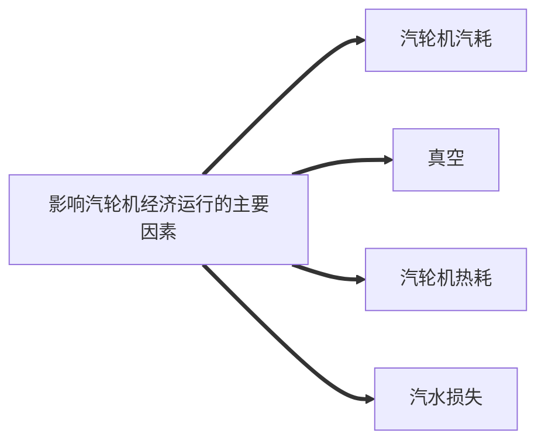

# 一、汽轮机工作原理

汽轮机是将蒸汽的热能转化为机械能的旋转动力机械，是蒸汽动力装置的主要设备之一。在喷嘴中将蒸汽的热能转变成蒸汽动能，压力降低、流速增加；在动叶中将蒸汽的动能转变成转子旋转的机械能。

蒸汽在喷嘴中发生膨胀，压力降低，速度增加，热能转变为动能。高速汽流流经动叶片3时，由于汽流方向改变，产生了对叶片的冲动力，推动叶轮2旋转作功，将蒸汽的动能变成叶轮轴旋转的机械能。这种利用冲动力作功的原理，称为冲动作用原理。

# 二、影响汽轮机经济运行的主要因素

### 汽耗对汽轮机经济运行的影响

在汽轮机运行过程中要十分注重影响汽耗问题的有关因素，在生产技术上进行革新，重视并减小汽耗，有助于汽轮机在使用中提升经济性和使用寿命。下面分析在实际应用中汽轮机最容易影响汽耗的因素：

#### 1、蒸汽压力对于汽耗的影响

在汽轮机蒸汽压力提升的过程中，各级烙降在这时基本是保持不变的，但此时汽轮机的蒸汽流量会减少，此时汽轮机的汽耗也会随之减少。但是蒸汽压力提升要有一定的限度，压力过大时会使危险工况超过额定负荷，还会使动叶片过负荷，有关转子在轴向的压力有所加大，造成很大的使用安全隐患。

当蒸汽压力过小时，会使汽轮机的汽耗增加，在经济角度方面看，如果降低蒸汽压力就必须增大蒸汽流量以保证汽轮机正常负荷。

#### 2、蒸汽温度对汽耗的影响

汽轮机的生产使用必须严格控制额定的汽压和汽温。汽轮机蒸汽温度的提升会使循环净工增大，热循环效率也会随之增加，降低汽耗量。而蒸汽温度的降低会使蒸汽的做功能力下降，导致汽轮机的汽耗大为增加，同时也会由于温度降低引起汽轮机末端蒸汽湿度增大，冲蚀作用比较明显，严重时还会造成汽轮机有关部件损坏，直接严重影响汽轮机正常运行，所以在实际应用过程中要严格控制额定温度。

#### 3、机组负荷平稳性对汽耗的影响

因为机组的设计都是依据额定负荷进行的，当机组负荷波动较大时，虽然其他有关运行参数维持设计值，但蒸汽流量偏离设计值，调节阀存在节流损失，相应汽轮机调节级、高压缸和末几级工况偏离设计值，机组的汽耗会随之增加。

### 真空对汽轮机经济运行的影响

真空系统运行的好坏对汽轮机运行的经济性有很大的影响。一方面由于真空降低,蒸汽的有效烙降将降低，在蒸汽量不变的情况下发电机出力下降，在发电机出力不变的情况下，机组的蒸汽流量需增大，机组的经济性下降；另一方面机组真空降低,排汽缸温度上升，机组冷源损失增大，循环热效率降低。一般情况下，真空度每变化1%，可是热耗率变化0.7～1%。在机组运行中应当注意分析机组凝汽器真空的变化，采取提高机组凝汽器真空的措施，尽量保持较高的真空度，降低机组运行终参数，提高机组运行经济性。

### 热耗对汽轮机经济运行的影响

提高回热效率。回热系统是指从汽轮机某些级中抽出部分作过功的蒸汽用来加热送往锅炉的给水以提高给水温度的系统，是最早也是最普遍用来提高机组效率的主要途径。

回热系统运行不正常表现为给水温度降低、各段抽汽参数不正常等方面。对单位质量的抽汽而言，低压抽汽回热做功将大于高压抽汽，故在多级回热系统中，应尽量多利用低压抽汽来代替高压抽汽，如回热系统工作不正常，使得部分本机蒸汽流入低一级抽汽中，高压抽汽排挤低压抽汽，造成机组热经济性降低。抽汽流入凝汽器还造成机组冷源损失增大，给水温度降低，造成给水在锅炉中吸热量增大都将使得机组热经济性降低。

造成回热系统运行不正常的因素主要有加热器端差增大、加热器停运、加热器汽侧无水位运行、抽汽压损增大等方面：

* 影响加热器端差的主要原因有：加热器内传热管的特性、传热管的尺寸、管内对流换热系数、管外凝结换热系数及管内外工质的温度等等。对于投运的加热器来说，主要影响因素有加热器传热管脏污程度、加热器内是否有空气等不凝结气体等方面。加热器端差增大直接导致出水温度降低，造成高一级抽汽量或在锅炉中吸热量的增大。
* 加热器停运导致相应的回热抽汽退出，造成机组冷源损失增加，降低热循环效率影响经济性。低压加热器停运将会造成除氧器进水温度降低，使进锅炉给水温度降低。需要增加在锅炉锅炉内吸热量来弥补，经济性明显下降。
* 加热器疏水调节系统不正常将造成加热器无水位运行，这样最明显的表现是出水温度降低，而且加热器无水位运行还使抽汽没有凝结就以蒸汽形式沿疏水管进入下一级加热器，排挤下级低压蒸汽抽汽使机组热经济性降低。
* 抽汽压损增大通常是因为抽汽管道的逆止阀、隔离门误关或开度不足造成，将造成本级抽汽减少，流入下一级抽汽而排挤低压抽汽，同时造成出水温度降低。

通流部分效率指各气缸实际烙降与理想等熵烙降的比值，如通流部分结垢、堵塞，轴封、汽封间隙过大等原因将造成机组通流部分效率下降，直接影响机组热经济性,还影响机组的出力。

老机组受当时设计、制造等方面的制约，通流部分效率普遍较低。一些老机组，其额定工况下低压缸效率只有75%左右，通过低压缸通流部分改造后可提高至87%，机组的热耗下降近500KJ/kW·h，可以看出，通流部分效率对机组热经济性影响是非常大的。

### 汽水损失对汽轮机经济运行的影响

机组外漏是指由于管道或系统不严密，造成汽、水泄露出热力系统。随着这些工质的损失，伴随着各种品味的能量损失。内漏是指由于阀门不严密，造成汽、水在热力系统中由高参数系统漏入低参数系统，虽然不像外漏有能量流出热力系统外，但这些工质只参加了低参数的热力循环，降低了工质的做功能力，使得机组热经济性下降。

疏水系统内漏不仅有阀门质量的问题，也与运行人员的操作习惯有很大关系。疏水系统疏放水热量的回收及合理利用也对机组运行经济性产生影响。若系统投入低或根本未利用，将对机组运行经济性产生不良影响。

机组启动过程中的汽水对空排放，也是影响机组运行经济性的一个问题。目前降低补水率往往只是在查漏上下功夫，而没有过多关注汽水的对空排放回收及利用。

# 三、汽轮机经济运行控制措施

## （一）管理方面

1. 强化检修和技术管理，制订检修管理、检修质量奖惩、技术监督等办法，采取科学、合理的技术措施，提高检修质量和机组经济运行水平。
2. 加强运行管理，完善指标竞赛管理等办法，采取科学、合理的优化调整措施,提高机组运行经济性。定期召开运行分析会，分析机组运行状态、指标完成情况和存在问题，研究和制定有针对性降低能耗指标的运行优化调整措施。在指标发生异常波动时，应及时组织专题分析。
3. 发挥热力实验的作用，定量分析机组经济状态，为机组检修、技术改造、运行经济调整提供科学的依据。当机组运行中热力性能或指标发生异常时，应进行热力实验，协助检修和立行查找原因。

## （二）技术方面

1. 根据设备和热力系统现状，制定检修项目，落实设备技术改造和系统优化措施。加强设备缺陷管理，及时消除影响机组经济运行的设备缺陷。
2. 制定机组经济调度和运行优化调整措施，加强监督与指导。积极开展运行指标竞赛活动，推行机组参数压红线运行。加强化学监督，确保汽水品质，防止锅炉、凝汽器、加热器等受热面，以及汽轮机通流部分发生腐蚀、结垢、积盐。
3. 提高蒸汽初参数，提高蒸汽参数调整的品质。运行要加强机组参数的监视和调整，做到四稳（汽温稳定、汽压稳定、水位稳定、负荷稳定），使运行蒸汽参数达到给定值。