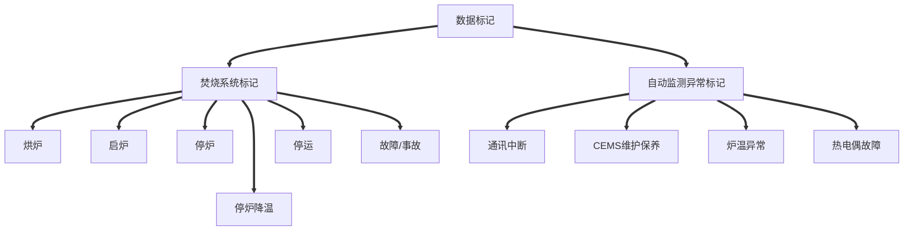
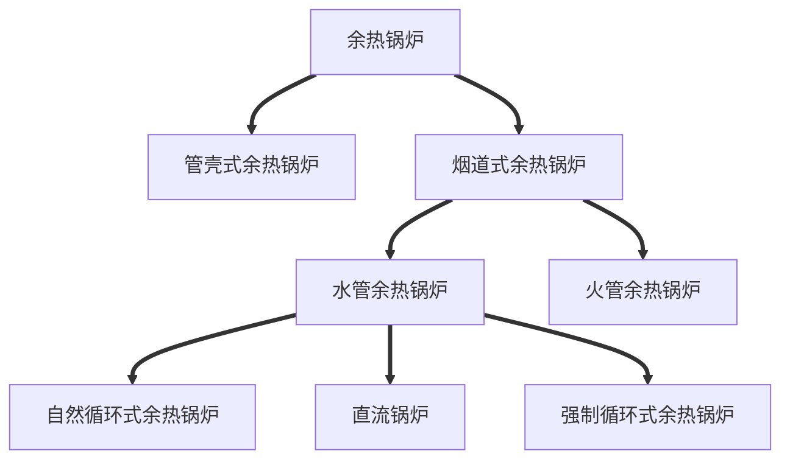
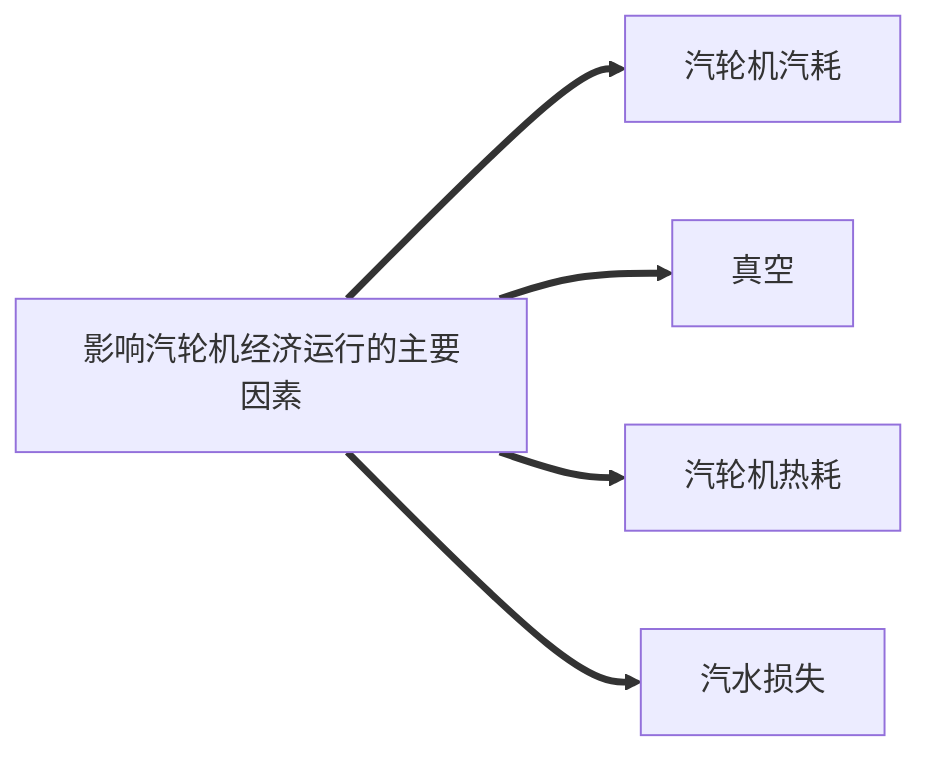
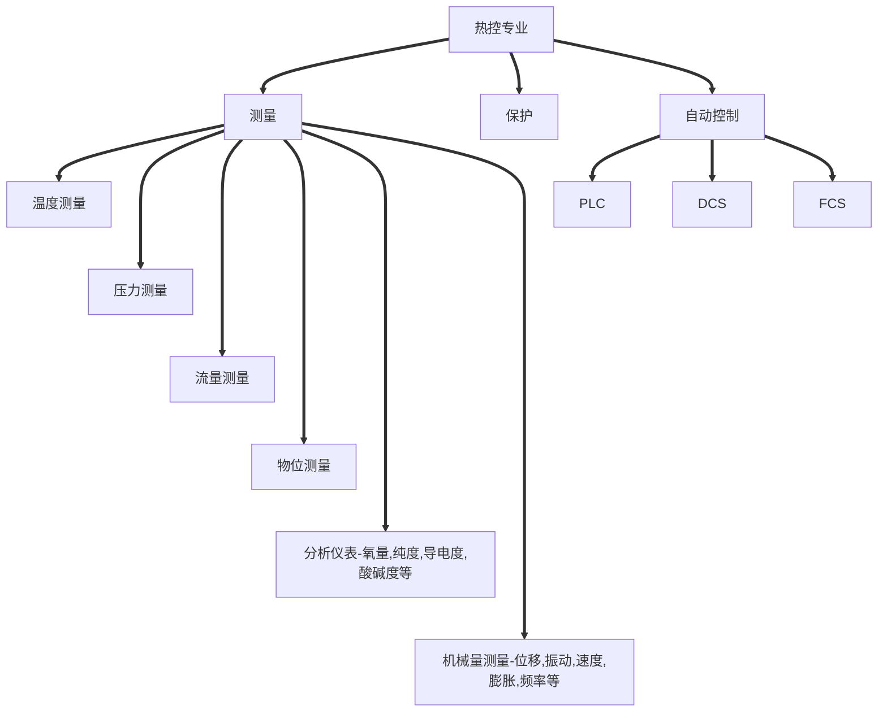

# 光大项目简介

2015年光大国际与高淳城管局正式签署“高淳区生活垃圾焚烧发电项目”BOT协议，特许经营权30年。由光大国际全资子公司承建，规划建设规模为日处理生活垃圾1000吨，分两期以BOT模式承担建设、运营和移交。项目总投资为5亿元人民币，一期建设规模 $1\times500\ t/d+1\times10\ MW$ 生活垃圾焚烧发电机组，预留二期建设场地。 $T=390～408℃$ ， $P=3.8～4.0\ MPa$ 。世界主流是 $5.2\ MPa$ 左右。垃圾焚烧锅炉如果压力做太高，受热面易腐蚀，容易出现爆管等事故。飞灰量每天 $10\ t$ 左右，加料熬合后 $14\ t$ 左右，填埋时毒性不易析出，需满足飞灰填埋的国家标准。

# 垃圾焚烧处理发展历程

随着产业革命的兴起，城市人口急剧增加，城镇无为制地影胀，市民居住在密集的空间里，生活垃圾、污水和粪便严重污染城市的土地，水源和空气，传染病随之而来。但是，将垃圾集中起来填理的方法操作不当极易引发传染病的蔓延。

1890年，细菌学的诞生让人们陆续弄清了欧洲许多传染病的病原和传播途径，由此推动了垃圾焚烧法的出现。

1896年，德国汉堡建立了人类历史上的第一座垃圾焚烧厂。从此，人类开始了对垃圾进行科学处理、资源化利用的新里程。

100年来，焚烧作为一种处理垃圾的专用技术，已经成为许多发达国家和地区处理城市生活垃圾的主要方式。

# 我国垃圾焚烧处理发展历程

1981-1990：进口设备为主。成功案例：深圳市政环卫综合厂（学习新加坡经验）

1991-2000：发展国产设备小焚烧厂。自主设备研发水平偏低、规模偏小。进口设备国产化取得进展、应用较少小型焚烧厂尝试污染较重、可靠性差。

2001-2010：发展大规模焚烧发电厂。可再生能源、市场化政策支持，技术规范、污控标准、建设标准评价标准完善，案例增多，约100座焚烧厂投产。

2011-目前：发展高标准焚烧发电厂。中央文件、五年规划政策支持，技术成熟、产品成熟、标准成熟、人才激增，大批城市加快规划、投资、建设运营，理念提升、标准提升，技术提升、监管提升。

# 垃圾焚烧处理优、缺点

## 一、焚烧处理垃圾的优点

垃圾焚烧发电是将生活垃圾在高温下燃烧，使生活垃圾中的可燃废物转变为二氧化碳和水等，产生的余热用于发电，产生的废气、飞灰进行无害化处理。生活垃圾焚烧发电具有“无害化、减量化、资源化”的优点，具体有以下七个方面的优点：

1. 项目用地省。同样的垃圾处理量，垃圾焚烧厂需要的用地面积只是垃圾卫生填埋场的1/20-1/15。
2. 处理速度快。垃圾在卫生填埋场中的分解时间通常需要7到30年，而焚烧处理只要2小时左右就能处理完毕。
3. 减量效果好。同等量的垃圾，通过填埋约可减量30%，而通过焚烧约可减量90%。
4. 污染控制好。采用现代先进的焚烧工艺技术，按照国家标准建设和运行，实现渗滤液和生产污废水的零排放，烟气经过严格的净化处理达标排放。
5. 能源利用高。每吨垃圾可焚烧发电300多度，大约每5个人产生的生活垃圾，通过焚烧发电可满足1个人的日常用电需求；还可回收铁磁性金属等资源，可以充分实现垃圾处理的资源化。
6. 消毒彻底。在高温环境中焚烧垃圾，可以使垃圾中的病菌、细菌等几乎完全被杀死。相比较其他垃圾处理方法，有很大优势。
7. 减轻或消除后续处置过程对环境的影响。垃圾焚烧处理之后，会给后续的处理环节带来好处，最明显的就是垃圾在填埋之后不会产生太多的垃圾污水以及释放在空气中的有害气体大大减少。

## 二、焚烧处理垃圾的缺点

1. 焚烧法投资大，占用资金周期长。
2. 焚烧对垃圾的热值有一定要求，一般不能低于 $5000\ kJ/kg$ ，限制了它的应用范围。
3. 焚烧过程中产生的二恶英问题，必须有很大的资金投入才能进行有效处理。

# 垃圾焚烧发电工艺流程

发酵压缩法，通过堆高，自重将渗出液挤出，3-5天发酵时间。挤出的液体送到渗滤处理站处理。给料炉排形成往复运动，不断将垃圾给入焚烧炉，可以控制焚烧量。

* 炉内脱硝：SNCR+PNCR；
* 半干式反应塔：脱除氯化氢、氟化氢、二氧化硫等；
* 活性炭系统：吸附二恶英。布袋除尘器捕捉收集飞灰。

## 一、垃圾收储运至焚烧流程

1. 其他垃圾收运（垃圾运输）
2. 中转站压缩（垃圾运输）
3. 过磅（通过栈桥）
4. 平台卸料（卸料操作）
5. 移料、堆料（吊机操作）
6. 垃圾发酵（吊机操作）
7. 垃圾投料（焚烧调整）
8. 入炉焚烧

## 二、垃圾焚烧简介

### 垃圾焚烧过程

垃圾焚烧是指垃圾作为一种固体燃料在高温条件下，与空气中氧产生热分解、燃烧、熔融等反应，放出热量，转化成为残渣或者熔融固体物质的过程。垃圾焚烧设施必须配有烟气处理设施，防止重金属、有机类污染物等再次排入环境介质中。回收垃圾焚烧产生的热量，可达到废物资源化的目的。

### 垃圾焚烧炉分类

垃圾焚烧炉分为：

1. 机械炉排焚烧炉；
2. 流化床焚烧炉；
3. 回转窑焚烧炉
4. 热解气化焚烧炉。

目前我国的垃圾焚烧厂建设适宜采用比较成熟的机械炉排焚烧炉。

炉排炉中的炉排有三部分，分别是干燥段、燃烧段和燃尽段。炉排沿着不同方向运动，运动过程中将垃圾送向下方，使垃圾在炉排炉中依次通过干燥、燃烧区域，直至烧尽。垃圾被炉排翻动的过程中，炉排下边的高温一次风会一直吹向垃圾，炉内也有一定辐射存在，这二者共同作用能够使垃圾在最短时间内变得干燥。持续干燥、持续加热，最终垃圾就会燃烧起来。用来干燥垃圾的高温一次风，是经过加热的抽气装置中的气体，穿过炉排达到炉膛中的。二次风可以为垃圾燃烧增加氧气，从垃圾燃烧炉上方吸取一定量的氧气，然后送至炉膛内，帮助垃圾充分燃烧。

近日，光大环境自主研发设计的首台小型生活垃圾焚烧炉样机正式下线。该设备是专门针对县域及农村市场开发的小吨位垃圾焚烧炉成套装备，可满足50吨/日至200吨/日不同型号设备需求。

进入“十四五”，县级地区（含县级市）生活垃圾焚烧处理设施短板弱项成为焦点，全面提升县级地区生活垃圾焚烧处理能力迫在眉睫。2022年，国家发改委、住建部联合发布《关于加快补齐县级地区生活垃圾焚烧处理设施短板弱项的实施方案的通知》，明确提出“生活垃圾日清运量小于200吨的县级地区，在确保生活垃圾安全有效处置的前提下，结合小型焚烧试点有序推进焚烧处理设施建设”。

## 三、余热炉及汽轮发电机组

垃圾焚烧会产生热量，经过设备转化之后，蒸汽被送至汽轮发电机，可进一步发电。另外，蒸汽也可以用来供热，为周围居民供暖。

流程：给水泵一给水操作平台→省煤器→汽包→下降管→下联箱→水冷壁→上联箱→汽包→低温过热器→减温器→中温过热器→减温器→高温过热器→集汽箱→主蒸汽管道→汽轮机。

项目配置一台型号为N10-3.8型中温、中压、单缸、冲动、凝汽式汽轮发电机。垃圾焚烧热能全部用于发电。

## 四、烟气净化与处理设备

本项目烟气净化系统采用“SNCR+PNCR+半干法+干法+活性炭吸附+布袋除尘器”的净化工艺流程，全部指标优于《生活垃圾焚烧污染物控制标准》（GB18485-2014），符合欧盟2010标准。

### 1、SCNR脱硝系统

采用SNCR技术，使用20%氨水为还原剂，通过气动调节阀控制调节氨水流量，有计量设备；一共八只喷射枪，设置两层每层八个喷入口，共十六个，根据反应温度可随时调节喷入位置及投用枪支数。

### 2、PNCR脱硝系统

使用气力输送原理，将高分子脱硝剂通过螺旋输送的形式输送至炉内，采用负压下料正压输送的形式，通过风机将物料输送到脱硝的最佳温区，实现脱硝的目的。脱硝剂是一种高分子活性物质，在850°以上被高温激活、汽化，瞬间与NOₓ化学反映，还原成N₂和H₂O，从源头遏制了NOₓ的形成，从而达到脱硝的目的。

### 3、半干脱酸系统

从余热锅炉来的温度为190~220℃的烟气从喷雾反应器顶部的水平烟道进入，顶部通道设有导流板，可使烟气呈螺旋状向下运动。旋转雾化器位于喷雾反应器上部，从石灰浆配制系统来的石灰浆进入旋转雾化器，由于雾化器的高速旋转（转速日常设定8500rpm），石灰浆被雾化成平均约30-50μm的微小液滴，该液滴与呈螺旋状向下运动的烟气形成逆流，并被巨大的烟气流裹带着向下运动，在此过程中，石灰浆与烟气中的酸性气体HCl、HF、SO₂等发生反应。该过程还使二噁英、呋喃和重金属产生凝结。

### 4、干法脱酸

干法脱酸系统在作为半干法脱酸的补充，喷入Ca(OH)₂来降低除烟气中的酸性气体的含量（如SO₂和HCl等）。在反应塔顶部设计喷水降温装置。在旋转喷雾反应器停用时，本反应塔因冷却喷嘴而作减温塔用。使烟气通过反应塔后通过喷嘴喷水降温后出口烟气温度仍控制在150℃左右，此时在烟道中喷入Ca(OH)₂干粉才能快速高效的反应。

### 5、活性炭系统

垃圾焚烧活性炭吸附是目前去除二噁英的有效方法，也因此被广泛应用于垃圾焚烧发电中。

垃圾焚烧活性炭，主要是200目～325目粉炭，碘吸附值800～900mg/g，用于去除燃烧过程中产生的二噁英等有害气体。

### 6、布袋除尘器

从喷雾反应器来的带有飞灰及各种粉尘的温度为150～160℃的烟气，从喷雾反应器下部位置进入袋式除尘器。烟气从滤袋外部进入，从隔仓顶部排出，各种颗粒物、焚烧产生的烟尘、石灰反应剂和生成物、凝结的重金属、喷入的活性炭等均附着于滤袋表面，形成一层滤饼，烟气中的酸性气体在此与过量的反应剂进一步起反应，使酸性气体去除效率进一步提高；活性炭也在滤袋表面进一步起吸附作用。

各设备具有完整的设备参数计算资料、良好的设备应用业绩。符合《生活垃圾焚烧工程技术规范》CJJ90-2009配置要求。

# 垃圾焚烧发电污染物排放及处理要求

## 一、工程技术要求

每条焚烧生产线的年运行时间应在8000小时以上，垃圾焚烧系统的设计服务期限不应低于20年。

垃圾池有效容积应按5～7天的额定垃圾焚烧量确定。垃圾池应设置垃圾渗滤液收集设施。生活垃圾贮存设施和渗滤液收集设施应采取封闭负压措施，并保证其在运行期和停炉期均处于负压状态。这些设施内的气体应优先通入焚烧炉中进行高温处理，或收集并经除臭处理满足《恶臭污染物排放标准》要求后排放。

应保证垃圾在焚烧炉内得到充分燃烧，二次燃烧室内的烟气应在不低于850℃的条件下滞留时间不小于2秒，焚烧炉渣热灼减率应控制在5%以内。

垃圾焚烧线必须配置烟气净化系统，并应采取单元制布置方式。烟气净化工艺流程的选择,应充分考虑垃圾特性和焚烧污染物产生量的变化及其物理、化学性质的影响，并应注意组合工艺间的相互匹配。

酸性污染物的去除：酸性污染物包括氯化氢、氟化氢、硫氧化物、氮氧化物等，应选用适宜的处理工艺对其进行去除。

应采取措施严格控制烟气中二噁英的排放，包括：控制燃烧室内焚烧烟气的温度、停留时间与气流扰动工况；减少烟气在200℃～500℃温度区的滞留时间；设置活性炭粉等吸附剂喷入装置。

## 二、运行监管要求

应定期监控垃圾贮池中的垃圾贮存量，并采取有效措施导排垃圾贮池中的渗滤液，渗滤液应经处理后达标排放。

应实现焚烧炉运行状况在线监测，监测项目至少应包括焚烧炉燃烧温度、炉膛压力、烟气出口氧气含量和一氧化碳含量，应在显著位置设立标牌，自动显示焚烧炉运行工况的主要参数和烟气主要污染物的在线监测数据。

应实现烟气自动连续在线监测，监测项目至少应包括氯化氢、一氧化碳、烟尘、二氧化硫、氮氧化物等项目，并与当地环卫和环保主管部门联网，实现数据的实时传输。

对垃圾焚烧产生的炉渣和飞灰应按照规定分别进行妥善处理或处置。

在各工艺环节要采取切实有效的臭气控制措施，厂区应做到无明显臭味；要在相关位置按要求使用除臭系统，并按要求及时维护。

在垃圾贮池、污水及渗滤液收集池、地下建筑物、生产控制室等沼气易聚集场所，应加强日常监测监管，以确保安全生产。

## 三、废气处理要求

垃圾焚烧厂排放的废气主要来自于焚烧过程所产生的烟气，其主要污染物为粉尘、氯化氢（HCl）、二氧化硫（SO₂）、氮氧化物（NOₓ）、一氧化碳（CO）、有机污染物、二噁英及重金属等。

通过计算机控制系统可以实现垃圾焚烧、热能利用、烟气处理等过程的高度自动化，控制设定的燃烧条件（如炉膛温度高于850℃，烟气停留时间大于2秒，保持烟气湍流流动和适度的过氧量），使焚烧系统在额定工况下运行，原始排放物浓度降到最低，并保证二噁英等有机物的彻底分解。

安装各种有效的烟气处理设备，如布袋除尘、活性炭吸附有害物质等，并使用烟气在线监测仪一以连续监测每条焚烧线的烟气排放指标，确保垃圾焚烧厂烟气污染物排放达到规定标准要求。

## 四、恶臭气体排放控制要求

应采用密闭性好、具有自动装卸结构的压缩式运输车来运输垃圾，尽量减少臭味外溢。

在垃圾卸料大厅出入口应设置空气幕，并在垃圾运输车卸料前后关闭电动卸料门，以防止臭气外逸。

垃圾池应采用密闭式设计，在垃圾池上方设置吸风口，将恶臭气体作为燃烧空气引至焚烧炉内高温分解，并使垃圾池和卸料大厅处于负压状态。

应设置备用的活性炭废气净化设施，在全厂停炉检修期间，垃圾池内的臭气必须经活性炭废气净化设施净化达标后才能排放。

## 五、二噁英排放控制要求

所谓二噁英，实际上是二噁英类的一个简称，指的是结构和性质都很相似的包含众多同类物或异构体的两大类，共210种有机化合物，但其中只有极少数种类被认为具有毒性。

二噁英并不是垃圾焚烧厂特有的公害，它是一种有机物与氯一起加热就会产生的化合物，是种比较普遍的化学现象。二噁英在空气、土壤、水、食物和垃圾中都能发现，有研究显示，食品是其主要来源，人体接触的二噁英中约有90%来自膳食方面。

垃圾焚烧厂控制二噁英排放，主要采用成熟的前“3T”后高效净化技术，其一是保持焚烧炉膛内温度大于850度，并控制烟气在炉膛内停留2秒以上，使二噁英得到完全分解；其二是烟气通过最先进的净化处理系统，将单位二噁英浓度控制在0.1(ngTEQ/m³）以内，达到国际上最严格的排放标准。

## 六、炉渣与飞灰控制要求

炉渣主要为生活垃圾焚烧后的残余物，其产生量视垃圾成分而定，其主要成分为氧化锰（MnO）、二氧化硅（SiO₂）、氧化钙（CaO）、三氧化二铝（Al₂O₃）、三氧化二铁（Fe₂O₃）、废金属，以及少量未燃尽的有机物等。

垃圾焚烧产生的炉渣经过高温无害化处理，再经过磁选等分离后，可对炉渣进行综合利用，不能综合利用部分可送至卫生填埋场填埋。

飞灰收集、储存与处理系统各装置应保持密闭状态。烟气净化系统采用干法或半干法方式脱除酸性气体时，飞灰处理系统应采取机械除灰或气力除灰方式；采用湿法时，应将飞灰从污水中有效分离出来。

飞灰属于危险废物，必须单独收集，不得与生活垃圾、焚烧残渣等混合，也不得与其他危险废物混合。垃圾焚烧飞灰不得在厂区长期储存，不得进行简易处置，不得随意外运排放。

# 一、入厂安全须知

为了保证您的人身安全，预防发生安全事故，请您熟悉并遵守如下要求：

1. 公司主要危险、有害因素是：火灾、爆炸、灼伤、触电、机械伤害、车辆伤害、高温、中毒室息等。
2. 进入厂区前请在保安室进行登记，并领取临时通行证，接受安全须知教育。
3. 请在公司相关人员陪同下进入生产区，未经许可请不要与上班的工人交谈，以免影响工人的注意力。
4. 进入生产禁止吸烟、携带火种，防爆区域请不要接打电话，参观请按照指定通道行走，听从陪同人员给您的指引。
5. 禁止在我公司生产现场操作任何设备，这会给您带来人身安全风险。
6. 未经同意，禁止在生产区内、安全敏感区域照相、摄像。
7. 所有进入厂区的人员，必须佩戴安全帽，女士请将长发盘到安全帽内。
8. 所有进入厂区的人员严禁穿带钉子鞋、拖鞋；严禁赤膊或穿背心、短裤进入厂区。
9. 在生产出现异常情况时，请及时按照陪同人员或岗位工作人员的指令要求迅速疏散到安全地方远离危险地;
10. 遇下列情况请不要围观或停留，如要通过请绕行：
    * 施工、检修区域附近，起重设备转动半径范围内。
    * 标有“有毒、有害、酸碱、高温、高压“等管道、阀门、设备附近。
    * 挂有“爆炸、火灾、腐蚀、触电、禁止通行”等警示标志附近。
    * 容易发生高处坠物的场所（如塔类设备、管廊、栈桥下面）。
    * 处于事故状态或试车、起停车区域。
11. 未尽事宜，请按照现场安排执行。

# 二、生产现场存在的安全风险

安全色是传递安全信息含义的颜色，包括红、黄、蓝、绿四种。禁止标志是红色；警告标志是黄色；指令标志是蓝色；提示标志是绿色。

## 事故案例

* 2017年9月18日上午，扬州市江都区垃圾站发生一起事故，有一位该垃圾站的工人站在垃圾池旁，被准备倒垃圾的垃圾车撞倒，坠入垃圾池不幸身亡。

* 2020年2月1日16时许，泾阳县桥底镇官庙村垃圾填埋场内，泾阳县满国天地环境工程有限公司垃圾清理车司机刘某驾驶中型自卸货车在该场进行垃圾倾倒作业时，因疏忽大意，倒车途中将该填埋场工作人员杨某碾压，致杨某当场死亡。

* 2020年01月14日12时45分许，位于拱墅区半山镇石塘村的杭州市环境集团有限公司（以下简称杭州环境集团）天子岭循环经济产业园的餐厨（厨余）资源化利用工程 4号厌氧罐，在施工过程中发生沼气爆炸（以下简称“1-14”爆炸事故），造成3人死亡，直接经济损失约748万元。

  据事故现场勘察取证、专家技术分析和相关调查证实：4号厌氧罐内危险物质主要为甲烷（沼气），罐内甲烷与空气混合后遇点火源而引发爆炸。经综合分析判断，厌氧罐附近可能存在雷电、电气线路设备设施漏放电、静电火花放电、电焊作业和明火等五种点火源。

  经调查分析：

  一是通过现场调查，根据气象资料和询问相关人员，排除雷电点火源可能。

  二是根据涉事厌氧罐电气线路设备设施均按防爆要求布设，排除电气漏放电点火源可能。

  三是涉事厌氧罐与基础地基均有大量固定螺栓连接，接地导电符合要求，排除静电累积造成点火源可能。

  四是厌氧罐顶部留存有直流逆变弧焊机一台、电焊护目镜和部分电焊条，但未发现使用痕迹；对山体上发现疑似4号罐顶部的型直流逆变弧焊机勘察证实，该电焊机断路器开关处于关闭状态，现场未发现有电源连接线；事发时未进行电焊作业，可排除电焊点火源可能。排除了其余四种点火源的可能性后，导致事故发生的点火源可能性仅剩一种，即吸烟产生的明火。

  五是在3号厌氧罐顶部发现利群牌香烟和红色打火机，并从4号厌氧罐底部附近地面发现残留烟头，市公安局DNA检测报告证实烟头生物遗留属于死者蒋小军。死者蒋小军、庄建军、吴兴大均有抽烟习惯。综上分析认为：在排除了其余四种点火源的可能性后，导致事故发生的点人源可能性仅剩一种，即吸烟产生的明火。

* 2023年5月12日某电厂发生一起人身伤亡事故，造成2人死亡！2023年5月12日下午，某电厂进行#2炉电除尘器内部检修。14时50分左右，当班检修人员开始#2电除尘四路一仓泵入口处清灰、捅灰作业。16时35分，因放灰不畅一名外委人员进入除尘器灰斗内部检查，不慎落入灰中被掩埋18时30分左右，一名现场监护人员在未系安全带、未使用防坠器的情况下，进入电除尘内部施救，掉入灰斗积灰中被掩埋。19时55分左右，两名被困人员被救出送往哈密市伊州区人民医院抢救。20时15分，医院宣布人抢救无效死亡。

* 2023年6月8日，广东某电厂1号机组为上海汽轮机厂生产的660MW超超临界二次再热机组，在基建调试期进行50%甩负荷试验后，因高压缸排气温度高触发超高压缸和高压缸切缸（超高压缸切缸期间内缸超温最高至670℃左右），后续通过中、低压缸继续并网，计划通过升负荷并回超高压缸和高压缸进行100%甩负荷试验。期间执行两次并超高压缸操作失败，特别是在第二次并超高压缸10分钟后，1瓦、2瓦轴振突升，22秒后1瓦振动大保护动作触发汽轮机跳闸，跳闸后21秒汽轮机转速到零，超高压缸通流部件发生碰摩。剧烈振动导致#1轴瓦损坏、油挡断裂松脱漏油，端部汽封碰摩导致轴封蒸汽外泄，高温热源引发润滑油着火、爆燃，造成轴瓦、超高压缸严重损坏。

## 如何去保障安全

确保《二十五项反措（2023版）》的有关要求在**规划设计**、**安装调试**、**运行维护**、**更新改造**等阶段落实到位，有效防范电力生产事故的发生。（全文共计245页）

（初步设计）、设计专篇、预评价、验收评价、电力质监（建设、安装质量管控）、事故预想、反事故演练、技术监督（技术监督的范围包括电能质量、金属、化学、绝缘、热工、电测、环保、继电保护、节能、振动、水工等方面）

#### 企业制度落实——两票三制

* **两票：工作票、操作票。**明确工作内容、作业范围、作业时间、作业人员、安全措施、技术措施现场确认审核等；
* **三制：交接班制度、巡回检查制度、设备定期试验轮换制度。**一般用电力行业工作管理制度，《电力安全工作规程》热力和机械部分也有此内容的规定。“两票三制”包含着企业对安全生产科学管理的使命感，也包含着员工对安全生产居安思危的责任感，它是企业安全生产最根本的保障。在一个成熟的企业中，安全应该是重中之重，因为安全本身就是效益的理念，就是企业管理的核心，所以安全就是效益。

# 三、焚烧运营中环境管控

焚烧炉一次风取风口设置在垃圾仓内，正常运行中，垃圾仓因一次风的抽取而成负压，保证垃圾仓内臭气不外溢。

垃圾仓设有独立机械排风微波光解除臭系统，当焚烧线停运时检修或焚烧一次风抽取量不足，不能保持垃圾池负压时，开启该系统，可有效防止臭气外逸。渗滤液区域臭气通过臭气收集系统引入垃圾仓内，有效防止渗滤液区域臭味外溢。

厂区恶臭浓度符合现行国家标准《恶臭污染物排放标准》厂界标准值二级标准的要求。

#### 一进四出

* 一进：所收储的生活垃圾；
* 四出：烟气净化系统烟气排出、污水处理系统工业用水排出、垃圾烟气系统产出飞灰处置、焚烧炉系统炉渣处置。

在焚烧厂显著位置设有排烟主要污染物显示屏。

我们作为省级科普教育教育基地，肩负着向公众普及生态环境科普知识的义务，通过引导公众参与生态文明建设和环境保护，不断提高公众生态文明素养，包括对垃圾无害化处理全过程进行答疑解惑，不断加强生态文明宣传教育，着力提升全民生态环境保护意识。作为光大环境人，我们将“安全稳定运行、环保达标排放“作为企业生命工程来抓。

# 自动监控数据标记规则

当焚烧系统工况出现异常或自动监测数据出现联网异常、零值、恒值、超量程以及超过污染物限值等情形时，垃圾焚烧厂应在1小时内进行数据标记。未对超标异常的自动监测数据做出标记的接到电子督办单后，应当及时核实、排除故障、并在6小时内按操作提示如实填报完成数据标记。

## 一、焚烧炉工况标记

一般情况下，焚烧炉工况呈现为：正常运行→停炉→停炉降温→（停运）→烘炉→启炉→正常运行。启炉、正常运行和停炉时，炉膛温度不应低于850℃。

焚烧炉工况标记包括“烘炉”“启炉”“停炉”“停炉降温”“停运”“故障”和“事故”等7种标记。

1. 在未投入垃圾的情况下，用辅助燃烧器将炉膛温度升至850℃以上的时段，可标记为“烘炉”

   **标记为“烘炉”的，一般情况下，炉膛温度起点应低于400℃；当“烘炉”的前序标记为“停炉降温”“故障”或“事故”时，允许炉膛温度起点高于400℃。标记为“烘炉”的，一般情况下，每次时长不应超过12小时；炉内耐火材料修复或改造后，每次时长不应超过168小时。**

2. 完成烘炉后，投入垃圾至工况稳定，且炉膛温度保持在850℃以上的时段，可标记为“启炉”

   标记为“启炉”的，每次时长不应超过4小时。

3. 停止向焚烧炉投入垃圾至炉膛内垃圾完全燃尽，且炉膛温度保持在850℃℃以上的时段，可标记为“停炉”

4. 焚烧炉炉膛内垃圾完全燃尽后，炉膛温度继续降低的时段，可标记为“停炉降温”。

   标记为“停炉降温”的，一般情况下，炉膛温度应从850℃以上降至**400℃以下**；当“停炉降温”的后序标记为“烘炉”时，允许该标记时段结束时炉膛温度高于400℃。

5. 1.5焚烧炉停止运转的时段，可标记为“停运”。

   标记为“停运”的，烟气含氧量不应低于当地空气含氧量的2个百分点。

6. 焚烧炉发生故障或事故的时段，可标记为“故障”或“事故”。标记为“故障”或“事故”的，每次时长不应超过4小时，并简要描述故障或事故起因。

7. 垃圾焚烧厂在企业端未作上述标记的，焚烧炉视为为正常运行。

## 二、自动监测异常标记

自动监测异常标记包括“烟气排放连续监测系统维护（以下简称CEMS维护）”“通讯中断”“炉温异常”和“热电偶故障”等4种标记。

1. CEMS校准、故障、检修以及数采仪故障、检修的时段，可标记为“CEMS维护”。

   标记为“CEMS维护”的，应同时备注维护的类型，并简要描述维护过程，保存运行维护记录备查。

2. 网络故障、通讯设备故障等原因导致数据无法报送至生态环境主管部门的时段，可标记为“通讯中断”。标记为“通讯中断”的，应在通讯恢复后补传自动监测数据。

3. 正常运行时，因不可抗力导致焚烧炉炉膛温度低于850℃的时段，可标记为“炉温异常”。

   标记为“炉温异常”的，应备注炉膛温度异常的原因以及提前采取控制烟气污染物排放的有效措施（如加强垃圾预处理，启动辅助燃烧器、加大活性炭喷入量等），并保存运维记录和台账资料备查。

4. 因热电偶结焦、损坏等情况导致热电偶测量温度不能反映实际温度的时段，可标记为“热电偶故障”。标记为“热电偶故障”的，应备注故障测点位置、故障原因、维修或更换过程，保存运行维护记录和台账备查。

5. 垃圾焚烧厂在企业端未作上述标记的，自动监测数据视为有效。

# 标记操作&监控数据应用管理&排污许可管理条例

焚烧炉工况和自动监测异常可分别标记，分别包括事前标记或事后标记。

1. 事前标记。垃圾焚烧厂可根据生产计划、CEMS维护计划等，在企业端提前标记。

2. 事后标记。当出现焚烧炉工况改变，自动监测异常，自动监测数据出现零值、恒值、超量程以及超过污染物限值等情形时，垃圾焚烧厂应当于1小时内核实并标记。

3. 未及时标记的，由生态环境部污染源监控平台向垃圾焚烧厂发出电子督办单，并抄送所在地县级以上生态环境主管部门。垃圾焚烧厂在接到电子督办单后，应当及时核实，并在**6小时**内按操作提示如实进行标记。

4. 垃圾焚烧厂应当按照生活垃圾焚烧发电厂自动监测数据标记规则（以下简称标记规则），及时在自动监控系统企业端，如实标记每台焚烧炉工况和自动监测异常情况。自动监测设备发生故障，或者进行检修、校准的，垃圾焚烧厂应当按照标记规则及时标记；未标记的，视为数据有效。

5. 生态环境主管部门可以利用自动监控系统收集环境违法行为证据。自动监测数据可以作为判定垃圾焚烧厂是否存在环境违法行为的证据。

6. 一个自然日内，垃圾焚烧厂任一焚烧炉排放烟气中颗粒物、氮氧化物、二氧化硫、氯化氢、一氧化碳等污染物的自动监测日均值数据，有一项或者一项以上超过《生活垃圾焚烧污染控制标准》（GB18485）或者地方污染物排放标准规定的相应污染物24小时均值限值或者日均值限值，可以认定其污染物排放超标。

   自动监测日均值数据的计算，按照《污染物在线监控（监测）系统数据传输标准》（HJ212）执行。

   对二噁英类等暂不具备自动监测条件的污染物，以生态环境主管部门执法监测获取的监测数据作为超标判定依据。

7. 垃圾焚烧厂应当按照国家有关规定，确保正常工况下焚烧炉炉膛内热电偶测量温度的5分钟均值不低于850℃。

8. 生态环境主管部门开展行政执法时，可以按照监测技术规范要求采集一个样品进行执法监测，获取的监测数据可以作为行政执法的证据。

   生态环境主管部门执法监测获取的监测数据与自动监测数据不一致的，以生态环境主管部门执法监测获取的监测数据作为行政执法的证据。

9. 根据本规定第六条认定为污染物排放超标的，依照《中华人民共和国大气污染防治法》第九十九条第二项的规定处罚。对一个自然月内累计超标5天以上的，应当依法责令限制生产或者停产整治。（**由县级以上人民政府生态环境主管部门责令改正或者限制生产、停产整治，并处十万元以上一百万元以下的罚款；情节严重的，报经有批准权的人民政府批准，责令停业、关闭**）

   垃圾焚烧厂存在下列情形之一，按照标记规则及时在自动监控系统企业端如实标记的，不认定为污染物排放超标：

   （一）一个自然年内，每台焚烧炉标记为“启炉”“停炉”“故障”“事故”，且颗粒物浓度的小时均值不大于150毫克/立方米的时段，累计不超过60小时的；

   （二）一个自然年内，每台焚烧炉标记为“烘炉”“停炉降温”的时段，累计不超过700小时的；

   （三）标记为“停运”的。

10. 垃圾焚烧厂正常工况下焚烧炉炉膛内热电偶测量温度的五分钟均值低于850℃，一个自然日内累计超过5次的，认定为“未按照国家有关规定采取有利于减少持久性有机污染物排放的技术方法和工艺”，依照《中华人民共和国大气污染防治法》第一百一十七条第七项的规定处罚。（**处一万元以上十万元以下的罚款**）

    下列情形不认定为“未按照国家有关规定采取有利于减少持久性有机污染物排放的技术方法和工艺”：

    （一）因不可抗力导致焚烧炉炉膛内热电偶测量温度的五分钟均值低于850℃，提前采取了有效措施控制烟气中二噁英类污染物排放，按照标记规则标记为“炉温异常”的;

    （二）标记为“停运”的。

11. 垃圾焚烧厂违反本规定第三条第三款，导致自动监测数据缺失或者无效的，认定为“未保证自动监测设备正常运行”，依照《中华人民共和国大气污染防治法》第一百条第三项的规定处罚。（**处二万元以上二十万元以下的罚款；拒不改正的，责令停产整治**）

    下列情形不认定为“未保证自动监测设备正常运行”：

    （一）在一个季度内，每台焚烧炉标记为“烟气排放连续监测系统（CEMS）维护”的时段，累计不超过30小时的；

    （二）标记为“停运”的。

12. 垃圾焚烧厂通过下列行为排放污染物的，认定为“通过逃避监管的方式排放大气污染物”，依照《中华人民共和国大气污染防治法》第九十九条第三项的规定处罚：（**由县级以上人民政府生态环境主管部门责令改正或者限制生产、停产整治，并处十万元以上一百万元以下的罚款；情节严重的，报经有批准权的人民政府批准，责令停业、关闭**）

    （一）未按照标记规则虚假标记的；

    （二）篡改、伪造自动监测数据的。

13. 垃圾焚烧厂任一焚烧炉出现污染物排放超标，或者未按照国家有关规定采取有利于减少持久性有机污染物排放的技术方法和工艺的情形，持续数日的，按照其违法的日数依法分别处罚；不同焚烧炉分别出现上述违法情形的，依法分别处罚。

14. 垃圾焚烧厂5日内多次出现污染物超标排放，或者未按照国家有关规定采取有利于减少持久性有机污染物排放的技术方法和工艺的情形的，生态环境主管部门执法人员可以合并开展现场调查，分别收集每个违法行为的证据，分别制作行政处罚决定书或者列入同一行政处罚决定书。

15. 篡改、伪造自动监测数据或者干扰自动监测设备排放污染物，涉嫌构成犯罪的，生态环境主管部门应当依法移送司法机关，追究刑事责任。

16. 垃圾焚烧厂因污染物排放超标等环境违法行为被依法处罚的，应当依照国家有关规定，核减或者暂停拨付其国家可再生能源电价附加补贴资金。

17. 生活垃圾焚烧发电厂自动监测数据标记规则由生态环境部另行制定。

18. 排污单位应当按照排污许可证规定和有关标准规范，依法开展自行监测，并保存原始监测记录。原始监测记录保存期限不得少于5年。

    排污单位应当对自行监测数据的真实性、准确性负责，不得篡改、伪造。

    将监测记录上传至平台即可。

    关键是要按许可证载明的频次、项目和自行监测方案开展监测。

# 垃圾收运流程及设备介绍

## 地磅

城市生活垃圾专用垃圾运输车辆，由环卫部门负责运入厂内，经地磅房汽车衡自动称重后，经高架桥进入主厂房卸料大厅，垃圾倒入卸料大厅后，经发酵、排水后由抓斗送入炉膛焚烧。在厂物流入口设置地磅房，配置2套60吨级电子汽车衡，计量入厂垃圾和出厂灰渣等物料重量，由承载台、计量装置和传送打印设备构成，可实现日常数据处理，制作日报表、月报表及向中央数据处理装置的数据传送；同时设监控与数据传输系统。地磅为全自动地磅，垃圾收运车携带地磅IC卡自动过磅并记录数据。

设置2台地磅，具有称重、记录、传输、监控、打印与数据处理功能。地磅输出的信号连接电脑数据库，以记下时间、车辆编号、总重和净重等数据。

地磅的技术参数为:

* 数 量：2台
* 最大称重量：60t
* 分度值：20kg
* 传感器容量：30t×6（每台磅）
* 台面尺寸：14×3.4m（长×宽）/台
* 识别称重系统：深圳远望谷XCRF-807
* 户外重量显示器：济南金钟DX562
* 监控系统： 杭州海康威视DC-2CD2T20FD-I3
* 打印机：爱普生LQ-300K+打印机

### 地磅管理内容

#### 1、车辆进厂把关

禁止车辆存在问题：

1. 车辆未密封
2. 渗滤液跑冒滴漏
3. 垃圾抛洒

对于车辆外部卫生较差、滴漏渗滤液的车辆我公司有权拒绝相关车辆入厂并拍照上报执法部门。对于屡次劝说不进行整改的我公司有权收回车辆磁卡，待车辆完全整改完毕后，根据整改情况确定是否发放磁卡。

#### 2、垃圾种类进厂把关

我厂处理工艺为炉排焚烧，主要处理人们在生活中产生的生活垃圾，无法处理大块物体和未分选的不可燃建筑垃圾。

1. 因焚烧炉炉口宽度有限，床垫、沙发、家具等大型垃圾，需破碎后入厂。
2. 未分选建筑垃圾严禁入厂。
3. 易燃易爆危险品严禁入厂。
4. 医疗垃圾严禁入厂。
5. 不可燃烧的保温棉、石棉等工业废料严禁入厂。

#### 3、计量管理

地磅房配备一套计量控制系统，一套榜单打印系统，能够准确、及时计量进出公司物资；地磅衡体定期进行年度检验。

#### 4、其它管理内容

1. 我厂地磅系统备案后的车辆方可进入卸料大厅，其他车辆严禁入厂，垃圾运输车辆进入时,地磅员对进垃圾车辆检验IC卡及运输许可证，对可疑车辆有权进行盘查和询问。
2. 进入厂区的垃圾运输车辆按规定速度行驶，严禁超速，并密封良好，不应有垃圾抛散现象。
3. 垃圾运输车辆进入厂区严禁抽烟或携带其它明火，卸料平台禁止吸烟或有明火现象。

## 车辆进厂顺序

卸车大厅内设3个垃圾卸料密封门，卸料门上方设红绿指示灯。垃圾运输车到达时，打开指定的卸料门。灯光用于提醒司机到指定的垃圾门的位置。不卸料时，卸料门关闭。为使垃圾车司机能准确无误地将车对准垃圾卸料门，在每个密封门前设有黄色斑马线标志和防撞墩，卸料门前设车挡。

地锚正确使用方法：

1. 卸料门前都配有地锚悬挂U型和牵引铁链。
2. 车辆倒车至卸料门前停稳后，悬挂地锚链条。
3. 地锚链条悬挂好没有脱落的可能后，方可卸料。
4. 卸料时必须人车分理，驾驶室内不允许留人。
5. 卸料完毕后，切记摘除地锚后方可开走。
6. 车辆倒车时不能压在锚链上，防止轮胎爆胎或压断地锚。

严禁车辆未悬挂地锚卸车！！

严禁人员在驾驶室内卸车！！

卸车时导致卸料平台污染的车辆，司机应负责将垃圾清理干净，情况严重者我公司将会上报上级主管部门。

## 垃圾仓介绍

垃圾仓紧挨焚烧间布置，仓长32.3m、净宽24m、深-6m（地上22.9m、地下-6m、渗滤液收集池最低液位-9m）。

垃圾仓是一个密闭、且具有防渗防腐处于负压状态的钢筋混凝土结构大坑，垃圾在垃圾仓内堆放发酵，使垃圾渗滤液顺利导出及保证设备事故或检修时能正常接收垃圾。垃圾在垃圾仓堆存不仅可达到垃圾堆放发酵，渗滤液顺利导出提高垃圾热值的目的，而且还能保证设备事故或检修时扔可接收垃圾，起到一定的调节作用。在垃圾堆放期间，对其进行搅拌、混合、脱水等处理，使垃圾成分更加均匀，有利于焚烧。底层垃圾自然堆积压实，压缩后的垃圾密度约提高50%～80%，提高了仓内垃圾的实际存量。

垃圾仓共分为四个区（即一区北、一区南、二区北、二区南）有卸料区、堆料区、发酵区、供料区。可以增加发酵2～3天。

## 抓料及计量情况介绍

垃圾吊抓斗：

* 型式：桔瓣液压驱动抓斗
* 起重量：4.59t
* 抓斗容积：6.3m³
* 数量：3个（渣吊抓斗1个）

垃圾仓顶设二台起重量12.5t，抓斗容积为6.3m³的桔瓣式垃圾抓斗吊车，供焚烧炉加料及对垃圾进行混合、倒堆、搬运、搅拌等，确保入炉垃圾组分的均匀及稳定燃烧。

垃圾抓斗吊车轨顶标高30.5m，起重机跨度30.5m，起重机的轨道行走长度为50m，抓斗提升高度为36m。在侧墙标高22.9m处设垃圾抓斗控制室。

在垃圾仓靠近焚烧间侧，标高22.9m设焚烧炉加料平台，布置有1个给料斗，每台给料斗的尺寸约为6000×8900mm。

### 抓料操作

* 移料：新进库垃圾料位较高时，应将其抓运到移料区，空出卸料位方便后续来车卸料。
* 混料：对于新到厂的垃圾应进行充分混合，垃圾吊操作员应利用一切空余时间进行混料和堆料工作。
* 堆料：当天到厂的垃圾混合后抓运到设定的移料区堆放，每天堆放一堆自然发酵，堆放时间一般为3至5天，作好发酵时间记录。（发酵时间相对进料时间少一天。）
* 投料：投料时应选择最先堆放并已经发酵充分的垃圾。上料前先松动垃圾，即先把垃圾抓起提高2m左右落回原处。严禁垃圾成团或大型物件入料斗。做到勤抓慢放，不过载，不搭桥。

抓料时抓斗不能有明显的倾斜，倾斜角度最大不得超过30°，否则将出现甩斗现象。

抓料时，钢丝绳稍有松动余量即可；禁止放钢丝绳过长，否则提升抓斗时，易造成钢丝绳与电缆跑出卷筒外，损毁设备。

### 计量情况

每台抓斗起重机配备一套“地磅式”垃圾称重系统,共同使用一套计算机统计打印。系统实时显示抓斗去皮重量（全重一抓斗自重）即物料重量，同时称量系统与可编程控制器交互信号参与控制（防松绳、超载保护、提高生产率等），给料时能自动称重、信号自动输入并在屏幕上显示。分别对投料、倒垛、搅拌的垃圾数量,按某台起重机、某给料口、某班、某日、某月、某年等需求完成计量、累计和打印报表作业；并留有DCS通讯接口，可将称量结果等信号传输到中央控制室DCS系统。称量系统采用计算机计量打印报表，具有去皮、显示、累计、打印、超载保护功能，并留有一路串口通讯。检测设备可自动判断垃圾重量是否介于设定范围之内。

# 垃圾除臭、发酵、倒排介绍

## 臭气控制

焚烧炉一次风取风口设置在垃圾仓内，正常运行中，垃圾仓因一次风的抽取而成负压，保证垃圾仓内臭气不外溢。

垃圾池设置有独立机械排风微波光解除臭系统（喷淋洗涤+微波光解+臭氧催化），当焚烧线停运时检修或焚烧一次风抽取量不足以保持垃圾池负压时开启该系统，可有效防止臭气外逸。

垃圾仓内设有一台引风机，渗滤液区域臭气通过臭气收集系统被引入垃圾仓内，同时输送管道为负压状态，能使有效防止渗滤液区域及管道臭味外溢。

垃圾进入垃圾池进行预处理干化，垃圾焚烧工况的稳定与否取决于干化程度。垃圾干化通过控制好垃圾发酵和排水实现。垃圾发酵过程实际是生物菌繁殖、升温、垃圾内部有机物的腐烂、垃圾中大部分水分不断被排出的过程，排出的水形成垃圾渗滤液。一般入炉焚烧垃圾含水率在20%左右，发酵和排水周期按季节可控制夏季3天，冬季5天。

## 垃圾池倒排

垃圾中析出的水，我们称之为渗滤液通过格栅排入渗滤液收集池中，再通过渗滤液提升泵抽至渗滤液处理站进行处理。为确保垃圾池倒排正常，每日格耀必须抓出。若因垃圾池垃圾太多，格栅无法抓出，需要通过人工放泵方式进行排倒水。

# 一、垃圾焚烧发电流程综述

垃圾通过卸料大厅进入垃圾仓内，在密闭的垃圾仓内通过分区堆放发酵3-7天后（北方地区冬季10天左右），由垃圾吊操作人员将发酵好的垃圾投入料斗进入溜槽，直到在投料口看到垃圾为止，投料口处的垃圾不能过多，以防垃圾搭桥（如发生搭桥，先停止上料，通过开关遮挡门或用抓斗来松动垃圾）。进入溜槽的垃圾由给料炉排推入焚烧炉膛，在第一、二单元完成干燥；第三单元开始燃烧；第四单元完成燃烬；第五单元炉渣冷却；最后炉渣排入捞渣机，再由捞渣机将炉渣推入渣仓（库）。按照以上流程周而复始运行，通过能量转换最终将垃圾变成电能，实现固废资源化。

# 二、溜槽

给料溜槽是提供垃圾从垃圾仓进入焚烧炉前的一个储存的场所，主要是为了保证垃圾吊设备故障时，确保焚烧炉正常运行，同时为了保证在停炉期间垃圾仓臭味进入炉膛，影响主厂房内的环境，以及在焚烧炉浇注料检修完后烘炉期间热烟气进入垃圾仓，影响垃圾吊操作人员视线，在溜槽上部设有关断挡板门，由液压缸执行遮挡门的开关。

溜槽冷却是为了避免启动期间和运行中溜槽温度过高。溜槽冷却由水套来保证，水套里压力为大气压。如果给料溜槽热量太多，多余的热量就通过水套里水的蒸发排走。水汽排入垃圾池，根据溜槽水温变化趋势及时补水。

# 三、给料炉排

### 给料炉排的组成

1. Ⅰ-Ⅱ-Ⅲ 轴线结构和主体框架；
2. 移动架；
3. 导向炉排片；
4. 液压油缸；
5. 速度检测及限位装置。

### 给料炉排参数

* 容量：500t
* 炉排宽度：8700mm
* 小车数量：4
* 额定行程：700mm
* 最大行程：2000mm
* 液压油缸工作压力：10MPa

# 四、焚烧炉排

焚烧炉排为垃圾焚烧设备的核心。垃圾在炉排长度方向上展开整个燃烧过程。光大自主研发炉排根据中国垃圾水分含量高、成分复杂等特点进行了专门设计，加大了干燥段炉排面积，按照燃烧的阶段分类，第一单元和第二单元炉排主要为干燥段，第三单元和第四单元炉排为燃烧段，第五单元为燃烬段。

光大自主焚烧炉排五段成阶梯状布置，自上而下形成约21度的倾角，燃烧炉排起着支撑和输送垃圾床层，使燃烬的炉渣通过排渣口排出，并将一次风从炉排片的下部送入，通过炉排片的空隙和其上的垃圾层进入到炉体，对垃圾进行干燥、燃烧、冷却的作用。每段炉排的下部有漏灰斗。漏灰斗承接从炉排片的间隙内落下的微小的垃圾物及漏灰。漏灰斗内的漏灰通过水封式刮板输送机排出。

### 焚烧炉排的组成

光大焚烧炉排由四个标准单元和一个加长的末端燃烬单元组成。前四个标准单元（段）均由两排翻动炉排片，两排滑动炉排片和两排固定炉排片组成；加长的末端（第五段）燃烬单元则由一排翻动炉排片，四排滑动炉排片和三排固定炉排片组成。滑动炉排片产生水平的往复运动，推动圾床层向排渣口移动。翻动炉排片产生翻转运动，这些炉排片在动作时产生上下运动，实现垃圾的松动作用，更利于燃烬。

第一单元炉排与给料炉排的接口处，安装有接口特用的固定炉排片及其刮板。第二单元至第四单元炉排在结构上基本与第一单元炉排相同，只是没有与给料炉排接口用的固定炉排片及其刮板。第五单元炉排在长度方向上比前面四段要长。

### 焚烧炉排片使用要求

光大自主研发的炉排片由 $\rm C$ 、 $\rm Ni$ 、 $\rm Mn$ 、 $\rm Si$ 等元素组成，其中 $\rm Ni$ 具有高强的抗腐蚀、耐磨性，但对其使用环境的温度有严格的限制，因当温度升高后，其耐磨性能明显下降，造成使用寿命缩短。根据实验及应用数据，炉排片的温度不得超过400℃以上运行。

在运行中如炉排片温度超400℃，必须采取措施，将炉排片温度降至400℃下，可以采取以下措施：

1. 适当增加垃圾料层厚度；
2. 降低一次风温度；
3. 根据入炉垃圾热值及水分，进行垃圾掺烧，降低入炉垃圾热值。

### 焚烧炉排片形式

* 固定炉排片
* 滑动炉排片
* 翻动炉排片

### 焚烧炉排的运动形式

正常运行时的炉排运转如下：

* 滑动炉排的前后运动，向前运动是慢的连续运动，而向后要快些。
* 翻动炉排是上下运动，两个方向运动都快（向上和向下），翻动运动后，有一段停滞（通常约5-10秒）。
* 翻动期间，滑动炉排停止运动。滑动和翻转运动交替进行。一个周期开始时是滑动炉排运转。如果滑动和翻转都完成后，一个周期就结束了。
* 针对每一段炉排，操作人员都可以设置其翻转和滑动次数（主要依据炉膛内垃圾着火燃烧情况）

垃圾通过滑动炉排片的推动输送，向后运动，其推进速度决定了垃圾在炉膛里的处理量、炉排上的垃圾厚度、停留时间及燃烧质量。

### 焚烧炉排片

炉排片的寿命取决于：

1. 燃烧点：可以仅在一个炉排部件，可在所有炉排部件上，火越集中，炉排的温度就越高，在此处的瓦片越容易磨损；
2. 翻转运动过于频繁：对于高热值的垃圾来说，翻动炉排不需要频繁翻动；
3. 一次风温过高：对于高热值的垃圾来说，不需过高的风温；
4. 炉排片的温度：炉排片的温度是决定炉排寿命的关键因素。

# 五、出渣单元

出渣单元有两部分组成：

#### 1、水封式刮板机

焚烧炉排下的漏灰经灰斗向下进入漏灰输送机，漏灰在水封的情况下，由漏灰输送机直接输送至捞渣机。有两个功能：

1. 冷却功能：冷却从炉排间隙落下的渣及灰
2. 密封功能：在外界与焚烧炉之间起封闭作用，使焚烧炉里的负压得以维持。

#### 2、捞渣机

焚烧炉炉排上的灰渣及灰斗中的漏灰通过落渣井进入出渣机内，出渣机内水将焚烧炉炉膛内排出的高温干灰渣浸湿冷却降温后，通过出渣机的液压推料器，将灰渣推入渣仓。

# 六、运行中设备需关注点

## 一、给料炉排

1. 前进速度是否同步，偏差是否过大；
2. 支撑轮、导向轮是否卡住不转；
3. 液压缸及油管有无渗油现象；
4. 给料小车有无跑偏现象。

## 二、溜槽

1. 垃圾投料口是否搭桥；
2. 溜槽水冷夹套温度是否在规定范围；

## 三、液压站

1. 油泵出口油压是否正常；
2. 油泵及电机声音、温度、晨动是否在规范范围内；
3. 油管道关卡有无松动迹象；
4. 油箱油温是否在规定范围内；
5. 阀站各阀有无渗油现象。

## 四、出渣单元

#### 1、水封刮板机

1. 链条链板、销套磨损情况；
2. 水封有无破坏，链条有无跳齿；
3. 刮板磨损情况及有无变形、有无掉落；

#### 2、捞渣机

1. 液压缸有无渗油；
2. 水箱水位是否在最高水位线下，水封是否正常；
3. 液压缸推进速度是否正常；

### 水在电厂中的重要性

水是热力发电厂重要的工作介质。在发电厂中，不断进行着各种能量交换，能量交换的关键媒介就是水。在锅炉中，水吸收燃料燃烧释放出来的热能，变成水蒸汽；在汽轮机内，蒸汽的热能转变为动能冲动汽轮机转动变成机械能；在凝汽器中，蒸汽和循环水进行热交换，将汽轮机排汽冷凝成水供锅炉重新利用；在冷却塔中，循环水与空气流动接触产生蒸汽，蒸汽挥发带走热量。此外，电厂中的水还充当着更多的角色，消防用水、生活用水、冲洗路面和景观水补充水等等。

# 原水净化处理

原水：指未经任何处理的天然水（如江河、湖、地下水等等）。是发电厂中各种用水的来源。

高淳项目原水取自河流，河水中一般含有泥沙、悬浮物和藻类等物质，无法直接使用，需要经过原水净化处理。

河水需要经过净化去除水中的悬浮物质才能够补充至循环水池，河水净化的关键指标是油度，经过净化后的河水浊度应当小于5NTU。

河水净化工艺主要分为两部分。第一步在原水中加入一定比例的混凝剂。（聚合氯化铝：无机高分子混凝剂，简称聚铝，英文缩写为PAC，它是介于AICl₃和AI(OH)₃之间的一种水溶性无机高分子聚合物。聚合氯化铝具有吸附、凝聚、沉淀等性能，适用于各种浊度的原水，pH适用范围广）。

净水过程一般分为三个阶段。这三个阶段分别是凝聚阶段、絮凝阶段和沉降阶段。凝聚阶段在药液注入混凝容器与原水快速混凝时会在极短时间内形成微细矾花，絮凝阶段是矾花成长变粗的过程，当絮凝剂处于沉降阶段时，矾花一边缓缓下降，一边继续相互碰撞结大，至后期余浊基本不变。

第二步原水与PAC充分混合后进入一体化净水器将混凝过程产生的絮体去除。

水经加混凝剂混凝后形成矾花,流到设备的沉淀池内进行沉淀，沉淀池采用斜管沉淀法，经过梯形斜板沉淀室沉淀完成固液分离，沉淀下来的污泥排入泥斗。

经沉淀后的水流到过滤池过滤，滤池结构：底部为布水管，中部为石英砂，上部为无烟煤。最后清水流到循环水池。

# 循环水处理

电厂循环水系统是电厂的关键系统，是维持电厂正常运行不可或缺的冷却系统。常使用冷却塔来给电厂降温，冷却塔原理是把冷水引入冷却塔中，不断循环，使机组降温。冷却塔里面的水变热后产生水蒸气，通过顶部对外排放。

* 循环冷却水处理的目的：防止凝汽器或热交换器铜管内形成沉积物，发生腐蚀和微生物侵袭，其次是保护配水管道以及冷却系统的其他部件。为达到这个目标，需要在循环水中投加缓释阻垢剂、氧化性杀菌剂和非氧化性杀菌剂，有时候还需要投加硫酸。

  加酸的目的是将循环水中的碳酸盐硬度降低，防止分解生成水垢，通常是往循环水中加硫酸，将碳酸盐转化成溶度积较大的硫酸盐。

  当循环水维护一定量阻垢剂时，可以起到稳定碳酸盐的作用，即可以使水中重碳酸盐不易分解成碳酸盐，提高极限碳酸盐硬度的作用。而且，阻垢剂与循环水中的Ca₂⁺有很大结合的能力，可以防止CaCO₃晶体的长大与析出。

  杀菌顾名思义就是用来杀菌消毒和灭藻的，一般在生活用水和工业用水上面都能够用到，在工业上面由于循环水需要经常的使用，但是换水的周期不长，容易长出水藻，工业杀菌剂可以帮助企业节约用水，保护水资源以及水的纯净。

* 以电化学技术为基础的一种先进的水处理技术，通过自建循环对循环水进行旁流处理。设备内部分阴阳两极，循环水经过设备时，会发生一系列变化：在阴极附近形成强碱环境，使循环水中的钙镁离子从水中吸出，并沉积在设备的阴极表面，通过定期清理排出系统。阳极附氯离子、水中的溶解氧等被变成自由基和次氯酸使水中的细菌、藻类被直接杀死。

# 锅炉水处理

* 除盐水（desalted water），是指利用各种水处理工艺，除去悬浮物、胶体和无机的阳离子、阴离子等水中杂质后，所得到的成品水。除盐水并不意味着水中盐类被全部去除干净，由于技术方面的原因以及制水成本上的考虑，根据不同用途，允许除盐水含有微量杂质。除盐水中杂质越少，水纯度越高。

#### 除盐水产水水质

| 序号 |  项目  |           指标            |
| :--: | :----: | :-----------------------: |
|  1   | 电导率 | $\le0.20\ \mu s/cm(250C)$ |
|  2   |  硬度  | $\approx0\ \mu\rm{mol}/l$ |
|  3   |  SiO₂  |     $\le20\ \mu g/l$      |

系统主工艺流程：

自来水→原水箱→原水泵→**盘式过滤器**→**超滤**（中空纤维膜）→阻垢剂加药装置→保安过滤器→高压泵→**反渗透装置**→中间水箱→中间水泵→**二级反渗透装置**→RO水箱**→EDI**装置→除盐水箱

# 炉内水处理

炉内水处理采用炉水加磷酸盐处理，以保证得到合格的汽水品质，保证热力系统的安全、经济、稳定运行。

为了保证锅炉受热面上不产生水垢，炉水采用Na₃PO₄碱性处理时，炉水中的钙盐在高温和足够OH⁻存在的情况下会与PO₄³⁻反应产生松软的碱式磷酸钙，随锅炉排污排除，其反应方程式为：
$$
\rm 10Ca^{2+}+6PO_4^{3-}+2OH^-\longrightarrow Ca_{10}(OH)_2(PO_4)_6
$$

# 一、余热锅炉的定义与分类

## 余热锅炉的定义和作用

余热锅炉，是指利用各种工业过程中产生的**废气、废料或废液中的余热及其可燃物质燃烧后产生的热量**把水加热到一定温度的锅炉；具有烟箱、烟道余热回收利用的锅炉也称为余热锅炉，余热锅炉通过余热回收可以生产热水或蒸汽来供给其它需要的地方使用。

## 余热锅炉的工作原理

高温余热烟气流经水冷壁、蒸发器、过热器和省煤器，利用换热使高温烟气降低到合理范围内的排烟温度，其换热过程中所释放出的热量通过热交换的方式使锅炉给水变成过热蒸汽。

## 余热锅炉的分类

根据结构形式，余热锅炉可分为管壳式和**烟道式**余热锅炉：

1. 管壳式余热锅炉，烟气在受热管管内流动，水在管外的锅壳中流动，热量通过管壁传递给管外的水。

2. 烟道式余热锅炉利用高温气体通过炉膛，加热炉膛内装设管束，将管束内流动的水加热汽化。

3. 根据高温气体通过管内或管外，余热锅炉可分为火管余热锅炉和**水管余热锅炉**：

   * 火管余热锅炉：高温气体在炉管内流动。锅炉给水从汽包经下降管流入锅炉底部，在管壁受热，变为汽水混合物，由上升管返回汽包。这种余热锅炉结构简单，因壳体承受蒸汽压力，适用于生产压力不高的蒸汽。

   * 水管余热锅炉：锅炉给水流过管内，高温气体流经管外。因锅炉的壳体不承受蒸汽压力，适用于生产高压蒸汽。根据介质的流动形式，水管余热锅炉又可分：

     1. 自然循环式：管内饱和水流动的动力是下降管内的水与上升管内的汽水混合物之间的密度差产生，该形式锅炉为保证一定的汽水循环量，汽包需有足够的安装高度。

     2. 强制循环式：在下降管路中安装循环泵，借以提高管内饱和水的流速，防止汽水循环停滞造成传热过程变差或停滞。

     3. 直流锅炉：没有汽包，给水在给水泵的作用下依次通过加热、蒸发、过热等各个受热面，因各个受热面没有明确的固定的界限，故称为直流锅炉。

        自然循环式锅炉工程应用的最高压力为11.9MPa：当蒸汽压力超过16MPa时，自然循环式锅炉因受循环流速等因素影响，可靠性能下降，因此会采用强制循环式锅炉，当蒸汽压力超过19.6MPa时，直流锅炉更为适用。

   #### 直流锅炉的特点：

   1. 受热面布置灵活性较高，金属消耗量较小，锅炉启动、停止的速度快；水容量及蓄热能力较小，锅炉负荷受外界因素影响较大。
   2. 直流锅炉因设计结构原因，无法实现连续排污，故而对锅炉给水水质要求非常高；同时因需要保证足够压头来维持汽水循环，给水泵均使用大功率电机，能耗较高。

# 二、自然循环锅炉原理及组成

## 自然循环式锅炉的原理

在一个闭合的管道回路中，由于**工质自身的密度差造成的重位压差**，推动工质流动的现象，称为**自然循环**。重位压差是由下降管和上升管（水冷壁管）内工质密度不同造成的。自然循环推动力的实质是由重位压差造成的循环推动力克服了上升系统和下降系统的流动阻力，推动工质在循环回路中流动。（压力越高，汽、水的密度差降低，工质循环流动速度越低）。

## 自然循环锅炉的组成

自然循环锅炉由汽包、下降管、分配水管、蒸发器、水冷壁下集箱、水冷壁管、水冷壁上集箱、汽水混合物引出管、汽水分离器、蒸汽对流管束、（低、中、高）过热器和、汇汽集箱、省煤器等部件组成。

锅炉给水进入省煤器吸热后→进入汽包→汽包内饱和水沿下隆管流至水冷壁的下集箱（下降管位于烟道外部，不吸收烟气的热量）→直立管簇吸收烟气的热量，当水吸收烟气热量后就有部份水变成蒸汽，由于蒸汽的密度比水的密度要小得多，所以直立管内汽和水混合物的平均密度要小于下降管中水的密度，两者密度差形成了压差→汽水混合物沿上升管向上运动（烟道内部）→汽包，建立水的自然循环。

通俗来讲：**不吸热的下降管（下降管在炉外）内的水比较重，向下流动。直立管内的汽水混合物通过上升管（炉内）流动，形成连续产汽过程；此时水的流动不是靠外部提供的动力，而是靠流体的密度差而流动**，这种余热锅炉称为“自然循环余热锅炉”。其特点是运行和维修简单。

# 三、余热锅炉各部件的功能

### 汽包的定义：

水管锅炉中用以进行汽水分离、蒸汽净化、集成水循环回路，并蓄存炉水的筒形压力容器。称为汽包（或锅筒）。

### 汽包内部主要部件：

旋风分离器、顶冒、顶部波形板、多孔板、蒸汽清洗孔板、给水管、清洗水分离装置、加药管、连续排污管等。

### 汽包的作用：

1. 汽包与下降管、上升管连接**组成自然循环回路**；同时汽包又接收省煤器输送的锅炉给水；以及**向过热器输送饱和蒸汽**，所以汽包是锅炉内加热、蒸发、过热这三个过程的连接枢纽。
2. 将汽水混合物分离并对炉水进行连续排污，进而减少水垢生成，排出炉水中的杂质及多余盐分，保证锅炉蒸汽品质。
3. 存有一定容量的水与汽，具有一定的蓄热量，当锅炉工况变化时，能起缓冲稳定汽压的作用，提高锅炉运行的安全性。

### 旋风分离器的组成与工作原理及作用：

组成部分：由筒体、引入管、顶帽、溢流环、筒底导叶和底板等部件组成，主要作用为将饱和蒸汽与炉水分离。

### 旋风分离器内部结构及工作过程：

上升管中较高流速的汽水混合物，经引入管**切向**进入旋风分离器筒体而产生**旋转运动**，在离心力的作用下，将水滴抛向筒壁，使汽水初步分离。分离出来的水通过筒底四周导叶，向下进入**汽包水侧**；饱和蒸汽则向上流动，进入顶帽的**波形板**间隙中曲折流动，在离心力和惯性力的作用下，小水滴被抛到波形板上，在附着力作用下**形成水膜向下**流动。经筒壁流入汽包水容积，使汽水进一步分离，而饱和蒸汽从顶帽上方或四周引入汽包蒸汽空间。此外，由于水贴着筒体内壁旋转运动，不仅能清除介质的动能，还能防止高浓度的炉水形成泡沫。分离出来的水通过导叶排出，能保持水室平静和减少水室的含汽量，从而改善下降的工作条件。

水冷壁加热后的汽水混合物是通过汽包里的旋风分离器进行汽水分离，同时**减小蒸汽动能**，目的是减少冲击，分离的蒸汽再次经过上部的**百叶窗分离器**经过再次分离，最后再经过**波形板**过滤**水份和盐分**后进入过热器管束。

### 连续排污装置作用：

连续排污又称为表面排污，连续排污装置一般装设在旋风分离器底部附近（正常水位下80～100mm处），因蒸发过程大多数都发生在汽水分界面上，所以该层面的介质含盐量最多，通过联排装置可以减少炉水中的盐含量、碱含量等。

### 事故放水装置作用：

为防止汽包满水造成事故，因此汽包内还装有事故放水管，当水位超限时可以**自动**打开放掉多余的水，但它**不是装在最低点**（需锅炉厂家进行计算管径和安装位置），为预防锅炉干锅造成事故，所以正常运行时汽包一般保持正常水位在±50mm左右。

### 加药管系统的作用：

汽包中加入磷酸盐，使磷酸根离子与锅水中钙镁离子结合，生成**难溶于水，易于排污**的沉淀泥渣（**碱式磷酸钙**等），定期排污排除，使锅水保持一定的磷酸根，既不产生结垢和腐蚀，又保证蒸汽品质。

### 水冷壁的描述：

水冷壁是锅炉的主要受热部分，它由数排钢管组成，分布于锅炉炉膛的四周。它的内部为流动的水或汽水混合物，**外部**接受锅炉**炉膛的火焰**和**高温烟气**的热量。

### 水冷壁的作用：

1. 吸收炉膛中高温火焰或烟气的辐射热量，将部分炉水变成饱和蒸汽。
2. 使炉墙温度大大降低，优化了炉墙结构，减轻了炉墙重量。
3. 降低了炉膛出口处的烟气温度，防止或减小炉墙结焦。

### 下降管的作用：

下降管将汽包中的炉水**连续不断**地送入水冷壁下集箱，通过集箱输送至换热管束，保证了换热管束有**充足的水循环量**。为了保证水循环的可靠性，下降管自汽包引出后都布置在锅炉**外部**，管材不受热。

### 集箱的作用：

集箱也叫联箱，它**不是一个独立的部件**，而是水冷壁、省煤器、过热器等部件的组成部分，即分别有水冷壁集箱、省煤器集箱和过热器集箱等。在受热面布置中，集箱起到汇集、混合、分配工质的作用，**是受热面布置的连接枢纽**；按其所在位置可划分为**上集箱**和**下集箱**或**进口集箱**和**出口集箱**。

### 过热器的定义：

过热器是锅炉中将蒸汽从饱和温度进一步加热至**过热温度**的部件，又称**蒸气过热器**。

### 过热器分类及工作方式：

根据过热器按结构特点可分为蛇形管式、 屏式、墙式和包墙式；按传热方式可分为对流式、辐射式和半辐射式，它们都是由若干根并联管道和进出口集箱连接组成。过热器最为常用为蛇形管式，它具有比较密集的管组，外部受烟气的横向和纵向冲刷，高温烟气主要以对流的方式将热量传递给过热器管束的管壁，进而通过热交换加热管道中的蒸汽。

### 过热器的作用：

1. 加热饱和蒸汽至过热温度；
2. 提高蒸汽在汽轮机中的做功能力，提高热机循环效率（ $\eta=\frac W{Q_1}=\frac{(Q_1-Q_2)}{Q_1}=1-\frac{Q_1}{Q_2}$ ），其中 $Q_1$ 越大， $Q_2$ 越小，热效率越高，参考：热力学第一定律及卡诺循环效率；
3. 避免蒸汽品质与汽轮机运行参数不符，造成汽轮机叶片腐蚀，提高机组安全运行能力。

### 过热器的布置种类与使用效果：

过热器按蒸汽与烟气相对流来划分有**顺流**、**逆流**、**混合流**等几种布置类型。

1. 逆流布置：传热温差大，传热效果好，可减少受热面数量，节省金属消耗；但蒸汽高温段与烟气高温区重合，管壁温度高，易使金属过热，过热器安全性差。
2. 顺流布置：蒸汽高温段处于烟气低温区，管壁温度较低，工作比较安全；但传热温差小，传热效果较差，需要布置的受热面较多，消耗金属多，不经济。
3. 混合流布置：过热器在烟温较低区采用逆流布置，在烟温较高区采用顺流而下布置，集中了顺流和逆流布置的优点，传热温差较逆流低，比顺流高，安全经济，应用较广泛。

### 立式锅炉特点：

该锅炉设计合理，结构简单，操作、维修方便，占地面积小，基建投资少。

### 卧式锅炉特点：

1. 水容量大，热效率高，产汽快，蒸汽充足，使用寿命长。
2. 适用于蒸汽量较大、压力较高的锅炉。

### 省煤器的定义：

省煤器是安装于锅炉尾部烟道用于**回收余热**的一种装置；是一种将锅炉给水加热成**汽包压力下的饱和水**的受热面。由于它吸收低温烟气的热量，减少了排烟热损失，降低了烟气的排烟温度，节省了燃料，提高了锅炉运行效率，所以称之为省煤器。

### 省煤器的作用：

1. 吸收低温尾部烟道烟气的热量，降低排烟温度，减少排烟热损失，节省燃料。
2. 由于给水进入汽包之前先在省煤器加热，因此减少了给水在其他受热面的热能吸收，提高了锅炉效率。
3. 给水流经省煤器后温度得到提升，进入汽包后会减小汽包壁温差，从而使热应力相应减小，进而延长汽包使用寿命。

### 省煤器再循环的作用：

锅炉在**启动或停炉过程中**，由于锅炉**不需要上水或不需要连续上水**，省煤器中的水处于**不流动状态**，对省煤器的**冷却效果较差**，尽管这时烟气温度相对较低，但省煤器的**管壁温度相对较高**，管道内的**存水有汽化的可能**，易造成省煤器**局部受热增多**，造成管材老化、蠕变引发省煤器损坏。为了防止这种情况的发生，此时将再循环门打开，利用汽包与省煤器中工质的密度差，在汽包→再循环管→省煤器→省煤器引出管→汽包之间，形成自然循环，使省煤器中的水有所流动，提高对省煤器的冷却效果，达到保护省煤器的目的。

### 余热锅炉三大安全附件：

锅炉的三大安全附件是安全阀、压力表和水位计。

1. 安全阀的作用是当锅炉内蒸汽压力超过允许值时，安全阀自动开启，向外排汽，降低系统压力；当压力降到规定值时自动关闭，防止锅炉因超压而发生爆炸事故。
2. 压力表是用来测量锅炉内工质压力大小的仪表，司炉人员通过它来监视锅炉内蒸汽压力的变化，做出相应调整。
3. 水位计是用以反映汽包内水位状况的直读仪表，司炉人员通过它来监视汽包水位的变化，并做出相应调整。

# 四、自然循环过程中的故障类型

## 循环流速的定义：

在自然循环中，循环流速是指循环回路中上升管人口截面按工作压力对应下饱和水密度折算的水流密度。

循环流速是衡量水循环工作可靠性的指标之一，它的大小直接反应管内流动的水将沿管壁所生的气泡带走的能力。循环流速大，气泡能及时脱离管壁，工质对流换热系数大，管壁的冷却条件好，不会出现超温。但随着循环流速的升高，下降管和上升管的流动阻力也增大，对水循环正常运行同样是产生不利影响的。

## 自然循环过程中的故障类型：

自然循环的故障主要有**循环停滞**、**循环倒流**、**汽水分层**、**下降管带汽和膜态沸腾**。

### 1、循环停滞：

在同一循环回路中，当并联的各个上升管**受热不均匀**时，热交换弱的管中的汽水混合物密度，大于热交换强的管道内的汽水混合物的密度；在下降管供水有限的情况下，换热弱的管内可能流速降低，甚至处于停止不动的状态，这种现象被称为循环停滞。

#### 循环停滞的危害：

1. 当发生水循环停滞时，即使热负荷较低，管道内汽水混合物由于不断蒸发，蒸汽向上运动，水中的**含盐浓度增加**，会引起**管壁的结盐和腐蚀**。
2. 在引入汽包的上升管中发生循环停滞时，**水面以上管内工质蒸汽**，因冷却条件恶化不断升温，易造成超温爆管；而处于**汽水分界面下的水位部分**，管壁在交变热应力作用下，易产生金属疲劳进而损坏。

### 2、循环倒流：

当并联的各上升管**受热严重不均匀**时，换热效果最好的管中的汽水混合物上升力强，流速过快从而产生**虹吸作用**，致使换热效果最弱的管中汽水混合物朝着与正常循环方向**相反**的方向流动，这种现象被称为**循环倒流**。

#### 循环倒流的危害：

当管道内汽泡的上升速度与水的向下流动速度相等的时候，便会造成**气泡停滞**，形成“气塞”现象，进而导致产生气塞的管道段过热，引发爆管。

### 3、下降管带汽

#### 下降管带汽的原因：

1. 产物中存在挥发性组分。

   炼油反应器中的产物通常含有一些挥发性组分，这些挥发性组分会在下降管状态下发生汽化反应，从而产生大量的汽体。如果在下降管里的汽化反应很强，这就会在管道内形成较大的汽团集，引起压力升高和冲击波，对设备造成伤害。

2. 下降管内流速过快。

   下降管内部流速过大或过快也会导致管内的气体发生流动阻塞，从而导致管道内气体压力升高。这种情况下，下降管内的产物会出现带汽现象。

3. 下降管温度过高。

   下降管的温度如果过高，那么产物在下降管内就会因为温度过高而发生汽化反应。这种情况下产量就会变得更小，从而产生很多气体，造成下降管带汽现象。

#### 下降管带汽的危害：

带汽时，工质平均密度减少，流动阻力增大，影响水循环安全性

### 4、膜态沸腾：

定义：在自然循环锅炉中，外部加热的管道中，炉水自水冷壁下集箱沿上升管向上流动时，因受热与管壁接触的水在某一高度形成一些**气泡而局部沸腾**，汽泡的**进一步聚结**会扩展成连续的**蒸汽流**，形成**膜态沸腾**。

#### 膜态沸腾的危害：

水冷壁在受热时，靠近管内壁处的工质**首先**开始吸热、蒸发产生大量小气泡，正常情况下这些气泡**应及时被带走**，位于水冷壁管中心的水不断补充过来冷却管壁。但若管外部热交换很强，管内壁产生气泡的速度**远大于气泡被带走的速度**，气泡就会在管内壁聚集起来形成所谓的“**蒸汽垫**”，使管壁得不到及时冷却，进而发生爆管。

# 一、凝结水系统及真空系统

## 凝结水系统

凝结水系统指由凝汽器至除氧器之间与凝结水相关的管路与设备，其主要功能是将凝结水从凝汽器热井送到除氧器。

锅炉对给水的品质要求很高，为了保证系统安全可靠运行和提高循环热效率，在输送过程中，对凝结水系统进行流量控制及除盐、加热、除氧等一系列必要的环节。此外，凝结水系统还对凝汽器热井水位和除氧器水箱水位进行必要的控制调节，以保证整个系统安全可靠运行。

凝汽设备的原则性系统主要由凝汽器、循环水泵、真空泵和凝结水泵等组成。

1. **凝汽器**的作用：利用低温的冷却水，将汽轮机的排汽凝结成水，为汽轮机排汽口建立与维持一定的真空度、对凝结水除氧、蓄水。
2. **凝结水泵**的作用：把凝结水送回除氧器继续使用。
3. **真空泵**的作用：在凝汽器开始运行时，抽出凝汽器壳体内的空气以建立真空；在凝汽器运行过程中，将汽轮机排汽中夹带的空气和从真空系统不严密处漏入的空气不断抽出，以维持凝汽器的真空。
4. **循环水泵**的作用：为机组提供冷却水，机组排汽在凝汽器中凝结，主要由循环水带走排除余热，保证机组安全的运行。

## 凝汽器

凝汽式汽轮机是现代火力发电厂和核电站中广泛采用的典型汽轮机，凝汽设备则是凝汽式机组的一个重要组成部分。凝汽设备工作性能的好坏直接影响着整个机组的热经济性和安全性。

**工作原理**：凝汽设备在汽轮机热力循环中起着冷源的作用，用来降低汽轮机排汽压力以提高循环的热效率。降低汽轮机排汽压力的最有效方法是将汽轮机的排汽凝结成水。因为若蒸汽在密闭的容器（凝汽器）中放热，将使容积很大的蒸汽被凝结成体积很小的凝结水而集结于凝汽器底部（如在4.9kPa的压力下，干蒸汽的比容为饱和水比容的28000多倍），从而在原来被蒸汽充满的凝汽器空间中形成高度真空。这就是凝汽设备的简单工作原理。

**凝汽设备的任务是**：

1. 在汽轮机排汽口建立并维持高度真空，以提高循环热效率；
2. 将汽轮机的排汽凝结成洁净的凝结水作为锅炉的给水，以回收工质。

低压汽轮机排出的蒸汽已释放了绝大部分能量，但它来自高纯度的除盐水，不能排放浪费，在凝汽器把这些蒸汽冷却成凝结水，通过凝结水泵送往锅炉再利用。凝汽器就在蒸汽轮机下方，外壳与低压汽轮机汽缸连为一体。在凝汽器中排列着冷却水管，从一端到另一端，密集的冷却水管称为管束。管束的左端连通进口水室，右端连通出口水室。冷却水从进水管到进口水室，再进入管束,从管京中出来后通过出口水室的出水管流出。按一定规律排列的管京构成凝结区，低压汽轮机排出的蒸汽碰到管束凝结成水，流到下方热井，由凝结水泵送往锅炉。

为了确保机组的运行性能，凝汽器在正式投入运行前，其水侧必须进行水压试验、汽侧进行灌水试验及真空系统进行严密性试验。

1. 水侧的水压试验：凝汽器的水压试验不应超过设计的最大承受压力，用于水压试验的水温应不低于15℃，在试验过程中必须注意水室法兰、人孔及各连接焊缝等处有无漏水、渗水及整个水室有无变形等情况发生。发现问题应立即停止试验，并采取补救措施。若在规定时间内不能做完全部检查工作，则应延长持压时间。
2. 汽侧的灌水试验：为了检验壳体及冷却管的安装情况，灌水试验在凝汽器运行前是不可少的，但不能与水侧水压试验同时进行。汽轮机检修后再次启动前也要做灌水试验。在试验过程中如发现冷却管及与端管板连接处、壳体各连接焊缝等处有漏水、渗水及整个壳体外壁变形等情况应立即停止试验，放尽清洁水进行检查，发现问题的原因并采取处理措施。

## 凝结水泵

凝结水泵是将凝汽器底部热井中的凝结水吸出，升压后流经低压加热器等设备输送到除氧器的水箱。

凝结水泵抽吸的是处于高度真空状态下的饱和凝结水，吸入侧是在真空状态下工作，很容易吸入空气和产生汽蚀。凝结水泵的运行条件要求泵的抗汽蚀性能和轴密封装置的性能良好。凝结水泵通常采用固定水位运行，设置自动调节凝汽器热井水位装置。

根据其结构特点可以有以下几种分类：

1. 按叶轮数目分，有**单级泵**和多级泵。单级泵轴上只装有1个叶轮；多级泵轴上装有2个或2个以上的叶轮；
2. 按泵轴位置分，有**卧式泵**和立式泵。卧式泵的泵轴位于水平位置；立式泵的泵轴位于垂直位置。

#### 凝结水泵运行中的维护

1. 设备清洁，现场干净，坑内积水不多，定期启动排污泵排水，防止淹没设备。
2. 对凝结水泵运行情况进行检查，发现异常及时采取措施。
3. 检查轴承室油位正常（油窗 $1/2$ 至 $2/3$ ），油质合格（没有乳化和变质情况）
4. 检查电机电流不应超过额定电流。
5. 检查电动机外壳温度<75℃，轴承温度≯75℃，轴承振动≯0.06mm。

## 轴封供汽系统

#### 1、轴封供汽系统的作用

本系统主要设备包括均压箱、轴加等。轴封系统的主要功能是向汽轮机的轴封和主汽阀、调节阀的阀杆汽封供送密封蒸汽，同时将各汽封的漏气合理导向或抽出。在汽轮机的高压区段轴封系统的正常功能是**防止蒸汽向外泄露**以确保汽轮机有较高的效率，在汽轮机的低压区段则是**防止外界的空气进入汽轮机内部**保证汽轮机有尽可能高的真空，也是为了保证汽轮机组的高效率。

#### 2、轴封加热器及风机

1. 轴封加热器是使用凝结水来冷却各段轴封和高中压调节阀、主汽阀杆漏出的汽气混合物，使混合物中蒸汽凝结成水，从而回收工质，使热量传给凝结水，提高经济性。
2. 轴封风机为单吸轴向进汽式风机，用以抽出轴封加热器内的不凝结气体，以保证轴封加热器在良好的换热条件下工作，并维持一定的汽封压力。

## 真空系统

### 1、真空降低的原因与危害

#### 原因：

1. 凝汽凝汽器循环水中断或减少
2. 轴封汽压力下降
3. 真空泵运行异常
4. 凝汽器热井水位过高
5. 凝汽器或真空运行管道漏空气

#### 危害：

1. 排汽压力升高，可用焓降减少，不经济、机组出力降低。
2. 排汽缸轴承座等受热部件膨胀，可能引起中心变化，使机组振动。
3. 排汽温度升高使凝汽器铜管胀口松弛，破坏了凝汽器的真空严密度。
4. 使汽轮机轴向推力发生变化。
5. 使汽轮机后部轴瓦温度高。
6. 使排汽容积流量减少，对末级叶片工作不利。

### 2、提高凝汽器真空的措施

1. 加强循环水冷却塔的运行维护，发现填料和配水管损坏时及时联系检修人员进行更换和修补。利用小修时及时进行水塔损坏填料的更换和配水管断裂处的修补，消除部分区域淋水密度过大造成的效率降低，从而提高冷却塔的效率；
2. 合理进行循环水泵的调度，根据气候变化适时调整循环水泵的运行台数，保证了循环水量的正常；
3. 减小凝汽器端差，保证清洗系统效率，提高凝汽器真空。
4. 提高汽轮机真空系统严密性，汽轮机真空系统漏入过量空气，将造成铜管表面形成一层气膜，降低凝汽器铜管换热系数，另外，容易造成真空泵超负荷，从而影响凝汽器真空；
5. 保证循环水水质，防止凝汽器管束结垢。根据化学监督的数据及时进行循环水浓缩倍率的调整；
6. 提高真空泵的工作效率，防止不凝结气体无法及时排出而影响机组真空。

## 抽气器

### 1、作用

拍气器的作用是不断地将凝汽器内的空气及其它不凝结的
气体抽走，以维持凝汽器的真空。

### 2、抽气器的种类和型式

电站用的抽气器大体可分为两大类：

1. 容积式真空泵主要有滑阀式真空泵、机械增压泵和液环泵等。因价格高、维护工作量大，国产机组很少采用。
2. 射流式真空泵主要是射汽抽气器和射水抽气器等，射汽抽气器按其用途又分为主抽气器和辅助抽气器。国产中、小型机组用射汽抽气较多，大型机组一般采用射水抽气器。

### 3、射水式抽气器的工作原理

从射水泵来的具有一定压力的工作水经水室进入喷嘴，喷嘴将压力水的压力能转变为速度能，水流高速从喷嘴射出，使空气吸入室内产生高度真空，抽出凝汽器内的汽、气混合物，一起进入扩散管，水流速度减慢，压力逐渐升高，最后以略高于大气压力排出扩散管。在空气吸入室进口装有逆止门，可防止抽气器发生故障时，工作水被吸入凝汽器中。

### 4、真空泵

如图：在泵体中装有适量的水作为工作液。当叶轮按图中指示的方向顺时针旋转时，水被叶轮抛向四周，由于离心力的作用，水形成了一个决定于泵腔形状的近似于等厚度的封闭圆环。水环的上部分内表面恰好与叶轮轮毂相切，水环的下部内表面刚好与叶片顶端接触（实际上叶片在水环内有一定的插入深度）。此时叶轮轮毂与水环之间形成一个月牙形空间，而这一空间又被叶轮分成叶片数目相等的若干个小腔。如果以叶轮的上部0°为起点，那么叶轮在旋转前180°时小腔的容积由小变大，且与端面上的吸气口相通，此时气体被吸入，当吸气终了时小腔则与吸气口隔绝；当叶轮继续旋转时，小腔由大变小，使气体被压缩；当小腔与排气口相通时，气体便被排出泵外。

综上所述，水环式真空泵是靠泵腔容积的变化来实现吸气、压缩和排气的，因此它属于变容式真空泵。

#### 真空系统的严密性试验

为了检测机组的安装水平，保证整个真空系统的严密性，应进行真空系统严密性试验。检测方法是停主抽气器或关闭抽气设备入口电动门（要求该电动门不得有泄漏）。测量真空度下降的速度，试验时必须遵照机组《汽轮机启动、运行说明》有关气密性试验的规定、要求。

# 二、给水除氧系统

主给水系统是指除氧器与锅炉省煤器之间的设备、管道及附件等。

主给水系统的主要作用：是在机组各种负荷下，对主给水进行除氧、升压及加热。为锅炉省煤器提供数量和质量都满足要求的给水。

我厂给水除氧系统主要为**除氧器**和**给水泵**，及其所连接的管道附件等。

## 1、除氧器

### 除氧器主要作用

除氧器的主要作用是除去锅炉给水中的氧气和其它不凝结气体，以保证给水的品质。若水中溶解氧气，就会使与水接触的金属被腐蚀，同时在热交换器中若有气体聚积，将使传热的热阻增加，降低设备的传热效果。因此水中溶解有任何气体都是不利的，尤其是氧气，它将直接威胁设备的安全运行。

## 2、旋膜式除氧设备主要由除氧塔头、除氧水箱两大件以及接管和外接件组成

### 除氧器热力除氧基本原理

在容器中，溶解于水中的气体量是与水面上气体的分压成正比。采用**热力除氧**的主法，即用蒸汽来加热给水，提高水的温度，使水面上蒸汽的分压力逐步增加，而溶解气体的分压力则渐渐降低，溶解于水中的气体就不断逸出，当水被加热至相应压力下的沸腾温度时，水面上全都是水蒸汽，溶解气体的分压力为零，水不再具有溶解气体的能力，亦即溶解于水中的气体，包括氧气均可被除去。除氧的效果一方面决定于是否把给水加至相应压力下的沸腾温度，另一方面决定于溶解气体的排除速度，这个速度与水和蒸汽的接触表面积的大小有很大的关系。旋膜式除氧器工作原理（射流、吸卷、紊流、传热、传质、水膜裙、淋雨状、饱和）凝结水及补充水首先进入除氧头内旋膜器组水室，在一定的水位差压下从膜管的小孔斜旋喷向内孔，形成射流，由于内孔充满了上升的加热蒸汽，水在射流运动中便将大量的加热蒸汽吸卷进来（试验证明射流运动具有卷吸作用）；

在极短时间很小的行程上产生剧烈的混仓加热作用，水温大幅度提高，而旋转的水沿着膜管内孔壁继续下旋，形成一层翻滚的水膜裙，（水在旋转流动时的临界雷诺数下降很多即产生紊流翻滚），此时紊流状态的水传热传质效果最理想，水温达到饱和温度。氧气即被分离出来，因氧气在内孔内无法随意扩散，只能随上升的蒸汽从排汽管排向大气。经起膜段粗除氧的给水及由疏水管引进的疏水在这里混合进行二次分配，呈均匀淋雨状落到装到其下的液汽网上，再进行深度除氧后才流入水箱。水箱内的水含氧量为高压0-7µg/L，低压小于15µg/L达到部颁运行标准。因旋膜式除氧器在工作中使水始终处于紊流状态，并有足够大的换热表面积，所以传热传质效果越好，排汽量小（即用与加热的蒸汽量少，能源损失小带来的经济效益也可观）除氧效果好产生的富裕量能使除氧器超负荷运行（通常可短期超额定出力的50%）或低水温全补水下达到运行标准。

## 3、除氧器运行中调整、检查和维护

1. 连续排气门微开，排气正常，气量适中，简体、管道无泄漏；
2. 水位计、压力表、温度表正常，安全门完好无泄漏；
3. 给水泵再循环门及相关管道、接头无泄漏；
4. 除氧器辅汽调整门及相关管道、接头无泄漏。

## 给水除氧系统

### 1、给水系统的组成及作用

给水系统主要设置除氧器及给水泵，除氧器一般采用中压旋膜式，给水泵设置变频装置，多合给水泵并列运行。

作用主要有三：

1. 给锅炉提供补给水；
2. 提供锅炉各种减温水；
3. 提供锅炉反冲洗水。

### 2、给水再循环

给水泵的设置最小流量再循环是因为，泵在转动的过程中，要产生部分的热量，如果这些热量没有一定的水带走这些热量的话，势必会加热泵体内的给水，水被加热以后就可能发生汽化现象也就是为了防止我们通常所说的汽蚀，因此在启动的初期和停泵的过程中，都要打开最小再循环流量调节阀。

### 3、给水泵运行中调整、检查和维护

1. 检查当进水温度为130℃，进水压力不低于汽化压力的1.13倍；
2. 检查出口压力应正常；
3. 检查平衡管压力不高于进水压力0.25MPa；
4. 轴承温度不超过85℃；
5. 必须加强对给水泵的管理，每小时巡回检查一次，做好运行日志记录；
6. 轴承振动，垂直方向振动值不大于0.05mm，水平方向振动值不大于0.05mm为合格，0.04mm为良好，0.03mm为优等。如振动值超过限额时，应停泵检查；
7. 检查轴封不冒烟、不发烫，有微量渗漏；
8. 给水泵电动机电流正常；
9. 给水泵进口滤网压差不大于0.05MPa。

# 三、循环水系统

### 循环水系统的功能

将冷却水送至凝气器去冷却汽轮机低压缸排汽，以维持运行中凝气器的真空，使汽水循环得以继续。

循环水的供水系统分为开式和闭式两种，地理位置上靠近江、海、河、湖的项目会采用开式循环，除此之外，一般项目采用闭式循环，各项目会根据供水源的特点选择诸如沉淀、过滤、加药等形式的处理手段。

### 循环水的用途

1. 作为凝汽器的冷却水；
2. 作为冷油器的冷却水；
3. 作为空冷器的冷却水；
4. 作为控制油供油装置的冷却水。

### 循环水系统的构成

循环水系统主要由冷却塔、循环水池、循环水泵、旁滤系统、加药系统、控制仪表系统及管道、阀门等组成。

循环水与生产区域经热交换后温度升高，然后分别进入冷却水塔，在塔内与空气进行热交换后滴入塔下冷却水池流入集水池，集水池出水经过双层格栅进入吸水井，再经循环水泵加压后送往**各装置区**。部分循环水回水进入旁路系统，以降低循环水的悬浮物浓度。

为减少循环冷却水对管道及设备产生腐蚀、结垢，系统一般设有全自动加药设施。

### 冷却塔运行中的注意事项

1. 运行中应定时观察记录冷却塔运行参数。
2. 经常观察集水池和循泵进水渠的水位。
3. 观察冷却设备污脏情况并做好记录。
4. 观察集水池和进水渠等设备渗漏情况。
5. 检查水池水面有无杂物和油花。

### 主蒸汽系统

#### 1、组成及作用

主蒸汽系统是指从锅炉集气集箱出口至汽轮机主汽阀进口的主蒸汽管道、主汽阀和调节阀、疏水管等设备、部件及减温减压器组成的系统。其作用是将新蒸汽引至汽轮机的缸体内做功。

#### 2、减温减压器的作用

就是将高温高压蒸汽降为客户（空预器、除氧器等）能够使用的低压低温蒸汽（可为过热蒸汽）。

#### 3、旁路系统

汽轮机旁路系统是热力系统的一个组成部分。它的功能是，当锅炉和汽轮机的运行情况不相匹配时，即锅炉产生的蒸汽量大于汽轮机所需要的蒸汽量时，多余部分可以不进入汽轮机而经过旁路减温减压后直接引入凝汽器。通过减压减温装置将主蒸汽参数降至凝汽器的相应参数。旁路系统的这些功能在机组启动、降负荷或甩负荷时是十分需要的。

# 五、低加加热蒸汽及疏水系统

## 1、低加加热蒸汽系统

低加加热蒸汽系统作用：抽汽回热系统是原则性热力系统最基本的组成部分，采用蒸汽加热凝结水的目的在于减少冷源损失，一定量的蒸汽作了部分功后不再至凝汽器中，使蒸汽热量得到充分利用。同时由于利用了在汽轮机作过部分功的蒸汽加热凝结水，提高了凝结水温度，减少了凝结水在除氧器中的吸热量。综合以上原因说明抽汽回热系统提高了机组循环热效率。因此，抽汽回热系的正常投运对提高机组的热经济性具有决定性的影响。

## 2、低加疏水系统

### 组成

本厂系统主要由一台低加、轴加、多级水封、气液两相流疏水器等组成。

### 低加疏水系统的作用

在低加正常运行时，不断排出低加汽侧产生的疏水，并阻止加热蒸汽逸出，维持一定的水位和维持汽侧压力，而且防止低加水位过高使水倒入汽轮机引起水冲击。

## 3、加热器运行中要注意事项

1. 进、出加热器的水温；
2. 加热蒸汽的压力、温度及被加热水的流量；
3. 加热器汽侧疏水水位的高度；
4. 加热器的端差；
5. 加热器在运行中都应保持一定水位，但不应太高，因为太高会淹没钢管（铜管），减少加面积，影响热效率。严重时造成汽轮机进水的可能。但水位也不能过低，将有部分蒸汽经过疏水管进入凝汽器，影响真空，降低机组效率。同时，汽水冲刷疏水管道，降低疏水管道的使用寿命。

# 六、疏水箱系统

* 疏水箱系统组成：有疏水箱、疏水扩容器、疏水泵等组成。
* 疏水箱的作用：疏水箱一般是存放回收的疏水的，电厂的疏水是指蒸汽在管道中遇冷凝结而成的水，这部分水若存在蒸汽中，对蒸汽品质和安全运行产生影响，所以需要将它排放，而水是宝贵的，而且疏水有一定的温度，将有温度的疏水收集起来再利用即节约了水资源，又省下了一部分水的吸热过程（省煤）回收后的凝结水是软化水，之后又会加到锅炉里的。
* 疏水扩容器的作用：疏水扩容器是将压力疏水管路中的疏水进行扩容降压，分离出蒸汽和疏水，将疏水引入疏水箱中定期送入给水系统。

# 一、汽轮机工作原理

汽轮机是将蒸汽的热能转化为机械能的旋转动力机械，是蒸汽动力装置的主要设备之一。在喷嘴中将蒸汽的热能转变成蒸汽动能，压力降低、流速增加；在动叶中将蒸汽的动能转变成转子旋转的机械能。

蒸汽在喷嘴中发生膨胀，压力降低，速度增加，热能转变为动能。高速汽流流经动叶片3时，由于汽流方向改变，产生了对叶片的冲动力，推动叶轮2旋转作功，将蒸汽的动能变成叶轮轴旋转的机械能。这种利用冲动力作功的原理，称为冲动作用原理。

# 二、影响汽轮机经济运行的主要因素

### 汽耗对汽轮机经济运行的影响

在汽轮机运行过程中要十分注重影响汽耗问题的有关因素，在生产技术上进行革新，重视并减小汽耗，有助于汽轮机在使用中提升经济性和使用寿命。下面分析在实际应用中汽轮机最容易影响汽耗的因素：

#### 1、蒸汽压力对于汽耗的影响

在汽轮机蒸汽压力提升的过程中，各级烙降在这时基本是保持不变的，但此时汽轮机的蒸汽流量会减少，此时汽轮机的汽耗也会随之减少。但是蒸汽压力提升要有一定的限度，压力过大时会使危险工况超过额定负荷，还会使动叶片过负荷，有关转子在轴向的压力有所加大，造成很大的使用安全隐患。

当蒸汽压力过小时，会使汽轮机的汽耗增加，在经济角度方面看，如果降低蒸汽压力就必须增大蒸汽流量以保证汽轮机正常负荷。

#### 2、蒸汽温度对汽耗的影响

汽轮机的生产使用必须严格控制额定的汽压和汽温。汽轮机蒸汽温度的提升会使循环净工增大，热循环效率也会随之增加，降低汽耗量。而蒸汽温度的降低会使蒸汽的做功能力下降，导致汽轮机的汽耗大为增加，同时也会由于温度降低引起汽轮机末端蒸汽湿度增大，冲蚀作用比较明显，严重时还会造成汽轮机有关部件损坏，直接严重影响汽轮机正常运行，所以在实际应用过程中要严格控制额定温度。

#### 3、机组负荷平稳性对汽耗的影响

因为机组的设计都是依据额定负荷进行的，当机组负荷波动较大时，虽然其他有关运行参数维持设计值，但蒸汽流量偏离设计值，调节阀存在节流损失，相应汽轮机调节级、高压缸和末几级工况偏离设计值，机组的汽耗会随之增加。

### 真空对汽轮机经济运行的影响

真空系统运行的好坏对汽轮机运行的经济性有很大的影响。一方面由于真空降低,蒸汽的有效烙降将降低，在蒸汽量不变的情况下发电机出力下降，在发电机出力不变的情况下，机组的蒸汽流量需增大，机组的经济性下降；另一方面机组真空降低,排汽缸温度上升，机组冷源损失增大，循环热效率降低。一般情况下，真空度每变化1%，可是热耗率变化0.7～1%。在机组运行中应当注意分析机组凝汽器真空的变化，采取提高机组凝汽器真空的措施，尽量保持较高的真空度，降低机组运行终参数，提高机组运行经济性。

### 热耗对汽轮机经济运行的影响

提高回热效率。回热系统是指从汽轮机某些级中抽出部分作过功的蒸汽用来加热送往锅炉的给水以提高给水温度的系统，是最早也是最普遍用来提高机组效率的主要途径。

回热系统运行不正常表现为给水温度降低、各段抽汽参数不正常等方面。对单位质量的抽汽而言，低压抽汽回热做功将大于高压抽汽，故在多级回热系统中，应尽量多利用低压抽汽来代替高压抽汽，如回热系统工作不正常，使得部分本机蒸汽流入低一级抽汽中，高压抽汽排挤低压抽汽，造成机组热经济性降低。抽汽流入凝汽器还造成机组冷源损失增大，给水温度降低，造成给水在锅炉中吸热量增大都将使得机组热经济性降低。

造成回热系统运行不正常的因素主要有加热器端差增大、加热器停运、加热器汽侧无水位运行、抽汽压损增大等方面：

* 影响加热器端差的主要原因有：加热器内传热管的特性、传热管的尺寸、管内对流换热系数、管外凝结换热系数及管内外工质的温度等等。对于投运的加热器来说，主要影响因素有加热器传热管脏污程度、加热器内是否有空气等不凝结气体等方面。加热器端差增大直接导致出水温度降低，造成高一级抽汽量或在锅炉中吸热量的增大。
* 加热器停运导致相应的回热抽汽退出，造成机组冷源损失增加，降低热循环效率影响经济性。低压加热器停运将会造成除氧器进水温度降低，使进锅炉给水温度降低。需要增加在锅炉锅炉内吸热量来弥补，经济性明显下降。
* 加热器疏水调节系统不正常将造成加热器无水位运行，这样最明显的表现是出水温度降低，而且加热器无水位运行还使抽汽没有凝结就以蒸汽形式沿疏水管进入下一级加热器，排挤下级低压蒸汽抽汽使机组热经济性降低。
* 抽汽压损增大通常是因为抽汽管道的逆止阀、隔离门误关或开度不足造成，将造成本级抽汽减少，流入下一级抽汽而排挤低压抽汽，同时造成出水温度降低。

通流部分效率指各气缸实际烙降与理想等熵烙降的比值，如通流部分结垢、堵塞，轴封、汽封间隙过大等原因将造成机组通流部分效率下降，直接影响机组热经济性,还影响机组的出力。

老机组受当时设计、制造等方面的制约，通流部分效率普遍较低。一些老机组，其额定工况下低压缸效率只有75%左右，通过低压缸通流部分改造后可提高至87%，机组的热耗下降近500KJ/kW·h，可以看出，通流部分效率对机组热经济性影响是非常大的。

### 汽水损失对汽轮机经济运行的影响

机组外漏是指由于管道或系统不严密，造成汽、水泄露出热力系统。随着这些工质的损失，伴随着各种品味的能量损失。内漏是指由于阀门不严密，造成汽、水在热力系统中由高参数系统漏入低参数系统，虽然不像外漏有能量流出热力系统外，但这些工质只参加了低参数的热力循环，降低了工质的做功能力，使得机组热经济性下降。

疏水系统内漏不仅有阀门质量的问题，也与运行人员的操作习惯有很大关系。疏水系统疏放水热量的回收及合理利用也对机组运行经济性产生影响。若系统投入低或根本未利用，将对机组运行经济性产生不良影响。

机组启动过程中的汽水对空排放，也是影响机组运行经济性的一个问题。目前降低补水率往往只是在查漏上下功夫，而没有过多关注汽水的对空排放回收及利用。

# 三、汽轮机经济运行控制措施

## （一）管理方面

1. 强化检修和技术管理，制订检修管理、检修质量奖惩、技术监督等办法，采取科学、合理的技术措施，提高检修质量和机组经济运行水平。
2. 加强运行管理，完善指标竞赛管理等办法，采取科学、合理的优化调整措施,提高机组运行经济性。定期召开运行分析会，分析机组运行状态、指标完成情况和存在问题，研究和制定有针对性降低能耗指标的运行优化调整措施。在指标发生异常波动时，应及时组织专题分析。
3. 发挥热力实验的作用，定量分析机组经济状态，为机组检修、技术改造、运行经济调整提供科学的依据。当机组运行中热力性能或指标发生异常时，应进行热力实验，协助检修和立行查找原因。

## （二）技术方面

1. 根据设备和热力系统现状，制定检修项目，落实设备技术改造和系统优化措施。加强设备缺陷管理，及时消除影响机组经济运行的设备缺陷。
2. 制定机组经济调度和运行优化调整措施，加强监督与指导。积极开展运行指标竞赛活动，推行机组参数压红线运行。加强化学监督，确保汽水品质，防止锅炉、凝汽器、加热器等受热面，以及汽轮机通流部分发生腐蚀、结垢、积盐。
3. 提高蒸汽初参数，提高蒸汽参数调整的品质。运行要加强机组参数的监视和调整，做到四稳（汽温稳定、汽压稳定、水位稳定、负荷稳定），使运行蒸汽参数达到给定值。

# 发电厂主要电气设备组成

一次设备：直接与生产电能和输配有关的设备称为一次设备。

二次设备：对一次设备进行监视、测量、操纵控制和起保护作用的辅助设备为二次设备。

### 发电厂电气系统的介绍

* 组成部分：由发电机，励磁机，励磁系统，主变，高压隔离开关，高压断路器，高压母线，电压互感器，电流互感器，10kV母线，广变，400V母线，400V配电装置，400V电动机，照明系统，置流系统，各种继电保护装置，各种控制电路，各种信号回路，各种表计回路等等组成。
* 电气系统的任务；是利用汽轮机带动发电机发电，完成机械能到电能的转换，尽可能向外发出更多的电，同时供发电广自身各种用电的设备使用。
* 把各种一次能源转换成电能并分配和输送到用户的过程。包括**发电、输电、配电、变电和电能销售等**环节叫做电力生产。
* 电气系统正常运行时，#1发电机直接并网运行，供厂内10kV I段母线，#1厂变正常工作，#0厂变处于备用状态。当#1厂变发生故障时，#0厂变可以通过备用电源投入装置代替故障厂变工作。

## 1、发电机

**汽轮发电机工作原理**：由汽轮机拖动发电机转子转动，当转子绕组通入直流电产生恒定磁场，这个磁场在定子绕组中做高速旋转，切割转子产生磁场。根据电磁感应定律，定子绕组中的电产生感应电动势，若接有负载，电能对外供电。

### （一）定子部分

发电机的定子由定子铁芯、定子绕组、机座、端盖及轴承等部件组成。

#### 定子铁芯

定子铁芯是构成磁路并固定定子绕组的重要部件，通常由导磁性能良好的冷轧硅钢片叠装而成。

#### 定子绕组

定子绕组嵌放在定子铁芯内圆的定子槽中，分三相布置，互成120°电角度，以保证转子旋转时在三相定子绕组中产生互成120°相位差的电动势。每个槽内放有上下两组绝缘导体（亦称线棒），每个线棒分为直线部分（置于铁芯槽内）和两个端接部分。直线部分是切割磁力线并产生感应电动势的有效边，端接部分起连接作用，把各线棒按一定的规律连接起来，构成发电机的定子绕组。中、小型发电机的定子线棒均为实心线棒。大型发电机由于散热的需要，采用内部冷却的线棒，即由若干实心线棒和可通水的空心线棒并联组成。

### （二）转子部分

发电机的转子主要由转子铁芯、励磁绕组（转子线圈）、护环和风扇等组成，是汽轮发电机最重要的部件之一。由于汽轮发电机转速高，转子受到离心力很大，所以转子都呈细长形，且制成隐极式的，以便更好地固定励磁机组。

#### 转子铁芯

发电机转子采用高强度、导磁性能良好的合金钢加工而成。沿转子铁芯表面铣有用于放置励磁绕组的凹槽。槽的排列方式一般为辐射式，槽与槽之间的部分为齿。未加工的部分通称大齿，余称小齿。大齿作为磁极的极身，是主要磁通回路。在大齿表面沿横向铣出若干个圆弧形月牙槽，使大齿区域和小齿区域两个方向的刚度相同。

#### 励磁绕组

励磁绕组为若干个线圈组成的同心式绕组。线圈用矩形扁铜线绕制而成。励磁绕组放在槽内后，绕组的直线部分用槽楔压紧，端部径向固定采用护环，轴向固定采用云母块和中心环。励磁绕组的引出线经导电杆接到集电环（滑环）上再经电刷引出。

#### 护环和中心环

汽轮发电机转速很高，励磁绕组端部承受很大的离心力，所以要用护环和中心环来紧固。护环把励磁绕组端部套紧，使绕组端部不发生径向位移和变形；中心环用以支持护环并防止端部的轴向移动。

#### 集电环

电精分为正、负两个环，由坚硬耐磨的合金锻钢制成，装于发磁机端外侧。两个集电环分别通过引线接到励磁绕组的两端，并借电刷装置
引至直流电源。

#### 风扇

入风扇装于发电机转子的两端，用以加快空气在定子铁芯和转子部分的循环，提高冷却效果。

## 2、变压器

高淳项目配有2台厂用变压器，其中一台担当的任务是在正常工作的情况下将10kV电压降至400V以供我厂低压用电设备用电。另外一台的任务是当正常运行的一台厂变产生了非电源故障，不能正常运行时，通过备自投装置自动切换工作。

厂变型号：**SCB13-2500/10** 干式变压器

S：三相	C：环氧树脂型	B：低压侧绕组为“箔”绕组	13：能效等级	2500：额定容量	10：高压侧电压

### 变压器的介绍

变压器是一种**静止**的电气设备，它通过**电磁感应**的作用，把一种电压的交流电能变换成频率相同的另一种电压的交流电能。

在电力系统中和生产生活中，变压器应用非常广泛。

油浸式变压器在电力系统使用最为广泛，三相油浸式电力变压器的基本结构可分成以下几个部分：**铁芯、绕组、绝缘套管、油箱及其他附件等**。**铁芯和绕组**是变压器的主要部件，称为器身，器身放在油箱内部。

变压器是通过电磁感应实现两个电路之间能量的变换，因此它必须具有**电路和磁路**两个基本部分。

变压器是由套在闭合铁芯上的主、副两组绕组组成。

### 变压器的工作原理

根据电磁感应原理并利用一二次侧绕组匝数不同，实现变压，当一次侧绕组接到交流电源时，一次侧绕组中流过交流电流并在铁芯产生交变磁通。其频率与电源电压频率相同。铁芯中的磁通同时交变一次侧二次侧绕组。根据电磁感应定律一次侧二次侧绕组中分别感应出相同频率的电动势。二次侧绕组接上用电设备并有电能输出，实了电能的传递。

简单的说，变压器的工作原理就是电磁感应原理。跟电源连接的线圈叫**原线圈**，也叫初级线圈，跟负载连接的线圈叫副线圈，也叫次级线圈，两线圈由绝缘导线绕制，铁芯由涂有绝缘漆的硅钢片叠合而成。

### 厂变投运前的检查

1. 检查所有紧固件，连接件是否松动。
2. 检查变压器是否有异物。
3. 检查温控设备以及其它辅助器件运行是否正常。
4. 测量绝缘合格。
5. 检查变压器二次回路良好，保护全部投入，并核对整定值正确；对保护和二次回路曾有作业的情况下，应试验保护和开关的传动良好

### 变压器特殊情况的检查

1. 正常情况下每两小时应进行检查一次。
2. 检修后的变压器，第一次加压带负荷后，在四小时内应每小时检查一次，二十四小时内每两小时检查一次。
3. 变压器在异常工况下运行（设备异常或过负荷），应增加巡回检查的次数。
4. 系统短路或系统冲击后，应及时检查。

## 3、电动机

三相异步电机是感应电机，定子通入电流以后，部分磁通穿过短路环，并在其中产生感应电流。短路环中的电流阻碍磁通的变化，致使有短路环部分和没有短路环部分产生的磁通有了相位差，从而形成旋转磁场。通电启动后,转子绕组因与磁场间存在着相对运动而感生电动势和电流，即旋转磁场与转子存在相对转速，并与磁场相互作用产生电磁转矩，使转子转起来，实现能量变换。

### 电动机定义

电动机是把电能转换成机械能的一种设备，是工业生产和日常生活中应用最广泛的电气设备之一，具有结构简单，运行可靠、维护方便、效率较高等优点。它是利用通电线圈（也就是定子绕组）产生旋转磁场并作用于转子（如鼠笼式闭合铝框）形成磁电动力旋转扭矩。电动机按使用电源不同分为直流电动机和交流电动机，电力系统中的电动机大部分是交流电机，可以是同步电机或者是异步电机（电机定子磁场转速与转子旋转转速不保持同步速）。电动机主要由定子与转子组成，通电导线在磁场中受力运动的方向跟电流方向和磁感线（磁场方向）方向有关。电动机工作原理是磁场对电流受力的作用，使电动机转动。

### 电动机启动前应进行外部检查

1. 电动机的电气和热力检修工作票均应收回，临时安全措施拆除，一、二次回路接线完好，控制及保护装置投入正确。
2. 电动机及所带的设备上应无人工作，其周围应无杂物、遗留物件。
3. 电动机外壳接地线及各部螺丝紧固，靠背轮连接良好，防护罩应完整牢固，所带动的设备应处于准备启动状态。
4. 检查电动机轴承箱油位、油色正常，轴承壳顶应封闭严密，如采用强制润滑及用水冷却的，则应先投入油系统及水系统。
5. 尽可能设法盘动转子，以检查定、转子有无摩擦，机械部分有无卡涩现象。
6. 检查联锁开关位置正确，电气热工仪表完整正确。
7. 对于远方操作合闸的电动机，值班人员应先到就地进行外部检查后通知远方操作者，说明已准备好，可以启动。

### 电动机启动要求

鼠笼式转子电动机在冷、热状态下允许启动的次数，应按制造厂的规定进行。正常情况下，电动机允许在冷态下启动2次，每次间隔时间不得小于5分钟，在热态下允许启动1次。其目的是防止电动机过热而损坏绝缘，导致电动机的使用寿命降低。

正常情况下，电动机严禁不经控制开关进行合闸，开关拒合时应查明原因。

### 电动机启动后的检查

1. 电动机确已启动，运行情况良好，无异常声音，转向正确。
2. 电流稳定，低于额定值。
3. 电动机的振动值不超过规定值。
4. 电机转子转动灵活，电机所带机械部分均良好。
5. 保护联锁开关投入正确。

### 电动机的停运操作

1. 切除联锁开关。
2. 将负荷减到最小。
3. 在后台操作面板上点击停止按钮，电机图标变绿色。
4. 对于用控制开关或按钮控制的电动机，将操作开关切到分闸位置，或按停止按钮，开关跳闸，电流指示到零，红灯熄，绿灯亮，电动机停转。
5. 必要时拉开电源侧开关或取下操作、合闸熔断器。

电动机停转后，如需在电机上工作，应按安规的要求做好相应的安全措施。

### 什么是倒闸操作

指电气设备或电力系统由一种运行状态变换到另一种运行状态，由一种运行方式转变为另一种运行方式时所进行的一系列的有序操作。目的是改变设备的使用状态，以保证系统改变运行方式或工作的需要。

电气设备的四种状态**运行、热备用、冷备用、检修状态**。

* 运行状态：是指设备的隔离开关及断路器都在合闸位置。
* 热备用状态：是指设备隔离开关在合闸位置，只断开断路器的设备。
* 冷备用状态：是指设备断路器，隔离开关均在断开位置，未作安全措施。
* 检修状态：指电气设备的断路器和隔离开关均处于断开位置，并按“安规”和检修要求做好安全措施。

### 倒闸操作的规定

1. 倒闸操作必须得到相应级别调度员和值长的命令才能进行。
2. 执行操作票和单项操作，均应在模拟图板上进行模拟操作，核对操作程序无误。
3. 设备送电前，必须终结全部工作票，拆除一切与检修工作有关的安全措施，恢复固定遮栏及常设警告牌，对设备各连接回路进行全面检查，摇测设备绝缘电阻合格，检查是否符合送电条件。

### 倒闸操作的要求

1. 倒闸操作必须严格按规范化倒闸操作的要求进行。
2. 操作中不得造成事故。万一发生事故，影响的范围应尽量小。若发生触电事故，为了解救触电人，可以不经许可即行断开有关设备的电源，但事后应立即报告调度和上级部门。
3. 尽量不影响或少影响对用户的供电和系统的正常运行。
4. 交接班时，应避免进行操作。雷电时，一般不进行操作，禁止在就地进行操作。
5. 操作中一定要按规定使用合格的安全用具（验电器、绝缘棒、绝缘夹钳），应穿工作服、绝缘鞋（雨天穿绝缘靴，绝缘棒应有防雨罩），戴安全帽、绝缘手套或使用安全防护用品（护目镜）。
6. 操作时操作人员一定要集中精力，严禁闲谈或做与操作无关的事，非参与操作的其它值班人员，应加强监视设备运行情况，做好事故预想，必要时提醒操作人员。操作中，遇有特殊情况，应经值长批准，方能使用解锁工具（钥匙）。

### 倒闸操作的注意事项

1. 倒闸操作前，必须了解系统的运行方式、继电保护、自动装置等情况，并应考虑电源及负荷的合理分布以及系统运行的调整情况。
2. 在电气设备送电前，必须收回并检查有关工作票，拆除安全措施，然后测量绝缘电阻。
3. 在倒闸操作前应考虑继电保护及自动装置整定值的调整，以适应新的运行方式的需要，防止因继电保护及自动装置误动作或振动而造成事故。
4. 备用电源自投装置、重合闸装置、自动励磁装置必须在所属主设备停运前退出运行，在所属主设备送电后投入运行。
5. 在进行电源切换或电源设备倒母线时，必须先将备用电源投入装置切除，操作结束后再进行调整。

### 什么是“五防”

1. 防止带负荷分、合隔离开关。（断路器合闸状态不能操作隔离开关。）
2. 防止误分、误合断路器、隔离刀闸。（只有操作指令与操作设备对应才能对被操作设备操作。）
3. 防止接地开关处于闭合位置时关合断路器。（只有当接地开关处于分闸状态，才能合隔离开关或手车才能进至工作位置，才能操作断路器闭合。）
4. 防止在带电时误合接地开关，（只有在断路器分闸状态，才能操作隔离开关或手车才能从工作位置退至试验位置，才能合上接地开关。）
5. 防止误入带电室。（只有隔室不带电时，才能开门进入隔室。）

### 10kV高压开关柜的“五防”功能

1. 只有当断路器手车完全达到试验或工作位置时，断路器才能合闸。
2. 当断路器手车在试验或运行位置失法控制电源时，断路器不能合闸。
3. 只有当断路器在试验、隔离位置或移开位置，接地开关才能合闸。
4. 当接地开关及断路器分闸时，手车才能从试验、隔离位置移向工作位置。
5. 当接地开关合闸或断路器合闸时，手车不能从试验、隔离位置移向工作位置。
6. 当手车处于工作位置时，二次插头被锁定，不能拔出。
7. 只有接地开关合闸时，电缆室才能打开，接地开关处于分闸状态时，电缆室后门无法打开。

### 高压声光验电器的使用

使用验电器时必须注意其额定电压和被检验电气设备的电压等级相适应，否则可能会危及验电操作人员的人身安全或造成误判断。验电时操作人员应戴绝缘手套，手握在罩护环以下的握手部位，先在有电设备上进行检验，检验时应渐渐将验电器移近带电设备至发光或发声时止，以确认验电器性能完好，有自检系统的验电器应先按自检钮确认验电器完好，然后再在需要进行验电的设备上检测，检测时也应渐渐将验电器移近待测设备，直至触及设备导电部位，此过程若一直无声、光指示，则可判定该设备不带电，反之，如在移近过程中突然发光或发声，即认为该设备带电，即可停止移近，结束验电。

### 摇表的概述

摇表又称兆欧表，是用来测量被测设备的绝缘电阻和高值电阻的仪表，它由一个手摇发电机、表头和三个接线柱（即L：线路端、E：接地端、G：屏蔽端）组成

我们工作的时候经常使用的一类工作工具就是摇表，但是摇表需要比较精确的校表，所以大家在测量前应将摇表进行一次开路和短路的试验，检查摇表是否良好，这是基本的使用要领。

我们检测摇表的时候，需要进行深度的分析，保证性能方面的完善，之后我们需要做的是被测设备与线路断开，对于大电容设备还要进行放电，这样的做法也是保障工作的顺利。

# 热控专业概述

### 热控

电厂包括各种系统，如果把机务专业比作人的躯干，电气专业相当于动脉，热控专业相当于人的神经系统。

热控，也叫热工。国外习惯称呼为仪表控制 I&C（Instrumentation & control）。

# 热工测量与仪表

## 热工测量

* 热工测量是测量技术中的一种，是指在热工过程中对各种热工参数，如温度、压力、流量、振动、转速、物位及位移等的测量。
* 在火力发电厂中，热工测量是运行人员的耳目，通过热工测量可以及时反映热力设备及系统的运行状态，为运行人员提供操作依据，为热工自动控制准确地、及时地提供测量信号，保证热力设备安全、经济运行，实现自动控制，节省人力、物力。

### 热电偶（Thermocouple 简称 TC）

#### 热电偶测温原理

热电偶利用的是热电效应原理。

**热电势**：两种不同的金属相互接触时，其接触端与非接触端的温度若不相等，则在两种金属之间产生的电位差称为热电势。

**热电效应**：在两种不同的导体或半导体组成的闭合回路中，当两个接点所处的温度不同时，回路中，就会产生电动势（热电势），这种现象叫做热电效应。

两种不同成份的导体，两端经焊接，形成回路，直接测量端叫工作端T₁（热端）接线端子端叫冷端T₀，当热端和冷端存在温差时，就会在回路里产生微小的电流，接上显示仪表，仪表上就会指示所产生的热电势的对应温度值，热电势随温度升高而增长。

#### 热电偶测温系统构成

在实际应用中，将A、B的一端焊接在一起作为热电偶的测量端放到被测温度t处，而将参考端t₀分开，用导线或补偿导线接入温度仪表，如果保持参考端接点温度t₀稳定。温度仪表所测电势只随被测温度t而变化。

### 热电阻（Resistance Temperature Detector 简称 RTD）

#### 热电阻测温原理

它是基本导体或半导体材料的电阻值，随温度的变化而变化电阻值与温度成一定函数关系。再用显示仪表测出热电阻的电阻值，从而得出与电阻值相对应的温度值。金属热电阻的电阻值与温度在某一范围内基本呈线性关系。

### 双金属温度计（Bimetal thermometer）

由于两种金属的热膨胀系数不同，双金属片在温改变时，两面的热胀冷缩程度不同，因此在不同的温度下，其弯曲程度发生改变。利用这一原理，制成温度计叫双金属温度计。

### 压力式温度计（Pressure-filled thermometer）

压力表式温度计是根据在封闭容器中的液体、气体或低沸点液体和饱和蒸汽，受热后体积膨胀或压力变化这一原理而制作的，并用压力来测量这种变化，从而测得温度。压力表式温度计主要由以下三部分组成：

1. 温包——温包是直接与被测介质相接触来感受温度变化的元件，因此要求它具有高的强度，小的膨胀系数，高的导热率以及抗腐蚀等性质，根据所充工作介质和被测介质的不同，温包可用铜合金，钢或不锈钢来制造。
2. 毛细管——它是用铜或钢等材料冷拉成的无缝圆管，用来传递压力的变化。
3. 弹簧管——它就是一般压力表用的弹性元件。

### 压力测量（Pressure measurement）

#### 压力测量的基本概念

垂直作用在单位面积的力称为压力，物理学中称为压强，其数学表达式为：P=F/S

式中：P-压力，Pa；F-垂直作用力，N；S-受力面积，m²

压力的单位也取法定计量单位，名称是“帕斯卡”，简称“帕”，用符号“Pa”表示。实际应用中，“Pa”的单位太小，工程上习惯以“帕”的1×10⁶倍为单位，即MPa。

#### 压力、大气压力、绝对压力、表压力、负压力（疏空压力）的定义

* 压力：是指垂直均匀作用于单位面积上的力。
* 大气压力：是指地球表面大气自重所产生的压力。
* 绝对压力：是指以完全真空作为零标准表示的压力。
* 表压力：是指以大气压力作为零标准表示的压力。
* 负压力：是指绝对压力低于大气压力时的表压力。

### 压力表（Pressure gauge）

压力表通过表内的敏感元件（波登管、波纹管、膜盒）的弹性形变，再由表内机芯的传动机构将压力形变传导至指针，引起指针转动来显示压力。

### 压力变送器（Pressure transmitter）

压力变送器将气压这种压力的力学信号转变成电流电子信号，然后把这些信号展示在工作电路设备中；一步来说压力和电压或电流大小成线性关系，大部分情况下是正比关系；所以，变送器输出的电压或电流随压力增大而增大；由此得出一个压力和电压或电流的关系式。

用途：压力变送器主要用于测量匀体、液体和蒸汽的压力、负压和绝对压力等参数，然后将其转换成4-20mA.DC信号输出，供电方一般24VDC。

### 压力开关（Pressure switch）

压力开关是一种简单的压力控制装置，当被测压力达到额定值时，压力开关可发出（警报或控制）信号。

压力开关的工作原理是：当被测压力超过额定值时，弹性元件的自由端（产生位移），直接或经过比较后推动（开关元件），改变（开关元件）的通断状态，达到控制被测压力的目的。

压力开关采用的弹性元件有（单圈弹簧管）、（膜片）、（膜盒）及（波纹管）等。开关元件有（磁性开关）、（水银开关）、（微动开关）等。

压力开关的开关形式有常开式（疏空压力时接点断开）和常闭式（疏空压力时接点闭合）两种。

压力开关的参数可调，依实际使用压力范围调节。

### 流量测量（flow measurement）

所谓流量，是指单位时间内流经封闭管道或明渠有效截面的流体量，又称瞬时流量。当流体量以体积表示时称为体积流量；当流体量以质量表示时称为质量流量。单位时间内流过某一段管道的流体的体积，称为该横截面的体积流量。简称为流量，用Q来表示。
$$
Q_V=S\times V\qquad Q_m=Q_V\times\rho
$$

### 涡轮流量计（Turbine flowmeter）

当被测流体流过涡轮流量计传感器时，在流体作用下，叶轮受力旋转，其转速与管道平均流速成正比叶轮的转动周期地改变磁电转换器的磁阻值。

### 孔板流量计（Orifice-plate flowmeter）

充满管道的流体，当它们流经管道内的节流装置时，流束将在节流装置的节流件处形成局部收缩，从而使流速增加，静压力低，于是在节流件前后便产生了压力降，即压差，介质流动的流量越大，在节流件前后产生的压差就越大，所以孔板流量计可以通过测量压差来衡量流体流量的大小。这种测量方法是以能量守衡定律和流动连续性定律为基准的。

### 浮子流量计（Float flowmeter）

浮子流量计，又称转子流量计，是变面积式流量计的一种，在一根由下向上扩大的垂直锥管中，圆形横截面的浮子的重力是由液体动力承受的，浮子可以在锥管内自由地上升和下降。在流速和浮力作用下上下运动，与浮子重量平衡后，通过磁耦合传到与刻度盘指示流量。一般分为玻璃和金属转子流量计。

### 涡街流量计（Vortex Flowmeter）

在流体中安放一个非流线型旋涡发生体，使流体在发生体两侧交替地分离，释放出两串规则地交错排列的旋涡，且在一定范围内旋涡分离频率与流量成正比的流量计。

### 超声波流量计（Ultrasonic flowmete）

超声波流量计常见的时间差计量（传播速度差法）。利用顺流和逆流时的传播速度之差与被测流体流速之间的关系求取流速。

### 电磁流量计（Electromagnetic flowmeter）

电磁流量计是根据法拉第电磁感应定律制造的用来测量管内导电介质体积流量的感应式仪表。

### 物位测量（level measurement）

#### 差压液位变送器

利用对测量介质的两点之间由于存在液位高度所产生的压差进行测量的变送器仪表。为了解决测量具有腐蚀性或含有结晶颗粒以及粘度大，易疑固等液体液位及引压管线被腐蚀、被堵的问题，而专门生产了法兰式差压变送器。变送器的法兰直接与容器上的法兰相连接。

作为敏感元件的测量头（金属膜盒），经毛细管与变送器的测量室相通。在膜盒、毛细管和测量室所组成的封闭系统内充有硅油，作为传压介质，并使被测介质不进入毛细管与变送器。

#### 电浮筒液位变送器（Electric float liquid level transmitter）

电浮筒是根据阿基米德原理工作的，当液位变化时浮筒（宽度是沉筒）所受浮力变化，通过支点，使扭力管受力作用后产生扭变，检测元件检测出后，变送器功能模块电路将测量信号经缓冲、放大和电压/电流变换后，输出4～20mA标准电流信号，此时与作用在浮筒上的浮力成正比例变化。

#### 磁翻板液位变送器（Magnetic level transmitter）

磁翻板式液位变送器是以浮子内磁钢驱动双色薄片的翻转来指示液位的一种新型仪表。主体内磁浮子随液位的升降而上下运动，同时驱使主体外指示器内的双色薄片翻转，有液位时转示红色、无液位时转示白色。

#### 雷达液位计（Radar level meter）

雷达液位计属于通用型雷达液位计，它基于时间行程原理的测量仪表，雷达波以光速运行，运行时间可以通过电子部件被转换成物位信号。
$$
t=2d/C\quad d=Ct/2\quad H=L-d=L-Ct/2
$$
只要测得微波的往返时间 $t$ ，即可计算得到液位的高度。探测器对时间测量有两种方式，即微波脉冲法及连续波调频法。

微波脉冲法：脉冲频率大多为5～6GHz

#### 音叉液位开关

音叉液位开关的工作原理是：通过安装在音又基座上的一对压电晶体使音叉在一定共振频率下振动。当音叉液位开关的音叉与被测介质相接触时，音叉的频率和振幅将改变，音叉液位开关的这些变化由智能电路来进行检测，处理并将之转换为一个开关信号。

特点：

适应性强：介质的电参数、密度对测量不产生影响。结垢、搅动、湍流、气泡、振动、中等粘度、高温、高压等恶劣条件对检测无影响；免于维护；不需调校。

### 浮球、浮标液位控制器（Floating ball liquid level controller）

浮标液位控制器利用重力与浮力的原理设计。主要包括浮标和微动开关，当液位变化，浮标内的开关通、断。

浮球液位控制器：由测量和输出两部分组成，当液位变化时，浮球随之上下移动，从而使磁钢摆动。根据磁性同性相斥原理，使触点接通或断开。

### 射频导纳物位计（RF admittance level meter）

射频导纳是一种从电容式发展起来的、防挂料、更可靠、更准确、适用性更广的新型物位控制技术，是电容式物位技术的升级。所谓射频导纳，导纳的含义为电学中阻抗的倒数，它由电阻性成分、电容性成分、感性成分综合而成，而射频即高频无线电波谱，所以射频导纳可以理解为用高频无线电波测量导纳。仪表工作时，仪表的传感器与灌壁及被测介质形成导纳值，物位变化时，导纳值相应变化，电路单元将测量导纳值转换成物位信号输出，实现物位测量。应用在液位测量，粉位及灰斗料位等测量。

### 电接点、玻璃板、玻璃管、牛眼双色水位计

电接点水位计根据水与汽电阻率不同而设计。测量筒的电极在水中对筒体的阻抗小。在汽中对筒体的阻抗大。 随着水位的变化，电极在水中的数量产生变化。

测量的水位比实际水位低。因为水的密度随温度的降低而升高。例如：测量汽包水位时，电接点水位计比实际水位低。现阶段，测量准确度较高的是差压式水位测量，图为差压变送器测量时虑了温度及压力对水位的影喻，运用了补偿公式。

### 机械量测量（Mechanical measurement）

机械量测量仪表是指测量位移、振动、速度、膨胀、厚度、长度等机械量的工业自动化检测仪表，一般由传感器、测电路、显示器和电源组成。测量电路包括变换、放大等，把传感器的输出信号转换成电信号；显示单元以模拟形式、数字形式，或以图像形式给出被测量的数据。

#### 转速传感器简介

光电式转速传感器：转轴每旋转一周，光敏元件就输出数目与白条纹数目相同个电脉冲信号。

磁电感应式转速传感器：当安装在被测转轴上的齿轮（导磁体）旋转时，其齿依次通过永久磁铁两磁极间的间隙，使磁路的磁阻和磁通发生周期性变化，从而在线圈上感应出频率和幅值均与轴转速成此例的交流电压信号u₀这种传感器不适合于低速测量。

#### 振动、位移、偏心、键相、膨胀测量

在现代火电厂站TSI（汽轮机监视仪表）中，电涡流传感器应用的比较广泛。现简单介绍下电涡流传感器的原理。

电涡流传感器是根据电涡流效应进行工作的，即利用金属导体置于变化的磁场中，产生感应电流，从而在金属体内形成自行闭合的电涡流线，这种现象称为电涡流效应。

电涡流传感器探头的直径越大，测量范围越大，分辨力越小。

电涡流探头主要监视主轴相对于轴承座的相对振动。

其工作原理：电涡流探头的线圈和被测金属体之间距离的变化，可以变换为线圈的等效电感、等效阻抗和品质因素三个电参数的变化，再配以相应的前置放大器，可进一步把这三个电参数变换成电压信号，即可实现对振动的测量。

#### 轴向位移

轴向位移是指机组内部转子沿轴心方向，相对于推力轴承二者之间的间隙而言。通过对轴向位移的测量，可以指示旋转部件与固定部件之间的轴向间隙或相对瞬时的轴向变化。它的工作原理与振动测量原理相同，但是需要说明一点，轴向位移的测量经常与轴向振动搞混。轴向振动是指传感器探头表面与被测体沿轴向之间距离的快速变动，用峰峰值表示，它与平均间隙无关。

#### 胀差

机组在运行时转子受热要发生膨胀，因为转子受推力轴承的限制，所以只能沿轴向往低压侧伸长。由于转子体积小，而且直接受蒸汽的冲击，因此升温和热膨胀比较快，而汽缸的体积较大，升温和热膨胀相对要慢一些。当转子和汽缸的热膨胀还没有达到稳定之前，它们之间存在的热膨胀值简称胀差。关于胀差方向的规定：在机组启动或增负荷时，是一个蒸汽对金属的加热过程，转子升温快于汽缸，大于汽缸的膨胀值称为正胀差。在停机或减负荷时，是一个降温过程，转子降温快于汽缸，所以转子收缩的快，也就是转子的轴向膨胀值小于汽缸的膨账，称为负胀差。

# 阀门及执行机构

### 调节阀（Regulating valve）

调节阀又名控制阀，通过接受调节控制单元输出的控制信号，借助动力操作去改变流体流量。调节阀一般由执行机构和阀门组成。如果按其所配执行机构使用的动力，调节阀可以分为气动调节阀、电动调节阀、液动调节阀三种。

#### 执行机构（Actuator）

执行机构使用液体、气体、电力或其它能源并通过电机、气缸或其它装置将其转化成驱动作用。

#### 执行机构分类

* 按执行机构划分：气动执行机构；电动执行机构；液压执行机构。
* 按执行机构的运行方式分为直行程（给水调节门）和角行程（风门、挡板控制）两类。
* 液压执行机构，常见的有主气门、高中压调节气门等。

# “装”“树”“联”

* “装”：垃圾焚烧企业要依法安装污染源自动监控设备，督促企业加强环境管理，落实主体责任。
* “树”：在便于群众查看的显著位置树立显示屏，向全社会公开污染排放数据，鼓励群众监督，确保治理效果。
* “联”：企业自动监控系统要与环保部门联网，进一步强化环境执法监管。

## CEMS系统介绍

CEMS （Continuous Emission Monitoring System）是烟气连续排放监测系统的英文缩写，即污染源排放连续监测系统。

CEMS 系统主要由三个部分组成，具体如下:

1. 气态污染物监测部分：监测烟气中的NOₓ、SO₂浓度等。
2. 烟气排放参数监测部分：监测烟气流速、温度、压力、氧含量等。
3. 控制系统部分：采用PLC控制，包括系统的采样、反吹、维护、校准、报警等的控制。同时当系统维护、反吹、校准的时候，系统模拟量信号输出保持不变，另外当系统处于报警的时候，系统会根据各种报警采取相应的控制。完成数据的采集、处理，并按相关标准要求的数据格式将相关参数上传环保部门。

### 数采仪

* 厂家：江苏三希科技股份有限公司
* 型号：C&M3000型
* 作用：实现采集、存储各种污染物监测数据、炉膛温度，并能计算出小时均值、日均值。同时将所得数据往市、省、国家的环保平台进行发送。

### 粉尘仪（CEMS）

* 厂家：杜拉格
* 型号：D-R800
* 原理：激光前向散射
* 组成：激光二极管、透镜组和光电检测器

散射时，如果相对于电子入射方向，散射角小于90°，则为前向散射，否则为后向散射。

散射光的强弱与颗粒物的大小成正比，即颗粒物越大，散射光越强。

通过光电监测器来检测光的散射光强，光电探测器受光照之后产生电信号，正比于粉尘的质量浓度。然后乘以电压校准系数，即可得到待测粉尘的浓度。

### 温压流（CMS）

* 温——烟气温度
* 压——烟气压力（静压）
* 流——烟气流速（动压）
* 厂家：北京航天益来型号：200CY

烟气温度原理：铂电阻

烟气流速原理：S型皮托管

烟气温度、压力、流速用于烟气的标干排放量的计算。

### 分析仪（CEMS）

* 厂家：ABB（中国）有限公司
* 型号：MBGAS-3000
* 原理：傅里叶红外
* 组成：气体检测池箱、光学器件箱、电气机箱

高淳项目的分析仪可以检测出：二氧化碳（SO₂）、氮氧化物（NOₓ）、一氧化碳（CO）、氯化氢（HCl）、湿度（H₂O）等的浓度，其中SO₂、NOₓ属于常规污染物因子，而CO、HCl属于特征污染物因子。

烟气氧量根据氧化锆原理监测。

# 一、安全环保

渗滤液处理站主要处理垃圾渗滤液，将渗滤液这种高浓度废水处理达标，满足回用或者排放标准。

渗滤液处理站有各式各样的大型设备和仪表，只有保证这些设备和仪表安全、正常运行，充分发挥这些设备的工作潜能，才能保障整个渗滤液处理站的正常运转。设备、系统的安全正常运行是建立在生产一线员工的人身安全基础上的，因此只有经过规范的安全培训，熟知安全生产制度并严格执行，才能保障人身、设备的安全。

## 渗滤液现场危险点源的辨识与分布

1. 职业中毒危险点分布情况。废水在管网输送时已处于缺氧状态，在处理过程中污水中的硫化氢、二硫化碳、甲烷、氨气、一氧化碳等有毒有害气体将产生、溶解、沉积或溢出，因此人要进入以下区域时会发生中毒事件：调节池、预处理、厌氧罐、污泥脱水间、A/O池，渗滤液沟道间。生产过程中使用的盐酸、氨水、化验室使用的分析试剂吸入也将发生中毒事件。
2. 触电危险点分布情况。生产区域有高低压变配电系统，操作人员在操作过程中，由于操作不当、设备故障及接地防雷保护系统不在安全状态时容易发生触电伤亡事故。主要部位为：现场操作电控柜，中心配电室、膜车间配电室等。
3. 火灾危险点源分布情况。除工艺构建物外还配套建设附属构筑物，当构筑物电源老化、雷击、电器使用不当，使用明火作业及其他不安全行为时会发生火灾危险：办公楼、高低压变电所、鼓风机房、加药间、厌氧池（罐）、A/O池、泵房、配电室、污泥脱水间。
4. 爆炸危险点源分布情况。渗滤液站处理过程中产生的沼气不仅是有毒有害气体，而且是易燃易爆气体，因此人员进入调节池、预处理车间、厌氧池（罐）、除臭风机房、污泥脱水间、A/O池、膜车间空压机房、鼓风机区域工作时必须采取有效措施，开具动火证后方可作业。生产过程中使用的带有高压容器或管道的设备（空压机、鼓风机）由于安全装置失效可能发生爆炸事故。
5. 溺水危险点源分别情况。污水处理的过程需要一定的停留时间，处理构筑物的有效水深一般5～10米，人落入后由于水中含有有毒有害气体和污泥，可能造成溺水伤亡事故。主要构筑物是：调节池、初沉池、厌氧罐、A/0池、超滤产水池、纳滤产水池、反渗透产水池、污泥储池、污水池。
6. 坠落危险点源分布情况。渗滤液站构筑物在构筑物顶部距地面4～6米，部分构筑物将达到10米以上，构筑物的池深一般也有3～6米，操作人员不慎坠落池内或地上，可能造成摔伤事故。主要构筑物是：调节池、预处理、厌氧池（罐）、A/O池、污泥储池。
7. 机械伤害危险点源分布情况。各系统进出入提升泵、搅拌机、排泥泵、加药泵，污泥搅拌机，污泥螺杆泵、螺旋挤压机、鼓风机，行动，电动闸门、除臭风机，其转动部件会对人造成机械伤害，行车吊装的物品或钢丝绳断裂会造成其中伤害。

### 1、沼气

* 主要成分是甲烷55%~70%，其余为二氧化碳25%～40%、少量的氧气、氮气和硫化氢等；
* 甲烷爆炸范围——标态下，体积比率5～15%;
* 爆炸具备三个条件：一是甲烷浓度，一般在5%～15%之间。其次是甲烷引火温度，一般认为甲烷的引燃温度为650～750C。明火、电气火花、吸烟甚至撞击磨擦产生的火花等，都可以引燃甲烷。第三是氧气浓度，氧气浓度增加，爆炸极限范围扩大，氧气浓度降低到12%,甲烷混合气体即失去爆炸性，遇火也不爆炸。

### 2、硫化氢

* 硫化氢，是一种易燃的酸性气体，浓度低时气味如臭蛋；浓度高时麻痹嗅觉神经，闻不到味道。监测数据：硫化氢（H₂S）4000～5000mg/m³;
* 急性剧毒物质，吸入少量高浓（1000mg/m³）数秒钟，很快出现急性中毒，呼吸加快后呼吸麻痹而死亡。

### 3、气体泄漏燃烧

沼气（甲烷）的使用、贮存、运输等装置、设备、管线泄漏到环境中，是爆炸引起燃烧还是燃烧导致爆炸，**气形成爆炸性混合系统之后才遇到**由泄漏与点火的先后顺序及燃烧中装置状态所决定。如果气体在泄漏的同时被点燃，将会在泄漏处燃烧；**如果泄漏到空气中达一定量与空火源，将首先发生爆炸**，泄漏部位在爆炸之后持续燃烧。

泄漏燃烧有两种情况：一是气体泄漏速度大于或等于气体燃烧速度，则会**喷射燃烧**；二是泄漏速度小于燃烧速度，则会**回火以致系统内爆炸**。

氧气浓度（%体积）-征兆（大气压力下）

* 100%——致命/6分钟
* 50%——致命/4～5分钟经治疗可痊愈
* 23.5%——富氧，有强烈爆炸危险
* 20.9%——氧气浓度正常
* 19.5%——氧气最小允许浓度
* 15～19%——降低工作效率，并可导致头部、肺部和循环系统问题
* 10～12%——呼吸急促，判断力丧失，嘴唇发紫
* 8～10%——智力丧失，昏厥，无意识，脸色苍白，嘴唇发紫，恶心呕吐
* 6～8%——8分钟
* 4～6%——40秒内抽搐，呼吸停止，死亡

# 二、渗滤液基础知识

## 垃圾渗滤液的特性

### 1、属高浓度有机废水成分复杂

垃圾焚烧厂收集的主要是城镇居民生活垃圾，经过几天发酵腐熟以提高热值后沥出渗滤液，即俗称“渗滤液”。相对于垃圾填埋场而言，焚烧厂的渗滤液属新鲜的原生渗滤液，未经厌氧发酵、水解、酸化过程，污染物浓度高、成分复杂，内含如苯、萘、菲等杂环芳烃化合物、多环芳烃、酚、醇类化合物、苯胺类化合物等难降解化合物，呈黄褐色或灰褐色。一般而言，垃圾渗滤液中CODcr、BOD₅的浓度、BOD₅/CODcr，比随垃圾存放的“年龄”增长而降低。

垃圾焚烧厂渗滤液的有机物污染物浓度很高。一般情况下，CODcr在30000～70000mg/L，BOD₅在20000～45000mg/L。除此之外，还有大量其他的金属、无机污染物，依各地方的具体情况不同而不同。

### 2、水质、水量变化大

垃圾焚烧厂渗滤液产生量及成份受诸多因素影响，具有很大的不确定性。由于季节、运输条件、运行管理等因素的影响，垃圾焚烧厂渗滤液的水量变化很大。一般情况下，冬季干旱季节水量较少，污染物浓度高；夏季多雨季节水量较多，污染物浓度较低。

### 3、营养比例失调

垃圾焚烧厂渗滤液属原生渗滤液，BOD₅/CODcr，超过0.4，一般情况下可生化性较好，属较易生物降解的高浓度有机废水。对于处理系统而言，垃圾焚烧厂渗滤液中营养物比例失调，主要体现在相对COD、BOD指标而言，磷含量偏低，氨氮含量偏高。

## 渗滤液处理站的工艺流程及处理规模

2017年6月调试完成，开始接收渗滤液。2017年11月技术改造，开始接收填埋场渗滤液。设计处理规模250m3/d，采用预处理+厌氧（IOC）+缺氧/好氧（A/O）+超滤+纳滤+反渗透工艺，出水执行《城市污水再生利用 工业用水水质标准》（GB/T 19923-2005）表1规定的敞开式循环冷却水系统补充水水质标准，产水（反渗透膜透过液）回用于焚烧发电厂循环冷却水补水，纳滤及反渗透浓缩液回用于焚烧发电厂石灰浆制备、捞渣机、反应塔等各用水点，实现“全回用、零排放”。

# 三、各处理工艺基本知识

## 1、预处理系统介绍

预处理系统由调节池、初沉池、自清洗过滤器等部分组成。

* 自清洗过滤器：利用滤网过滤水中悬浮物质，过滤的杂质通过内部搅拌机进行刮除，通过底部排空阀进入污泥储池。相较传统袋式过滤器减少了操作量。
* 初沉池：主要功能为去除水中的悬浮物，原理是利用悬浮物自身的重力沉降作用，使得悬浮物等大颗粒物质在沉淀池内进行沉淀分离，降低水中的SS（固定悬浮物浓度）。沉淀池的上清液进入出水池，经由提升泵送至厌氧系统，沉淀产生的污泥由排泥泵送至污泥浓缩池进行后续脱水处理。
* 调节池：主要功能为调节水量、水质，缓解来水不均匀有可能给后续处理系统带来的负荷冲击。

### 预处理系统主要功能参数

* 调节池：调节池共2座，设计总有效容积2200m³。采用半地下式钢筋混凝土结构，有效水深8m。调节池内设置液下搅拌器以保持整池的内部循环流动，避免池体内部产生死角而形成固体颗粒的沉淀沉积。
* 初沉池：通过池内布置的布水器，水流进入池内后冲击中心筒筒壁。颗粒物质在重力作用下下沉至池底排出，上清液通过溢流围堰溢流。

注：调节池及初沉池主要设备及参数详见《渗滤液处理站运行规程》及《设备台账》

## 2、高效厌氧反应器介绍

渗滤液厌氧系统采用的是由光大科技公司自主研发的高效厌氧反应器，设计规模250m³/d，共2座厌氧反应器。

该高效厌氧反应器是在第三代IC厌氧反应器基础上研发而成，增加了外循环设备及外循环管路，采用连续进水、连续出水的运行方式，通过外置式循环泵经外循环使经过预处理系统处理后的渗滤液与厌氧反应器内第一反应室出水混合后再通过底部布水管道均匀喷射到反应器底部，保证渗滤液与污泥能充分的混合，从而提高处理效率。

该反应器具有有机负荷高、抗水力冲击能力强、占地面积小等特点。运行操作简便，电耗成本相对UBF系统要低，且厌氧反应器密封性较好，无臭气逸散。

#### 高效厌氧反应器构造

1.进水管；2.外循环设备；3.第一反应室三相分离器；4.第二反应室三相分离器；5.沼气提升管；6.污泥回流管；7.第一反应室沼气收集管；8.第二反应室沼气收集管；9.气液分离器；10.沼气总管；11.出水管；12.排泥管

## 3、A/O工艺流程

A/O系统由A池、O池、曝气系统、排水回流系统等部分组成。

### A/O工艺功能描述

A/O工艺法也叫缺氧好氧工艺法，用于脱氮除磷；A是缺氧段，进行反硝化反应；O是好氧段，用于去除水中的有机物，进行硝化反应，通过排除磷。

A/O工艺的主要特点为流程简单，无需外加碳源并以原液为碳源，运行费用较低；反硝化在前，硝化在后，设内循环，以原污水中的有机底物作为碳源，效果好，反硝化反应充分；曝气池在后，使反硝化残留物得以进一步去除，提高了处理水质；A段搅拌，只起使污泥悬浮，而避免DO的增加。O段的前段采用强曝气，后段减少气量，使内循环液的DO含量降低，以保证A段的缺氧状态。

曝气系统采用射流曝气和鼓风曝气组合曝气方式向待处理污水充加足够的氧气，使好氧菌能有足够的氧气利用水中有机物进行新陈代谢，从而使水中的污染物变成二氧化碳和水等无害无机物。

目前A池由于有氨气等气体产生，考虑到安全、环保等因素，对A池加盖密封，并增加臭气收集管道，由除臭风机统一收集后输送至焚烧厂无害化处理。

## 4、超滤系统

### 功能描述

超滤系统采用外置式管式超滤膜，与A/O系统组合成MBR系统。A/O系统出水先经过袋式过滤器，待拦截大颗粒物质和毛发等纤维物后进入超滤循环系统，超滤产水进入超滤产水池，进入后续系统进一步处理，超滤浓液回到前端A/O系统。

超滤系统的功能是通过拦截作用进一步去除生化系统未降解的有机物、COD、BOD等污染物质。

### 系统介绍

超滤系统设计处理能力为300m³/d，膜通量70LMH，共2套。超滤系统采用外置管式超滤膜，选用滨特尔管式膜8mm组件。

## 5、纳滤系统

### 功能描述

纳滤膜技术作为污水治理及回用中一项实用技术，常用于二级处理后的深度处理中。纳滤系统通过拦截作用将水中的部分难降解有机物、二价及其以上的金属离子截留，其主要功能是降低水中有机物、二价离子等物质含量，能够有效降低色度；纳滤产水进入纳滤产水池进行后续处理，纳滤浓缩液外排至浓缩液储池进行回用。

经MBR处理的污水溶解盐、小分子及大部分离子仍难以脱除，必须经纳滤才能将这些组分脱除，从而满足回用或新标准排放的要求。二级出水经纳滤处理后，水回收率75%以上，COD和BOD的去除率85%以上。

### 系统介绍

纳滤系统设计处理能力为250m³/d，回收率为80%，共1套，纳滤系统选用美国陶氏NF270-400。

## 6、反渗透系统

### 功能描述

反渗透系统通过拦截作用将水中的部分难降解有机物、一价及以上的金属离子截留，其主要的功能是降低有机物、盐分等物质含量，能够有效降低色度；反渗透产水进入回用水池用于循环冷却水补水，反渗透浓缩液外排至浓缩液储池进行回用。

### 系统介绍

反渗透系统设计处理能力为250m³/d，回收率为75%，共1套。反渗透系统选用陶氏海淡膜。

## 7、污泥处理系统

1. **污泥浓缩**：初沉污泥、厌氧及A/0系统的剩余污泥排泥设备集中收集至污泥浓缩池，在浓缩池内经过浓缩沉降和停留。
2. **污泥脱水**：污泥储池底部经浓缩后的污泥经污泥螺杆泵压入螺旋挤压脱水机进行机械脱水。
3. **污泥焚烧**：脱水减容后的污泥含水率在75%-80%，这部分污泥通过管道输送方式送至焚烧厂污泥斗内通过和生活垃圾掺混后最终焚烧处理。

# 四、预处理系统运行操作

1. 调节池进水：由于焚烧厂、填埋场渗滤液分开输送，当值长通知进水时，需检查相应进水管路上阀门是否打开。操作步骤为：打开进水主管路进水手动阀及调节池进水阀，确认无误后通知值长已具备进水条件。

   根据调节池液位合理调整进水量和进水顺序，调节池最高液位不得超过8m。

2. 搅拌：调节池、事故池各安装两台潜水搅拌机，需保持搅拌机常开。

3. 调节池出水：根据调节池液位和系统处理量合理调整出水流量和每班出水总量。一般要均衡每班处理量，避免处理负荷大幅波动。

4. 初沉池排泥：每天白班进行预处理排泥，排泥时间根据渗滤液处理量和SS去除率确定。

5. 自清洗过滤器清理：白班进水前需要对自清洗过滤器进行反冲洗排污操作，将过滤器内过滤物反冲进入污泥储池。自清洗过滤器也可设置定时冲洗，进水一定时间后旁路阀自动打开，过滤器自动进行冲洗，冲洗间隔时间和冲洗时间均可视实际情况自行设定。

## 厌氧系统运行操作

### 1、厌氧系统运行操作知识

1. 厌氧进水：渗滤液厌氧系统采用连续或间隔进水方式，进水量视渗滤液产量进行确定，非极端情况不要超过设计进水负荷。正常运行时2台厌氧罐同时进水，同时开启外循环，循环量一般不超过150m³/h。厌氧进水流量可根据处理量通过进水调节阀调节。
2. 厌氧出水：厌氧罐从底部进水，从顶部溢流围堰出水。每台厌氧罐单独对应一个A/O池，特殊情况下也可以两台厌氧罐向一个A/O池进水。
3. 厌氧排泥：厌氧系统排泥前需要停止进水，避免未经处理的原液通过排泥排出。厌氧罐排泥量需要根据罐内污泥量确定，一般而言，厌氧罐内污泥浓度低于30g/L不需要排泥，高于30g/L视情况进行排泥。
4. 氧化还原电位：水解阶段氧化还原电位为-100～+100mv，产甲烷阶段的最优氧化还原电位为-150～-400mv。因此，应控制进水带入的氧的含量，不能因以对厌氧反应器造成不利影响。
5. 营养物：厌氧反应池营养物比例为 C:N:P=(350-500):5:1。
6. 有毒有害物：抑制和影响厌氧反应的有害物有三种：
   1. 无机物：有氨、无机硫化物、盐类、重金属等，特别硫酸盐和硫化物抑制作用最为严重；
   2. 有机化合物：非极性有机化合物，含挥发性脂肪酸（VFA）、非极性酚化合物、单宁类化合物、芬香族氨基酸、焦糖化合物等五类。
   3. 生物异型化合物，含氯化烃、甲醛、氰化物、洗涤剂、抗菌素等。

### 3、系统运行操作

#### A/O系统行操作知识

1. 进水：A/O池内水位控制在6-8m，一般控制7-8米。池内液位一部分为泡沫，运行中要注意判断实际液位。池内泡沫太多会导致冒池，为防止泡沫外溢，消泡系统需24h投运，必要时投加消泡剂。曝气系统以鼓风+射流曝气。
2. 出水：A/O系统保持进水、出水平衡，根据进水量合理调整超滤膜运行工况。
3. 排泥：A/O系统排泥通过二沉池排泥泵进行。每班均需进行排泥，排泥量由处理量、污泥浓度确定。
4. 温度控制：为保证微生物的活性以及超滤膜的运行要求，O池温度一般不超过35℃，夏季需开启冷却塔降温。

#### A/O工艺主要控制条件

1. 营养物质的平衡

   营养物质的平衡对微生物生长至关重要，当某些元素不足或缺少时会影响活性污泥的正常功能发挥。当碳源不足时会使得活性污泥生长不良，污泥松散、絮凝性不好。好氧池微生物所需营养元素中C、N、P比例控制100:5:1。

2. 溶解氧的含量
   在好氧生物处理中，为维持好氧微生物的代谢要求，需向曝气池补充氧气，好氧池混合液溶解氧浓度一般控制在2-5mg/L。

3. pH值

   曝气池中不利的pH值可引起细胞膜电荷的变化，从而影响微生物对营养物质的吸收以及代谢过程中酶的活性；改变营养物质的供给性和有害物质的毒性。此外，不利的pH值条件不仅影响微生物的生长，甚至影响微生物的形态。PH应控制在7-9。

4. 水温

   水温改变，影响在生物体内所进行的许多生化反应，因而影响生物的代谢活动。此外，水中温度改变可引起其他环境因子变化，从而影响微生物的生命活动。温度一般控制在30-35℃。

### 4、膜处理系统运行操作

1. 膜系统运行：超滤、纳滤、反渗透膜处理系统分为手动、自动控制方式。自动控制分为三种，运行自动控制、冲洗自动控制和化学清洗自动控制。当采用自动控制时，应在PLC控制面板上将控制方式打到“自动”档。手动控制操作详见《渗滤液处理站运行规程》。
2. 冲洗：膜污染比较严重或异常原因需停机时，需对膜系统进行清水冲洗，冲洗运行方式详见《渗滤液处理站运行规程》。
3. 化学清洗：当膜污染较严重时，应对膜进行清洗，清洗过程分为两种，酸洗和碱洗。在清洗过程，首先进行酸洗。膜系统酸清洗后，用水冲洗，然后进行碱性清洗，具体运行方式详见《膜系统清洗手册》。

### 5、污泥处理系统运行操作

1. 絮凝剂制备
2. 脱泥机启停
3. 污泥螺杆泵启停
4. 脱泥机清洗
5. 常见故障：a.脱泥机跑泥；b.出泥管路堵塞；c.污泥不絮凝；d.进料、药报警等

### 6、除臭系统运行操作

#### 除臭风机启动前准备

1. 检查除臭风机进、出口阀门，确认阀门打开后方可开启除臭风机。
2. 检查电源装置是否安全、可靠，电压是否符合规定，现场控制系统是否正常。
3. 检查电缆线有无破损、折断，接线盒处的密封是否完好，如发现不合规定处妥善处理。

#### 启动与运行管理

1. 开启除臭风机。
2. 操作人员在除臭风机开启至运行稳定后方可离开控制现场。
3. 一般情况下，不要频繁开、关除臭风机。

#### 停机

1. 关停除臭风机。关闭除臭风机进、出口阀门。
2. 关闭供电系统的电源。

#### 系统检修

除臭系统管路检修时，停运除臭风机，关闭风机进、出口阀门。关闭各个臭气电源系统除臭管路阀门。将各系统与除臭系统隔离。

# 垃圾焚烧工艺流程

生活垃圾由垃圾封闭运输车运至垃圾焚烧电厂→厂内地磅过磅→卸料平台→卸入封闭的垃圾仓内→进料区→发酵区→经过5～7天的发酵，和巨型抓斗的翻检，投入焚烧炉给料斗，由给料炉排送入自动化炉排系统，经过干燥段、燃烧段和燃烬段进行充分燃烧。垃圾池所产生的沼气，经垃圾池上方的通风口送入炉膛，既实现送风助燃，又保持垃圾池内负压，避免臭气外泄。

#### 中国及欧盟垃圾焚烧烟气污染物排放标准

| 序号 | 污染物名称 |    单位    | 日平均 （GB18485-2014） | 小时平均 （GB18485-2014） | 日平均 （2000/76/EC） | 小时平均 （2000/76/EC） |
| :--: | :--------: | :--------: | :-------------------------: | :---------------------------: | :-----------------------: | :-------------------------: |
|  1   |   颗粒物   |   mg/Nm³   |           **20**            |              30               |            10             |             30              |
|  2   |  氮氧化物  |   mg/Nm³   |           **250**           |              300              |            200            |             400             |
|  3   |  二氧化硫  |   mg/Nm³   |           **80**            |              100              |            50             |             200             |
|  4   |   氯化氢   |   mg/Nm³   |           **50**            |              60               |            10             |             60              |
|  5   |  一氧化碳  |   mg/Nm³   |           **80**            |              100              |            50             |             100             |
|  6   |  二𫫇英类  | ng-TEQ/Nm³ |           **0.1**           |              0.1              |            0.1            |             0.1             |

# 烟气处理系统设备概况

烟气处理系统包括喷雾反应系统、袋式除尘系统、干法脱酸系统、引风机、烟囱等子系统和主机设备。该烟气处理采用脱硝、半干法（石灰浆喷雾反应器）、干法、袋式除尘器、活性碳喷入组合工艺。其特点是有害物质去除率高，反应剂消耗量较少，无液态污染物需要处理，污染物排放浓度可满足排放标准。

为防止垃圾焚烧处理过程中对环境产生二次污染，需严格控制垃圾焚烧烟气的排放。

烟气净化工艺：选择性非催化还原法+半干法+干法+活性碳+布袋除尘器

目前光大的烟气净化工艺可满足欧盟2010标准要求。

烟气净化典型工艺+SNCR系统+半干法脱酸系统+干法及活性炭系统+布袋除尘及输灰系统

### 光大垃焚烧烟气净化典型工艺

生活垃圾焚烧烟气的主要成份是NOₓ、SO₂、HCl和CO，还含有少量的污染物，主要包括：

1. 颗粒物，包括金属盐类、未完全燃烧产物等；
2. 酸性污染物，包括HCl、SOₓ、NOₓ等；
3. 重金属，包括铅、镉、钛、锌等；
4. 残余有机物，包括未完全燃烧有机物与反应生成物，如二𫫇英类。

自20世纪90年代开始，半干法烟气脱酸与布袋除尘的组合工艺技术因其技术优势而迅速普及并形成成熟的工艺技术，到21世纪初期，欧美国家75%的生活业级焚烧项目烟气净化是采用该项技术。

# 什么是多联机

多联机指的是一台或多台室外机通过配管连接两台或两台以上室内机，室外侧多采用风冷换热形式、室内侧采用直接蒸发换热形式的一次制冷剂空调系统。

## 多联机系统原理

* 每一台室内机独立控制开关和设定温度；
* 室外机根据内机负荷自动调节输出大小；
* 系统完全密封，没有进入杂质的风险；
* 室内机直接蒸发，无二次换热的损失；
* 内外机铜管连接，系统设计简单。

## 风冷热泵系统原理

* 传热介质是水，冬季需要防冻；
* 水易结垢，需要定期清理管路；
* 二次换热，有热量损失；
* 水温固定，室内机无法自主调节；
* 系统复杂，需要水泵、水阀、水温、水压传感器、水箱等。

# 一、多联机市场简析

## 多联机的优势

超过国家一级能效标准的产品占比

* 多联机：99%
* 冷水机组：20%
* 空气源热泵：8%

安装标准化、使用便捷、室内机形式多样、无需维护保养

高能效成为行业准入门槛，进一步促进了厂家在能效提升方面的研发投入。使多联机产品相对于其他品类的产品更具节能优势。

## 多联机技术路线

### 定频多联机

多台压缩机，通过改变投入工作的压缩机数量来进行容量调节。

### 数码多联机

通过改变涡旋盘啮合和脱离的时间占比进行容量调节。

### 变频多联机

通过改变压缩机的转速来进行容量调节。

根据应用需求衍生的各种功能的产品：大数据、热回收、无线通讯、更新改造、同时冷暖……

## 多联机的发展方向

### 新风、净化

疫情使得用户更加关注空气质量，加速多联机产品升级，搭载洁净除菌、除霾净化新风等功能模块的新品集中上市健康市场广受欢迎。

### 性能、外观

产品噪音性能的优化，成为学校，家居考虑的一项重要因素，厂家需要更加优化这些功能的同时，还要同步关注用户对产品外观美化。

### 低温、智能

超低温环境稳定运行，除霜，制热效率等因素的考量近两年也成为关注热点，同时通过人工智能物联技术应用提升产品竞争优势。

## 多联机的技术难点

越来越多的润滑油附着在铜管壁上，回到压缩机的润滑油越来越少，造成压缩机损坏，空调效果变差，制冷剂压力衰减，制冷剂分配不均。

# 天加独有的多联机

## 燃气热泵多联机

GHP (Gas engine Heat Pump)，即燃气热泵。其原理是由燃气发动机驱动压缩机运转完成制冷和制热循环。

## 燃气热泵多联机的优势

* 供暖能力受环境温度影响小，-15℃制热能力不衰减。
* 制热时启动迅速，电空调需要预热，启动时间为GHP的3倍左右。
* GHP使用清洁能源天然气，相同热值的天然气较燃煤，二氧化碳排放量降低40%-60%，氮氧化物降低60%-80%，无硫化物排放。
* 结合其高能效、一次能源消耗更低的特点，相同制冷/热量下GHP的二氧化碳排放是EHP的38.9%

# 天加“五恒”空气系统

* 舒适地暖，暖从脚升——**恒温**
* 智能加湿，润养生活——**恒湿**
* 温湿分控，清爽送风——**恒净**
* 有凉感，无风感——**恒静**
* 多联新风，清新洁净——**恒氧**

吊顶辐射制冷（简称天冷）

地面辐射供暖（简称地暖）

## 恒温、恒静

#### 舒适送风

* 温湿双控，出风清爽不干燥
* 出风19～21℃，接近人体体温

#### 辐射供冷，静享舒适

* 业内最舒适的空调方式，房间内温度场高度均匀
* 0.4～0.6m/s超微送风，23分贝超静运行

## 恒湿、恒净

#### 行业首创加湿技术

* 冬季智能加湿，呵护全家健康
* 保湿润肤，促进新陈代谢，减少静电，保护名贵家具.…….
* 除霾、除醛、杀菌低阻高效过滤器
* 高分子、抑菌、防霉加湿模块

# 喷气增焓的原理

为提高空调系统的制热效率并解决由于室外环境温度过低时导致传热空气源热泵出现压缩机比过大排气温度过高的问题，提出多联机用喷气增焓技术。喷气增焓技术是指以喷气增焓压缩机为基础，通过压缩机中间压力吸气孔吸入一部分中间压力的气体，与经过部分压缩的冷媒混合再压缩，得以单台压缩机实现两级压缩，增加了冷凝器中的制冷剂流量，加大了主循环回路的焓差，从而大大提高了压缩机的效率，使得采用喷气增焓的多联机可以适应比普通多联机更低的室外环境温度。——《喷气增焓多联机技术应用蓝皮书》

为提高制热效率，解决排气温度过高的问题。通过压缩机吸入一部分中间压力的气体增加了冷凝器中的制冷剂流量，加大了主循环回路的焓差，从而提升空调的低温制热和高温制冷效果。

# 三、多联机设计选型案例简介

### 选型设计流程

1. 了解客户意向完成负荷计算
2. 室内机容量选择
3. 估算步骤
4. 计算室内机实际需求
5. 计算室外机实际输出
6. 外机输出>内机需求
7. 确定室内、室外机
8. 确定房间类型
9. 计算房间面积
10. 选取单位面积冷负荷估算指标
11. 计算空调房间总负荷

### 室内负荷计算

在实际操作时，不可能每个项目都要精确计算室内负荷，通常根据经验值进行估算。

估算简易公式：总负荷=单位面积冷负荷指标×房间地面面积×修正系数

修正系数取值： 

1. 房间层高超过4米；
2. 有新风负荷；
3. 顶层隔热性能差等恶劣条件。

取值：1.15-1.2

### 室外机型选择

根据 GBT27941-2011多联式空调（热泵）机组应用设计与安装要求标准

当多联机系统的设计工况与多联式机组的名义工况不同时，多联机系统的实际制冷（热）量需根据设计条件的**温度、配置率、管长、室内外机组的安装高差以及融霜等因素进行修正**，由此确定需选用的室外机组的名义制冷量和名义制热量。多联机系统室外机组的制冷量和制热量应按式下式进行修正。
$$
Q=Q_R\times\alpha\times\beta\times\delta
$$
式中：

$Q$ ——室外机组的实际制冷（热）量，单位为干瓦（ $kW$ ）；

$Q_R$ ——室外机组的名义制冷（热）量，单位为干瓦（ $kW$ ）；

$\alpha$ ——室内、外设计温度和室内、外机组配置率修正系数，采用产品制造商的推荐值；

$β$ ——室内、外机组之间的连接管等效长度和安装高差综合修正系数，采用产品制造商的推荐值；

$\delta$ ——制热时的融霜修正系数，采用产品制造商的推荐值。

### 管长及高落差修正

制冷剂在铜管中传输时需要克服管路的摩擦阻力和重力必然会造成能量的损失，因此随着管路长度和高落差增加，系统的能力会随之衰减。

* 制冷模式（室外机向室内机输送液态制冷剂）：室外机在上时，高落差是**正**影响（重力有利于制冷剂传输），管长是**负**影响。外机在下，高落差和管长均为**负**影响。
* 制热模式（室外机向室内机输送气态制冷剂）：重力影响可以忽略，因此衰减系数只受管长影响。

# 关于中正

## 公司简介

公司始建于1988年，三十多年来始终致力于锅炉的研究、设计、制造及服务，和清华大学、西安交大、上海交大等院所建立了合作关系,至今已为全球超过15000家企业提供了产品及服务，产品远销一百多个国家和地区。

无锡中正锅炉有限公司是中华人民共和国质量监督检验检疫总局核准的A级锅炉和BRI级压力容器定点制造企业。坐落于风光优美的无锡太湖之滨，占地15万平方米，企业注册资金1.27亿元，是AAA级资信等级企业、江苏省高新技术企业。主要从事各种类型工业锅炉的研发制造，提供技术解决方案及配套产品，引领工业锅炉行业的发展，拥有50多项专利设备，领跑锅炉行业。

中正锅炉旗下拥有燃气（油）锅炉、生物质锅炉、燃煤锅炉、循环流化床、导热油锅炉五大系列，400多个品种的锅炉产品。产品覆盖全国，并销往全球100多个国家。

## 岗位职责

* 负责公司产品的设计和开发，并按照《锅炉质量手册》、程序文件和相关文件、法规和标准的要求，开展产品的设计和开发工作；
* 在接受产品设计任务书后，按设计任务书和设计条件图要求，负责所承担产品图样的设计和设计文件的编写，按时按质完成设计任务；
* 正确应用压力容器设计的基础资料、数据、计算方法、计算公式，做好受压元件的计算和应力分析；
* 在设计图样和技术文件中，做到制图比例适当，视图投影正确、图面清晰，尺寸、数字、符号、图例准确、文字叙述切题、通顺；
* 设计图样和技术文件全部完成后，送校前，应全面自校，并负责对校核和审核中提出的意见进行设计文件的修改；
* 负责对产品设计图样和设计技术文件做到统一、完整和正确，并负责其管理工作。

# 南京五洲制冷集团有限公司企业介绍

### 五洲制冷

#### 资深 专注 稳健

## 企业简介

### 概述

南京五洲制冷集团有限公司，中国制冷空调行业早期大型重点骨干企业之一。公司成立于1958年，专业从事制冷空调、除湿及冷冻冷藏等设备的研发、制造和销售。现集团公司位于南京市江宁高新园区，公司制造基地占地面积12万平方米建筑面积6万平方米。

半个多世纪的制冷专业史，公司跟踪国际前沿技术，前瞻行业发展趋势，奉行“绿色、环保、节能”的标准（现为“双碳”），坚持“以科技创新推进技术进步，以产品创新赢取市场用户”、“以特色产品为专业领域服务”的发展理念。今天的“五洲”已发展成为国内空气净化和温湿度控制领域专家型企业和成套系统的主力集成供应商，

## 产品介绍

* 单元式空调机
* 除湿机组
* 冷水机组
* 组空及末端设备

核心产品：单元式空调机和除湿机组

### 特色产品

双冷源新风机组、溶液调湿新风机组、集成化板片蒸发冷冷水机组、低环温空气源热泵、VOCs综合回收装置、食品冷链成套装置等
